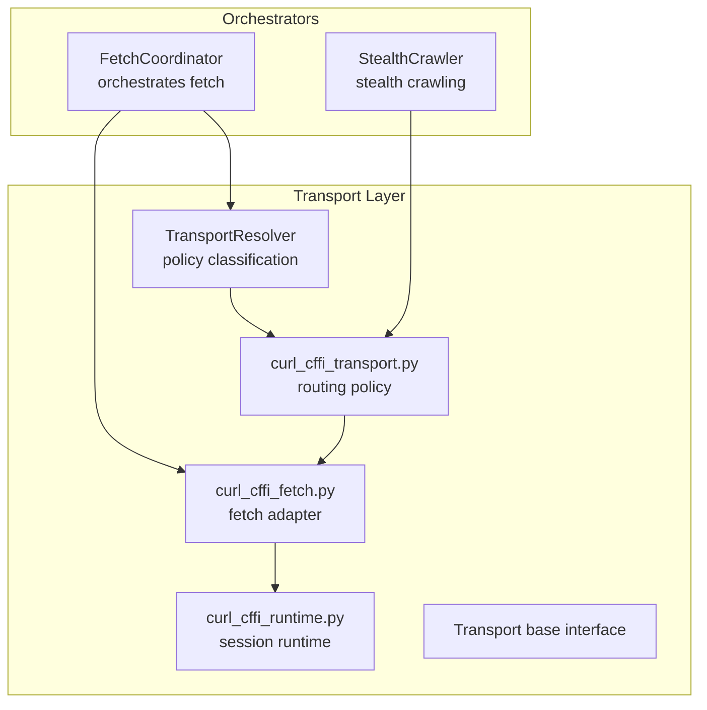
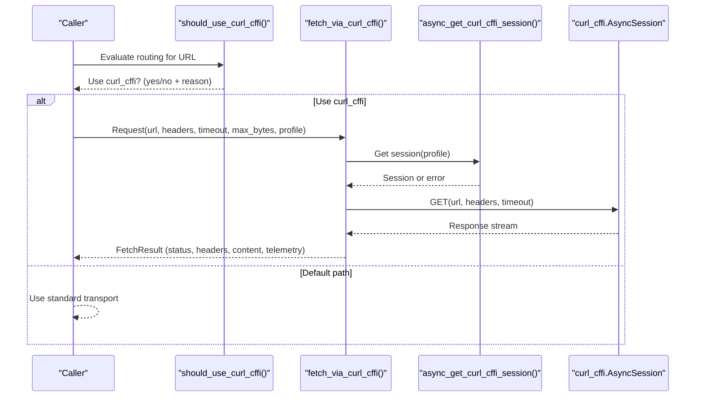
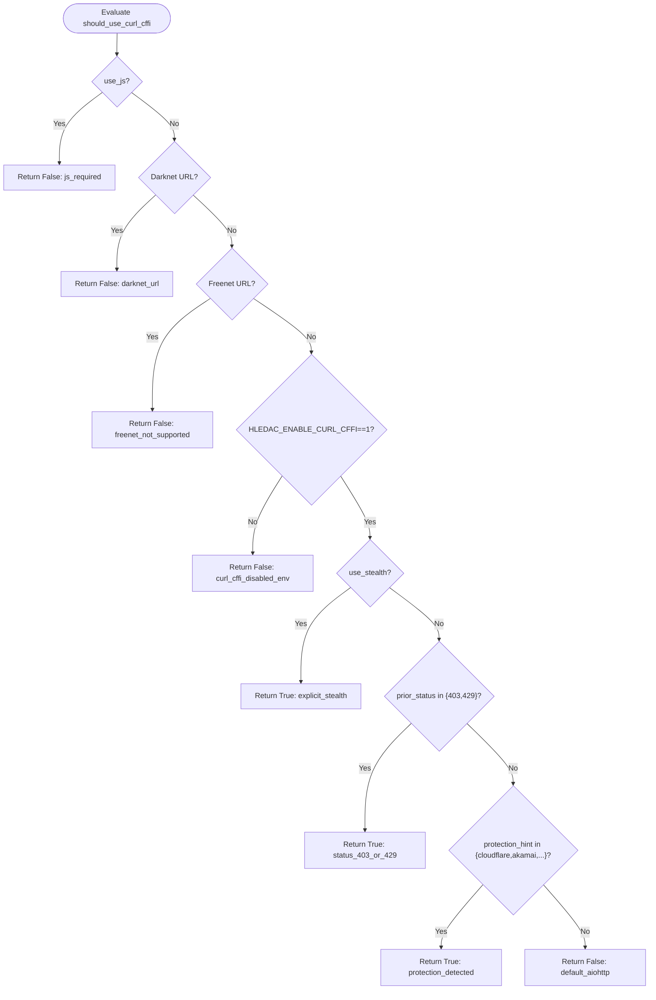
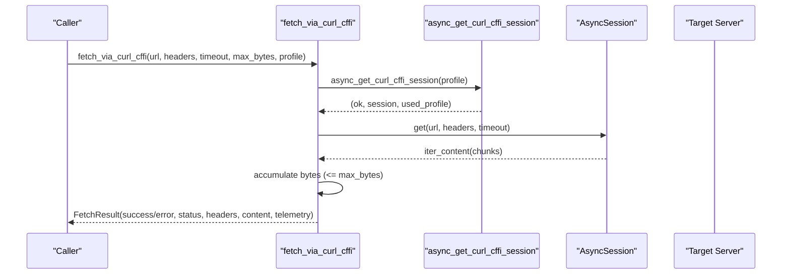
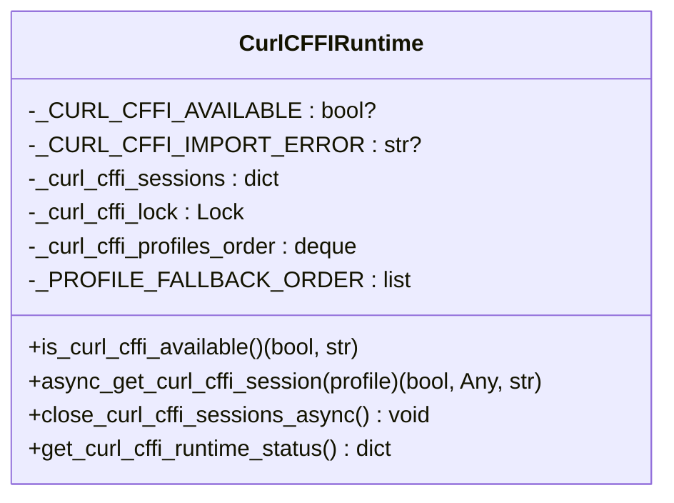
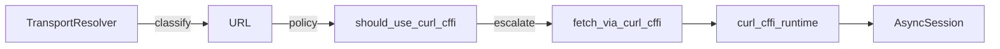
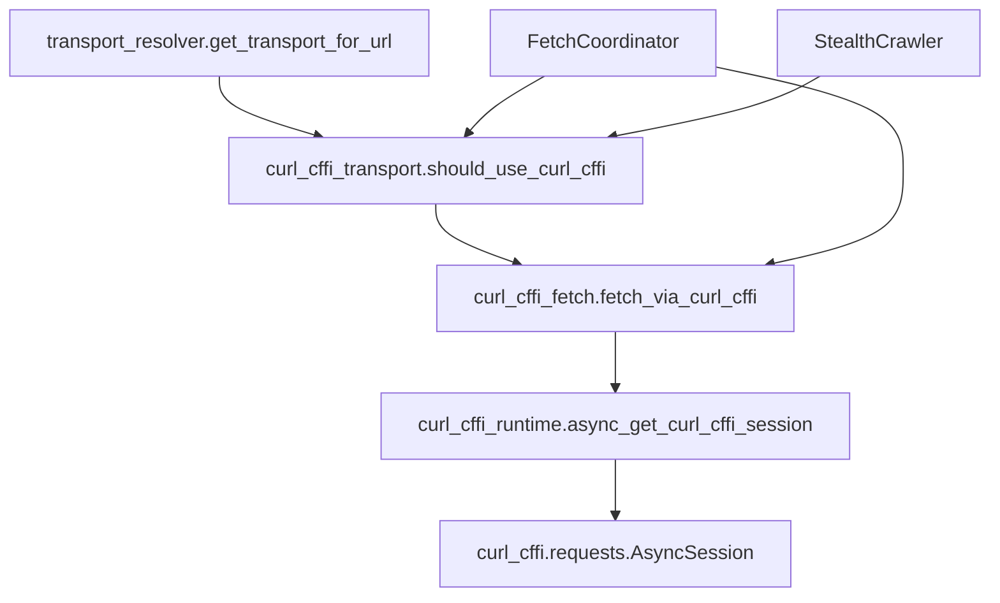

# curl_cffi Transport

<cite>
**Referenced Files in This Document**
- [curl_cffi_transport.py](file://transport/curl_cffi_transport.py)
- [curl_cffi_runtime.py](file://transport/curl_cffi_runtime.py)
- [curl_cffi_fetch.py](file://transport/curl_cffi_fetch.py)
- [transport_resolver.py](file://transport/transport_resolver.py)
- [base.py](file://transport/base.py)
- [stealth_crawler.py](file://intelligence/stealth_crawler.py)
- [fetch_coordinator.py](file://coordinators/fetch_coordinator.py)
- [e2e_curl_cffi_protected_fixture.py](file://benchmarks/e2e_curl_cffi_protected_fixture.py)
</cite>

## Table of Contents
1. [Introduction](#introduction)
2. [Project Structure](#project-structure)
3. [Core Components](#core-components)
4. [Architecture Overview](#architecture-overview)
5. [Detailed Component Analysis](#detailed-component-analysis)
6. [Dependency Analysis](#dependency-analysis)
7. [Performance Considerations](#performance-considerations)
8. [Troubleshooting Guide](#troubleshooting-guide)
9. [Conclusion](#conclusion)
10. [Appendices](#appendices)

## Introduction
This document explains the curl_cffi transport system used for stealth browsing and TLS fingerprint spoofing within the universal transport layer. It covers how curl_cffi is integrated to emulate popular browsers (e.g., Chrome, Safari) to reduce detection by servers employing bot protection systems. The documentation details routing policy, runtime session management, connection characteristics, and telemetry, along with configuration options and operational guidance for evasion and performance.

## Project Structure
The curl_cffi transport is implemented as a dedicated stealth lane alongside other transport mechanisms. It is orchestrated by the broader transport resolution and fetch pipeline, with optional integration points in the stealth crawler and fetch coordinator.

**Diagram sources**
- [transport_resolver.py:95-361](file://transport/transport_resolver.py#L95-L361)
- [curl_cffi_transport.py:34-86](file://transport/curl_cffi_transport.py#L34-L86)
- [curl_cffi_fetch.py:23-187](file://transport/curl_cffi_fetch.py#L23-L187)
- [curl_cffi_runtime.py:37-193](file://transport/curl_cffi_runtime.py#L37-L193)
- [base.py:4-24](file://transport/base.py#L4-L24)
- [fetch_coordinator.py:1-200](file://coordinators/fetch_coordinator.py#L1-L200)
- [stealth_crawler.py:1-800](file://intelligence/stealth_crawler.py#L1-L800)

**Section sources**
- [transport_resolver.py:1-361](file://transport/transport_resolver.py#L1-L361)
- [curl_cffi_transport.py:1-86](file://transport/curl_cffi_transport.py#L1-L86)
- [curl_cffi_fetch.py:1-187](file://transport/curl_cffi_fetch.py#L1-L187)
- [curl_cffi_runtime.py:1-193](file://transport/curl_cffi_runtime.py#L1-L193)
- [base.py:1-24](file://transport/base.py#L1-L24)
- [fetch_coordinator.py:1-200](file://coordinators/fetch_coordinator.py#L1-L200)
- [stealth_crawler.py:1-800](file://intelligence/stealth_crawler.py#L1-L800)

## Core Components
- Routing policy: Determines when to escalate to curl_cffi based on URL, prior responses, and protection hints.
- Fetch adapter: Performs HTTP(S) requests via curl_cffi with streaming and truncation controls.
- Runtime session manager: Provides lazy, bounded, LRU-cached AsyncSession instances with graceful fallback.
- Telemetry and error reporting: Consistent FetchResult-compatible structure with failure stage and network error kind.

Key responsibilities:
- Route: should_use_curl_cffi() evaluates environment, URL suffixes, and protection signals.
- Fetch: fetch_via_curl_cffi() executes requests and returns normalized results.
- Runtime: async_get_curl_cffi_session() creates and caches sessions with bounded profiles.
- Telemetry: standardized fields for transport selection, TLS profile, and failure classification.

**Section sources**
- [curl_cffi_transport.py:34-86](file://transport/curl_cffi_transport.py#L34-L86)
- [curl_cffi_fetch.py:23-187](file://transport/curl_cffi_fetch.py#L23-L187)
- [curl_cffi_runtime.py:61-193](file://transport/curl_cffi_runtime.py#L61-L193)

## Architecture Overview
curl_cffi operates as a separate TLS fingerprinting lane from the standard HTTP stack. The routing policy decides whether to use curl_cffi or default transports. When escalated, the fetch adapter obtains a session from the runtime and performs the request, returning a normalized result with telemetry.

**Diagram sources**
- [curl_cffi_transport.py:34-86](file://transport/curl_cffi_transport.py#L34-L86)
- [curl_cffi_fetch.py:23-187](file://transport/curl_cffi_fetch.py#L23-L187)
- [curl_cffi_runtime.py:61-151](file://transport/curl_cffi_runtime.py#L61-L151)

## Detailed Component Analysis

### Routing Policy: should_use_curl_cffi
The policy determines when to escalate to curl_cffi:
- Disallow: JS-required URLs, darknet (.onion/.i2p/.b32.i2p), freenet, environment gate off, missing curl_cffi.
- Escalate: explicit stealth flag, prior 403/429, known protection hints (Cloudflare/Akamai/DataDome/Imperva/PerimeterX/Incapsula).
- Otherwise: default to standard transport.

**Diagram sources**
- [curl_cffi_transport.py:34-86](file://transport/curl_cffi_transport.py#L34-L86)

**Section sources**
- [curl_cffi_transport.py:1-86](file://transport/curl_cffi_transport.py#L1-L86)

### Fetch Adapter: fetch_via_curl_cffi
- Availability check: early exit if curl_cffi is not available.
- Session retrieval: lazy, bounded, LRU session cache with fallback profiles.
- Request execution: GET with headers and timeout; streaming body read with max_bytes truncation.
- Error handling: maps exceptions to failure_stage and network_error_kind; preserves TLS profile used.

**Diagram sources**
- [curl_cffi_fetch.py:23-187](file://transport/curl_cffi_fetch.py#L23-L187)
- [curl_cffi_runtime.py:61-151](file://transport/curl_cffi_runtime.py#L61-L151)

**Section sources**
- [curl_cffi_fetch.py:1-187](file://transport/curl_cffi_fetch.py#L1-L187)

### Runtime Session Manager: async_get_curl_cffi_session
- Lazy availability check with module-level caching.
- Bounded LRU cache (max 3 profiles) with O(1) eviction via deque.
- Thread-safe creation guarded by asyncio.Lock; evicted sessions closed asynchronously after lock release.
- Preferred fallback order: chrome136 → chrome120 → chrome110 → safari17_0.
- Telemetry endpoint exposes availability, cache state, and capacity.

**Diagram sources**
- [curl_cffi_runtime.py:1-193](file://transport/curl_cffi_runtime.py#L1-L193)

**Section sources**
- [curl_cffi_runtime.py:1-193](file://transport/curl_cffi_runtime.py#L1-L193)

### Transport Resolver and Orchestration
- TransportResolver classifies URLs by suffix (.onion/.i2p/.b32.i2p/.freenet) and provides policy gates used by orchestrators.
- curl_cffi is a separate TLS plane from the resolver’s proxy-aware TCP world.
- FetchCoordinator integrates the curl_cffi lane via routing and fetch adapters; stealth crawler also participates in routing and telemetry.

**Diagram sources**
- [transport_resolver.py:268-322](file://transport/transport_resolver.py#L268-L322)
- [curl_cffi_transport.py:34-86](file://transport/curl_cffi_transport.py#L34-L86)
- [curl_cffi_fetch.py:23-187](file://transport/curl_cffi_fetch.py#L23-L187)
- [curl_cffi_runtime.py:61-151](file://transport/curl_cffi_runtime.py#L61-L151)

**Section sources**
- [transport_resolver.py:1-361](file://transport/transport_resolver.py#L1-L361)
- [stealth_crawler.py:1-800](file://intelligence/stealth_crawler.py#L1-L800)
- [fetch_coordinator.py:1-200](file://coordinators/fetch_coordinator.py#L1-L200)

## Dependency Analysis
- curl_cffi_transport depends on environment variables and protection hints to decide escalation.
- curl_cffi_fetch depends on curl_cffi_runtime for session provisioning and uses curl_cffi.AsyncSession for requests.
- curl_cffi_runtime depends on curl_cffi.requests.AsyncSession and maintains internal state for availability and sessions.
- TransportResolver provides policy classification used by orchestrators; curl_cffi is kept separate from resolver’s proxy-aware world classification.

**Diagram sources**
- [curl_cffi_transport.py:34-86](file://transport/curl_cffi_transport.py#L34-L86)
- [curl_cffi_fetch.py:23-187](file://transport/curl_cffi_fetch.py#L23-L187)
- [curl_cffi_runtime.py:61-151](file://transport/curl_cffi_runtime.py#L61-L151)
- [transport_resolver.py:268-322](file://transport/transport_resolver.py#L268-L322)
- [fetch_coordinator.py:1-200](file://coordinators/fetch_coordinator.py#L1-L200)
- [stealth_crawler.py:1-800](file://intelligence/stealth_crawler.py#L1-L800)

**Section sources**
- [curl_cffi_transport.py:1-86](file://transport/curl_cffi_transport.py#L1-L86)
- [curl_cffi_fetch.py:1-187](file://transport/curl_cffi_fetch.py#L1-L187)
- [curl_cffi_runtime.py:1-193](file://transport/curl_cffi_runtime.py#L1-L193)
- [transport_resolver.py:1-361](file://transport/transport_resolver.py#L1-L361)
- [fetch_coordinator.py:1-200](file://coordinators/fetch_coordinator.py#L1-L200)
- [stealth_crawler.py:1-800](file://intelligence/stealth_crawler.py#L1-L800)

## Performance Considerations
- Session caching: bounded LRU with max 3 profiles prevents unbounded memory growth; sessions are closed asynchronously after eviction to avoid blocking the lock.
- Streaming reads: body accumulation uses bytearray.extend() for O(1) amortized append behavior; hard cap on bytes prevents excessive memory usage.
- Timeout and concurrency: default timeout is modest; adjust per target; ensure global concurrency and AIMD settings align with fetch coordinator limits.
- TLS profile fallback: preferred order reduces failures by trying newer browser profiles first.

Recommendations:
- Tune max_bytes for content size expectations.
- Monitor cache capacity and eviction frequency via runtime status telemetry.
- Use environment gating to enable curl_cffi only when needed to minimize overhead.

**Section sources**
- [curl_cffi_runtime.py:26-35](file://transport/curl_cffi_runtime.py#L26-L35)
- [curl_cffi_runtime.py:118-151](file://transport/curl_cffi_runtime.py#L118-L151)
- [curl_cffi_fetch.py:19-21](file://transport/curl_cffi_fetch.py#L19-L21)
- [curl_cffi_fetch.py:90-99](file://transport/curl_cffi_fetch.py#L90-L99)
- [fetch_coordinator.py:120-146](file://coordinators/fetch_coordinator.py#L120-L146)

## Troubleshooting Guide
Common issues and resolutions:
- curl_cffi not available:
  - Cause: Import error or environment gate disabled.
  - Action: Install curl_cffi; set HLEDAC_ENABLE_CURL_CFFI=1; verify availability via runtime status.
- Session creation failures:
  - Cause: Profile unsupported or environment constraints.
  - Action: Retry with alternate profile; check fallback order; inspect error reason.
- Timeouts and DNS errors:
  - Cause: Network latency or misconfiguration.
  - Action: Increase timeout; verify connectivity; review failure_stage and network_error_kind.
- Excessive memory usage:
  - Cause: Large content without truncation.
  - Action: Reduce max_bytes; monitor cache capacity; ensure sessions are closed on shutdown.

Operational checks:
- Environment variable: HLEDAC_ENABLE_CURL_CFFI must equal "1".
- Profiles: Supported profiles include chrome136, chrome120, chrome110, safari17_0.
- Telemetry: Use runtime status to confirm availability and cache usage.

**Section sources**
- [curl_cffi_transport.py:63-67](file://transport/curl_cffi_transport.py#L63-L67)
- [curl_cffi_runtime.py:37-58](file://transport/curl_cffi_runtime.py#L37-L58)
- [curl_cffi_runtime.py:181-193](file://transport/curl_cffi_runtime.py#L181-L193)
- [curl_cffi_fetch.py:46-56](file://transport/curl_cffi_fetch.py#L46-L56)
- [curl_cffi_fetch.py:119-161](file://transport/curl_cffi_fetch.py#L119-L161)

## Conclusion
The curl_cffi transport provides a robust, stealth-oriented HTTP(S) lane that integrates cleanly with the existing transport ecosystem. Its routing policy, bounded session runtime, and comprehensive telemetry enable effective evasion against bot protections while maintaining operational safety and performance. Proper configuration of environment gates, timeouts, and TLS profiles ensures reliable operation across diverse targets.

## Appendices

### Configuration Options
- Environment:
  - HLEDAC_ENABLE_CURL_CFFI: Enable curl_cffi escalation when set to "1".
- Fetch parameters:
  - headers: HTTP headers to send.
  - timeout_s: Request timeout in seconds.
  - max_bytes: Hard cap on response body size.
  - profile: TLS impersonation profile (e.g., chrome110, chrome120, chrome136, safari17_0).
- Routing policy arguments:
  - use_stealth: Force escalation.
  - use_js: Prevent escalation (JS handled elsewhere).
  - prior_status/prior_error/protection_hint: Influence escalation based on prior outcomes and protection signals.

**Section sources**
- [curl_cffi_transport.py:34-86](file://transport/curl_cffi_transport.py#L34-L86)
- [curl_cffi_fetch.py:23-29](file://transport/curl_cffi_fetch.py#L23-L29)
- [curl_cffi_runtime.py:61-88](file://transport/curl_cffi_runtime.py#L61-L88)

### Examples and Evasion Strategies
- Protected fixture benchmark demonstrates curl_cffi recovery from 403 to 200 by impersonating Chrome/110.
- Strategy: Use should_use_curl_cffi() with prior_status=403 or protection_hint to escalate automatically.
- Strategy: Rotate TLS profiles to avoid signature correlation; leverage fallback order.

**Section sources**
- [e2e_curl_cffi_protected_fixture.py:278-325](file://benchmarks/e2e_curl_cffi_protected_fixture.py#L278-L325)
- [curl_cffi_transport.py:7-18](file://transport/curl_cffi_transport.py#L7-L18)

### Runtime Lifecycle
- Initialization: Lazy availability check; sessions created on demand.
- Request processing: Session retrieved, request executed, body streamed with truncation.
- Cleanup: Sessions closed asynchronously; shutdown drains and closes remaining sessions.

**Section sources**
- [curl_cffi_runtime.py:37-58](file://transport/curl_cffi_runtime.py#L37-L58)
- [curl_cffi_runtime.py:153-178](file://transport/curl_cffi_runtime.py#L153-L178)
- [curl_cffi_fetch.py:82-117](file://transport/curl_cffi_fetch.py#L82-L117)