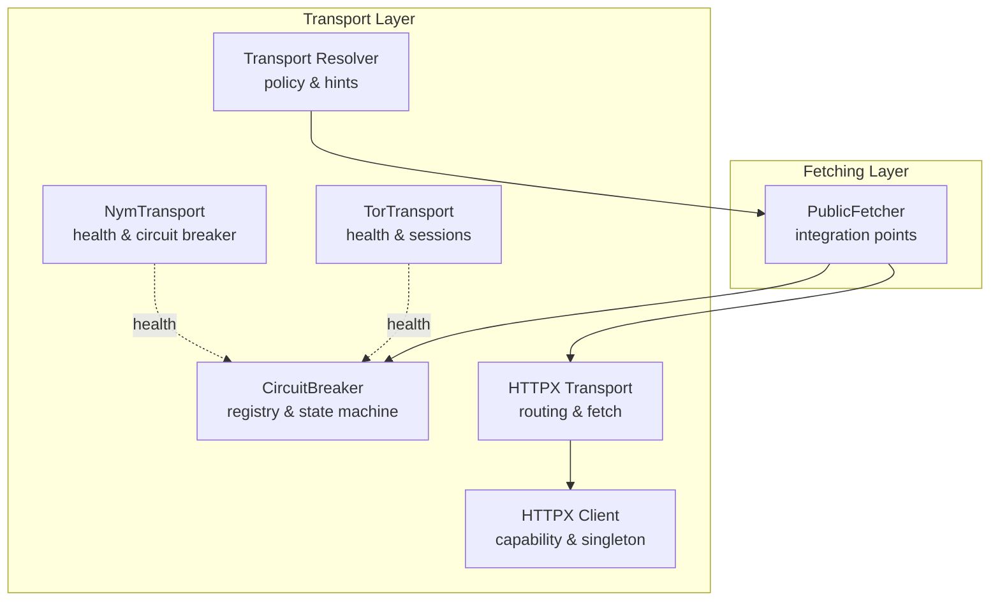
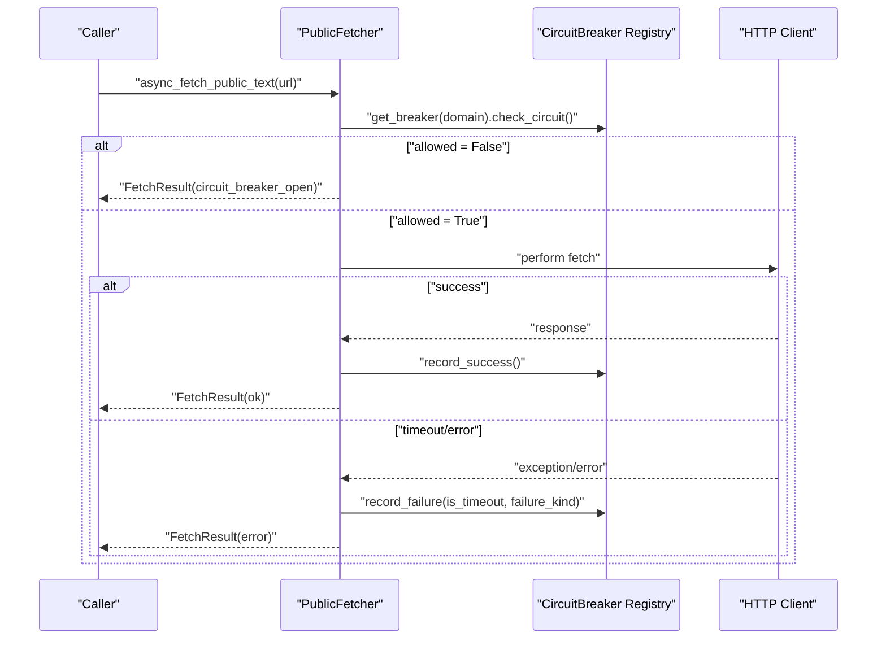
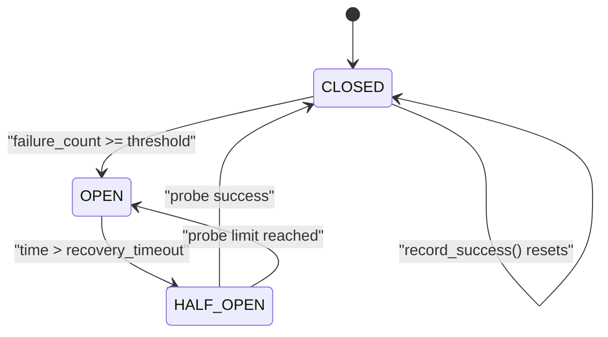
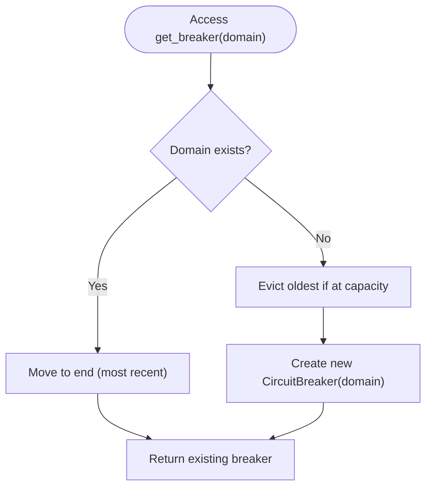
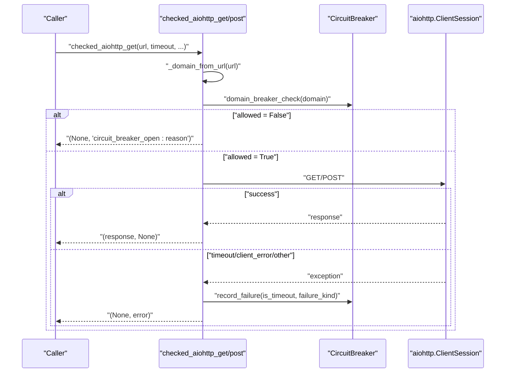
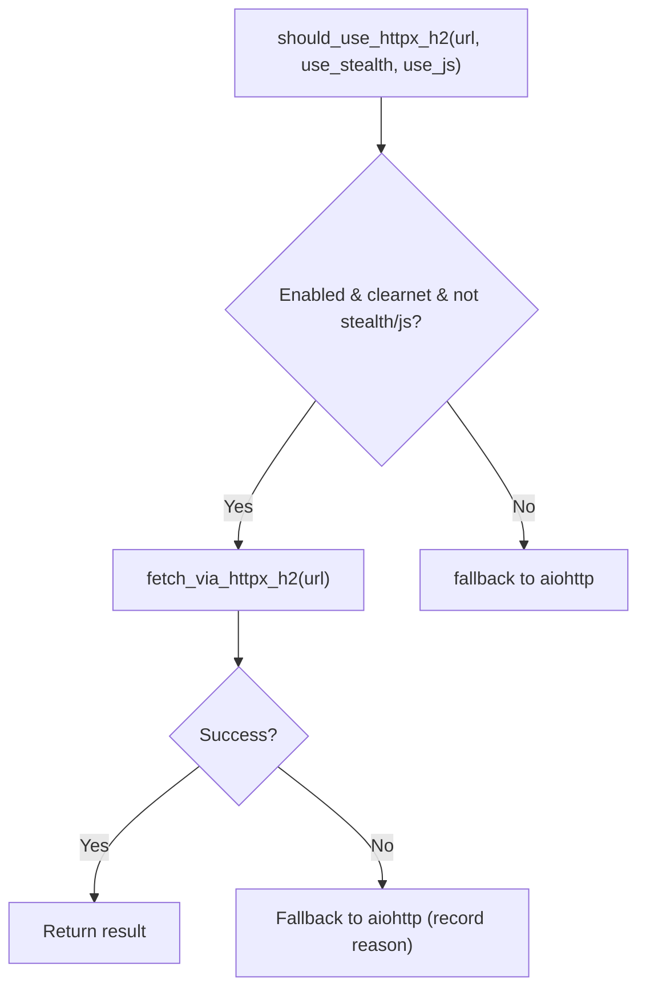
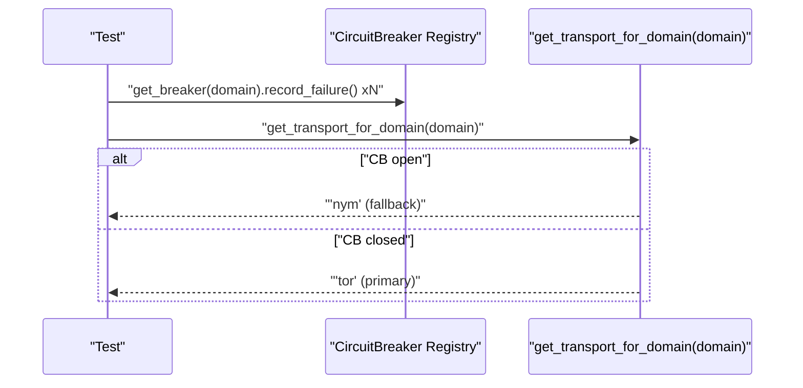
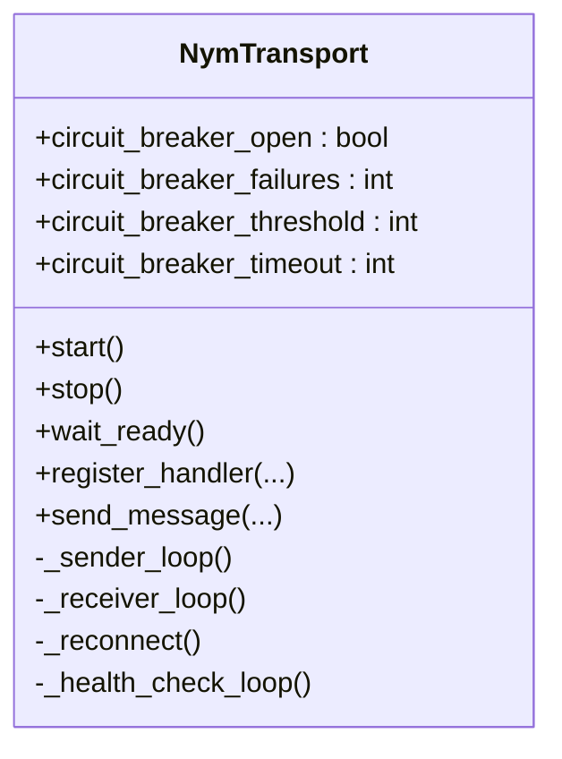
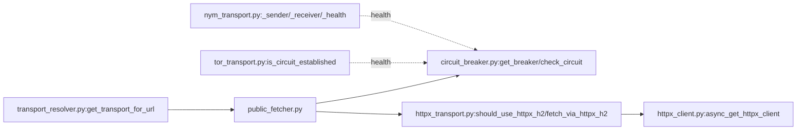

# Circuit Breaker

<cite>
**Referenced Files in This Document**
- [circuit_breaker.py](file://transport/circuit_breaker.py)
- [public_fetcher.py](file://fetching/public_fetcher.py)
- [httpx_transport.py](file://transport/httpx_transport.py)
- [httpx_client.py](file://transport/httpx_client.py)
- [transport_resolver.py](file://transport/transport_resolver.py)
- [tor_transport.py](file://transport/tor_transport.py)
- [nym_transport.py](file://transport/nym_transport.py)
- [test_cb_opens_after_threshold.py](file://tests/probe_8vb/test_cb_opens_after_threshold.py)
- [test_cb_half_open_after_recovery.py](file://tests/probe_8vb/test_cb_half_open_after_recovery.py)
- [test_cb_timeout_doubles_recovery.py](file://tests/probe_8vb/test_cb_timeout_doubles_recovery.py)
- [test_cb_resets_on_success.py](file://tests/probe_8vb/test_cb_resets_on_success.py)
- [test_cb_singleton_per_domain.py](file://tests/probe_8vb/test_cb_singleton_per_domain.py)
- [test_transport_resolver_fallback_chain.py](file://tests/probe_8ve/test_transport_resolver_fallback_chain.py)
</cite>

## Table of Contents
1. [Introduction](#introduction)
2. [Project Structure](#project-structure)
3. [Core Components](#core-components)
4. [Architecture Overview](#architecture-overview)
5. [Detailed Component Analysis](#detailed-component-analysis)
6. [Dependency Analysis](#dependency-analysis)
7. [Performance Considerations](#performance-considerations)
8. [Troubleshooting Guide](#troubleshooting-guide)
9. [Conclusion](#conclusion)
10. [Appendices](#appendices)

## Introduction
This document explains the circuit breaker pattern implementation used in transport operations to prevent cascading failures and enable graceful degradation. It covers failure detection, state transitions (CLOSED, OPEN, HALF-OPEN), automatic recovery with exponential backoff, health monitoring hooks, and integration points with HTTP clients and transport selection. Practical usage scenarios include HTTP client wrappers, retry coordination, and fallback strategies for anonymized networks.

## Project Structure
The circuit breaker resides in the transport layer and is consumed by higher-level fetching logic. Supporting modules provide HTTPX H2 routing, capability detection, and transport resolver logic that influences fallback behavior.

**Diagram sources**
- [circuit_breaker.py:198-228](file://transport/circuit_breaker.py#L198-L228)
- [httpx_transport.py:149-218](file://transport/httpx_transport.py#L149-L218)
- [httpx_client.py:93-161](file://transport/httpx_client.py#L93-L161)
- [transport_resolver.py:268-318](file://transport/transport_resolver.py#L268-L318)
- [tor_transport.py:211-241](file://transport/tor_transport.py#L211-L241)
- [nym_transport.py:146-239](file://transport/nym_transport.py#L146-L239)
- [public_fetcher.py:733-763](file://fetching/public_fetcher.py#L733-L763)

**Section sources**
- [circuit_breaker.py:1-428](file://transport/circuit_breaker.py#L1-L428)
- [public_fetcher.py:733-763](file://fetching/public_fetcher.py#L733-L763)
- [httpx_transport.py:1-391](file://transport/httpx_transport.py#L1-L391)
- [httpx_client.py:1-213](file://transport/httpx_client.py#L1-L213)
- [transport_resolver.py:1-322](file://transport/transport_resolver.py#L1-L322)
- [tor_transport.py:1-345](file://transport/tor_transport.py#L1-L345)
- [nym_transport.py:1-239](file://transport/nym_transport.py#L1-L239)

## Core Components
- CircuitBreaker: Domain-scoped state machine with counters and timeouts; exposes decision APIs and snapshots.
- Registry: LRU-ordered registry keyed by domain; ensures bounded memory footprint.
- HTTP client helpers: Checked fetch wrappers around aiohttp that integrate with the circuit breaker.
- PublicFetcher integration: Pre-checks domain circuit breaker before initiating fetches.
- HTTPX H2 routing: Optional lane gated by capability detection and policy; complements circuit breaker by avoiding failing endpoints.
- Transport resolver and transports: Provide fallback hints and health signals influencing circuit breaker behavior.

Key constants and bounds:
- MAX_TRACKED_DOMAINS: 500
- MAX_RECOVERY_TIMEOUT_S: 300.0
- BASE_RECOVERY_TIMEOUT_S: 30.0
- CIRCUIT_FAILURE_THRESHOLD: 3
- CIRCUIT_HALF_OPEN_PROBES: 1

**Section sources**
- [circuit_breaker.py:43-48](file://transport/circuit_breaker.py#L43-L48)
- [circuit_breaker.py:198-228](file://transport/circuit_breaker.py#L198-L228)
- [circuit_breaker.py:307-324](file://transport/circuit_breaker.py#L307-L324)
- [circuit_breaker.py:326-428](file://transport/circuit_breaker.py#L326-L428)
- [public_fetcher.py:733-763](file://fetching/public_fetcher.py#L733-L763)
- [httpx_transport.py:149-218](file://transport/httpx_transport.py#L149-L218)
- [httpx_client.py:155-161](file://transport/httpx_client.py#L155-L161)

## Architecture Overview
The circuit breaker is a shared, in-memory registry keyed by domain. Before any HTTP operation, the domain’s breaker is consulted. If open, the operation is skipped (fail-soft). On success, the breaker resets; on failure, counters and timeouts are updated. For anonymized networks, transport health and fallbacks are coordinated via transport-specific logic and resolver hints.

**Diagram sources**
- [public_fetcher.py:733-763](file://fetching/public_fetcher.py#L733-L763)
- [circuit_breaker.py:100-146](file://transport/circuit_breaker.py#L100-L146)
- [circuit_breaker.py:148-172](file://transport/circuit_breaker.py#L148-L172)
- [circuit_breaker.py:326-428](file://transport/circuit_breaker.py#L326-L428)

## Detailed Component Analysis

### CircuitBreaker State Machine
States:
- CLOSED: Normal operation; counters increment on failures.
- OPEN: Circuit is open; subsequent checks fail fast with a retry-after estimate.
- HALF-OPEN: Recovery probe window; allows a limited number of probes before deciding to close or reopen.

Transitions:
- CLOSED → OPEN when failure count reaches threshold.
- OPEN → HALF-OPEN after recovery timeout elapses.
- HALF-OPEN → CLOSED on success; remains HALF-OPEN if probes exceed limit or all probes fail.

Exponential backoff:
- Timeout doubles on consecutive timeouts until capped by MAX_RECOVERY_TIMEOUT_S.
- Resets to BASE_RECOVERY_TIMEOUT_S on success.

**Diagram sources**
- [circuit_breaker.py:51-90](file://transport/circuit_breaker.py#L51-L90)
- [circuit_breaker.py:91-172](file://transport/circuit_breaker.py#L91-L172)

**Section sources**
- [circuit_breaker.py:51-90](file://transport/circuit_breaker.py#L51-L90)
- [circuit_breaker.py:91-172](file://transport/circuit_breaker.py#L91-L172)
- [circuit_breaker.py:43-48](file://transport/circuit_breaker.py#L43-L48)

### Registry and Snapshot
- LRU registry: Evicts oldest entries when exceeding MAX_TRACKED_DOMAINS.
- Snapshots: Immutable diagnostics exposing current state, failure counts, and last failure kind.

**Diagram sources**
- [circuit_breaker.py:192-205](file://transport/circuit_breaker.py#L192-L205)

**Section sources**
- [circuit_breaker.py:188-228](file://transport/circuit_breaker.py#L188-L228)
- [circuit_breaker.py:57-89](file://transport/circuit_breaker.py#L57-L89)

### HTTP Client Integration
- Checked GET/POST wrappers:
  - Extract domain from URL.
  - Check breaker; if disallowed, return early with a specific error string.
  - On success, return response; on failure, record failure with kind and timeout flag.
- PublicFetcher integration:
  - Pre-check breaker before any fetch attempt; on OPEN, return a FetchResult indicating circuit breaker failure.

**Diagram sources**
- [circuit_breaker.py:290-324](file://transport/circuit_breaker.py#L290-L324)
- [circuit_breaker.py:326-428](file://transport/circuit_breaker.py#L326-L428)
- [public_fetcher.py:733-763](file://fetching/public_fetcher.py#L733-L763)

**Section sources**
- [circuit_breaker.py:290-324](file://transport/circuit_breaker.py#L290-L324)
- [circuit_breaker.py:326-428](file://transport/circuit_breaker.py#L326-L428)
- [public_fetcher.py:733-763](file://fetching/public_fetcher.py#L733-L763)

### HTTPX H2 Routing and Circuit Breaker Coordination
- HTTPX H2 is optional and gated by capability detection and policy.
- Policy determines whether to use HTTPX H2 based on URL characteristics and environment flags.
- If HTTPX H2 fails, the system falls back to aiohttp with a fallback reason recorded.

**Diagram sources**
- [httpx_transport.py:149-218](file://transport/httpx_transport.py#L149-L218)
- [httpx_transport.py:225-306](file://transport/httpx_transport.py#L225-L306)
- [httpx_client.py:93-161](file://transport/httpx_client.py#L93-L161)

**Section sources**
- [httpx_transport.py:149-218](file://transport/httpx_transport.py#L149-L218)
- [httpx_transport.py:225-306](file://transport/httpx_transport.py#L225-L306)
- [httpx_client.py:93-161](file://transport/httpx_client.py#L93-L161)

### Transport Resolver and Fallback Chain
- The resolver classifies URLs and provides transport hints.
- For anonymized networks, transport health and circuit breaker state influence fallback behavior.
- Test seam demonstrates fallback chain: when a Tor circuit breaker is open, a transport hint can switch to Nym.

**Diagram sources**
- [transport_resolver.py:268-318](file://transport/transport_resolver.py#L268-L318)
- [circuit_breaker.py:267-281](file://transport/circuit_breaker.py#L267-L281)
- [test_transport_resolver_fallback_chain.py:5-11](file://tests/probe_8ve/test_transport_resolver_fallback_chain.py#L5-L11)

**Section sources**
- [transport_resolver.py:268-318](file://transport/transport_resolver.py#L268-L318)
- [circuit_breaker.py:267-281](file://transport/circuit_breaker.py#L267-L281)
- [test_transport_resolver_fallback_chain.py:5-11](file://tests/probe_8ve/test_transport_resolver_fallback_chain.py#L5-L11)

### Tor and Nym Transport Health Integration
- TorTransport and NymTransport maintain their own health and circuit breaker semantics.
- NymTransport includes a circuit breaker that opens after repeated sender/receiver errors and resets after a timeout.
- These health signals complement the domain circuit breaker for transport-level resilience.

**Diagram sources**
- [nym_transport.py:14-239](file://transport/nym_transport.py#L14-L239)

**Section sources**
- [nym_transport.py:14-239](file://transport/nym_transport.py#L14-L239)
- [tor_transport.py:211-241](file://transport/tor_transport.py#L211-L241)

## Dependency Analysis
- CircuitBreaker depends on time and ordered dictionary for LRU eviction.
- PublicFetcher depends on the circuit breaker registry and HTTP client helpers.
- HTTPX transport depends on capability detection and policy gating.
- Transport resolver depends on URL parsing and environment flags.

**Diagram sources**
- [public_fetcher.py:733-763](file://fetching/public_fetcher.py#L733-L763)
- [circuit_breaker.py:198-228](file://transport/circuit_breaker.py#L198-L228)
- [httpx_transport.py:149-218](file://transport/httpx_transport.py#L149-L218)
- [httpx_client.py:93-161](file://transport/httpx_client.py#L93-L161)
- [transport_resolver.py:268-318](file://transport/transport_resolver.py#L268-L318)
- [tor_transport.py:211-241](file://transport/tor_transport.py#L211-L241)
- [nym_transport.py:167-239](file://transport/nym_transport.py#L167-L239)

**Section sources**
- [public_fetcher.py:733-763](file://fetching/public_fetcher.py#L733-L763)
- [circuit_breaker.py:198-228](file://transport/circuit_breaker.py#L198-L228)
- [httpx_transport.py:149-218](file://transport/httpx_transport.py#L149-L218)
- [httpx_client.py:93-161](file://transport/httpx_client.py#L93-L161)
- [transport_resolver.py:268-318](file://transport/transport_resolver.py#L268-L318)
- [tor_transport.py:211-241](file://transport/tor_transport.py#L211-L241)
- [nym_transport.py:167-239](file://transport/nym_transport.py#L167-L239)

## Performance Considerations
- Memory footprint: Registry bounded by MAX_TRACKED_DOMAINS; LRU eviction keeps overhead predictable.
- Event loop safety: All operations are non-blocking; timeouts and retries are handled asynchronously.
- Exponential backoff: Prevents thundering herd on recovery; caps at MAX_RECOVERY_TIMEOUT_S.
- HTTPX H2: Optional lane reduces latency for API-like endpoints when available; fallback to aiohttp is fail-soft.
- Transport health: Tor/Nym health checks avoid wasted attempts when underlying transports are unhealthy.

[No sources needed since this section provides general guidance]

## Troubleshooting Guide
Common behaviors and remedies:
- Circuit breaker opens after repeated failures:
  - Cause: failure_count reached CIRCUIT_FAILURE_THRESHOLD.
  - Remedy: Allow recovery timeout to elapse; monitor exponential backoff doubling on timeouts.
- Half-open recovery:
  - Behavior: Allows limited probes before deciding to close or reopen.
  - Remedy: Ensure upstream stability; confirm success resets breaker.
- Timeout-driven backoff:
  - Behavior: Consecutive timeouts double recovery timeout up to MAX_RECOVERY_TIMEOUT_S.
  - Remedy: Investigate upstream latency; adjust expectations or retry strategy.
- Domain not tracked:
  - Behavior: get_snapshot(domain) returns None if not seen.
  - Remedy: Trigger a request to populate registry; verify URL parsing.
- Transport fallback:
  - Behavior: When Tor CB is open, transport hint can switch to Nym.
  - Remedy: Confirm CB state and transport health; validate resolver logic.

Operational checks:
- Verify constants and thresholds align with expectations.
- Use snapshots to inspect current state and last failure kind.
- Confirm HTTP client helpers are used consistently to record outcomes.

**Section sources**
- [circuit_breaker.py:43-48](file://transport/circuit_breaker.py#L43-L48)
- [circuit_breaker.py:162-167](file://transport/circuit_breaker.py#L162-L167)
- [circuit_breaker.py:176-185](file://transport/circuit_breaker.py#L176-L185)
- [test_cb_opens_after_threshold.py:3-7](file://tests/probe_8vb/test_cb_opens_after_threshold.py#L3-L7)
- [test_cb_half_open_after_recovery.py:4-9](file://tests/probe_8vb/test_cb_half_open_after_recovery.py#L4-L9)
- [test_cb_timeout_doubles_recovery.py:3-11](file://tests/probe_8vb/test_cb_timeout_doubles_recovery.py#L3-L11)
- [test_cb_resets_on_success.py:3-8](file://tests/probe_8vb/test_cb_resets_on_success.py#L3-L8)
- [test_cb_singleton_per_domain.py:3-4](file://tests/probe_8vb/test_cb_singleton_per_domain.py#L3-L4)
- [test_transport_resolver_fallback_chain.py:5-11](file://tests/probe_8ve/test_transport_resolver_fallback_chain.py#L5-L11)

## Conclusion
The circuit breaker provides robust, in-memory resilience for transport operations by preventing cascading failures, enabling controlled recovery, and integrating with transport health and fallback strategies. Its design emphasizes bounded memory, deterministic behavior, and fail-soft semantics, making it suitable for production-grade fetching pipelines.

[No sources needed since this section summarizes without analyzing specific files]

## Appendices

### Configuration Parameters
- MAX_TRACKED_DOMAINS: 500
- MAX_RECOVERY_TIMEOUT_S: 300.0
- BASE_RECOVERY_TIMEOUT_S: 30.0
- CIRCUIT_FAILURE_THRESHOLD: 3
- CIRCUIT_HALF_OPEN_PROBES: 1

**Section sources**
- [circuit_breaker.py:43-48](file://transport/circuit_breaker.py#L43-L48)

### Practical Usage Scenarios
- HTTP client wrappers:
  - Use checked_aiohttp_get/post to integrate breaker checks and failure recording.
- Retry logic coordination:
  - Respect retry_after_s from CircuitDecision; avoid immediate retries during OPEN.
- Graceful degradation:
  - Skip fetch when allowed=False; continue with safe paths or fallback transports.
- Anonymized networks:
  - Combine circuit breaker state with transport health to choose optimal lanes (e.g., Tor vs Nym).

**Section sources**
- [circuit_breaker.py:100-146](file://transport/circuit_breaker.py#L100-L146)
- [circuit_breaker.py:326-428](file://transport/circuit_breaker.py#L326-L428)
- [transport_resolver.py:268-318](file://transport/transport_resolver.py#L268-L318)
- [nym_transport.py:146-239](file://transport/nym_transport.py#L146-L239)