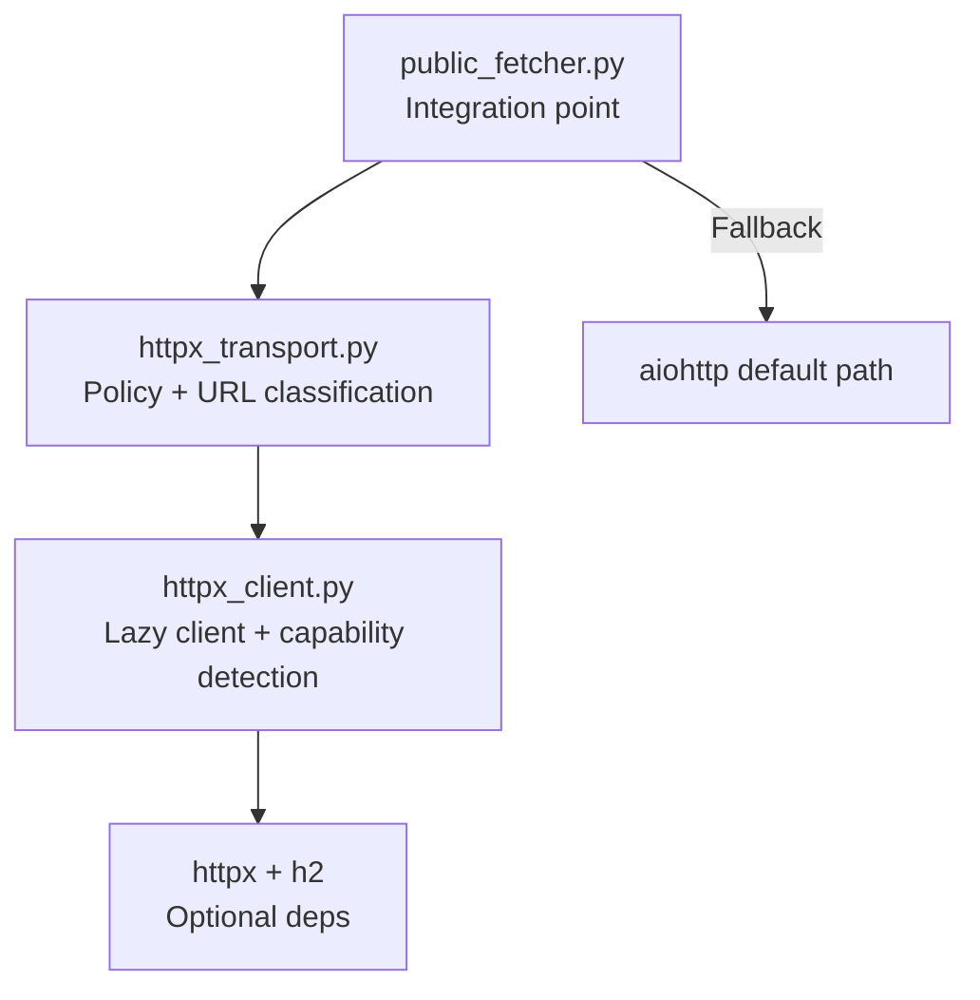
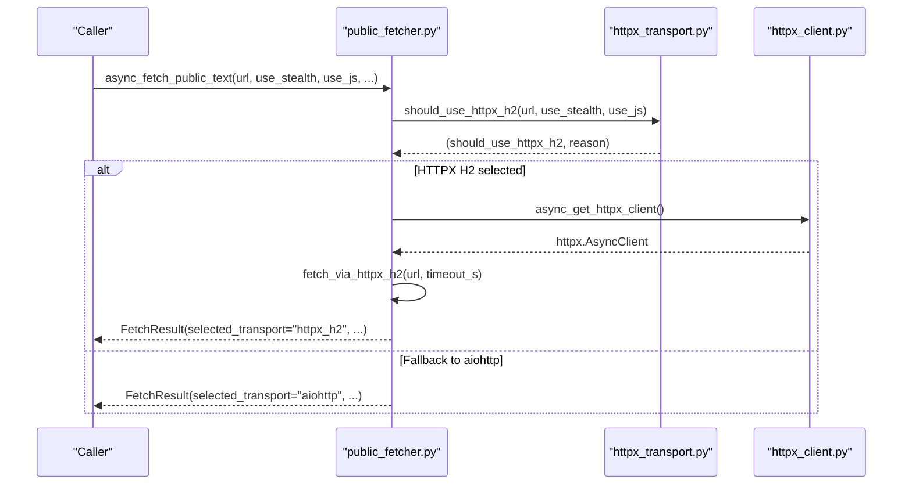
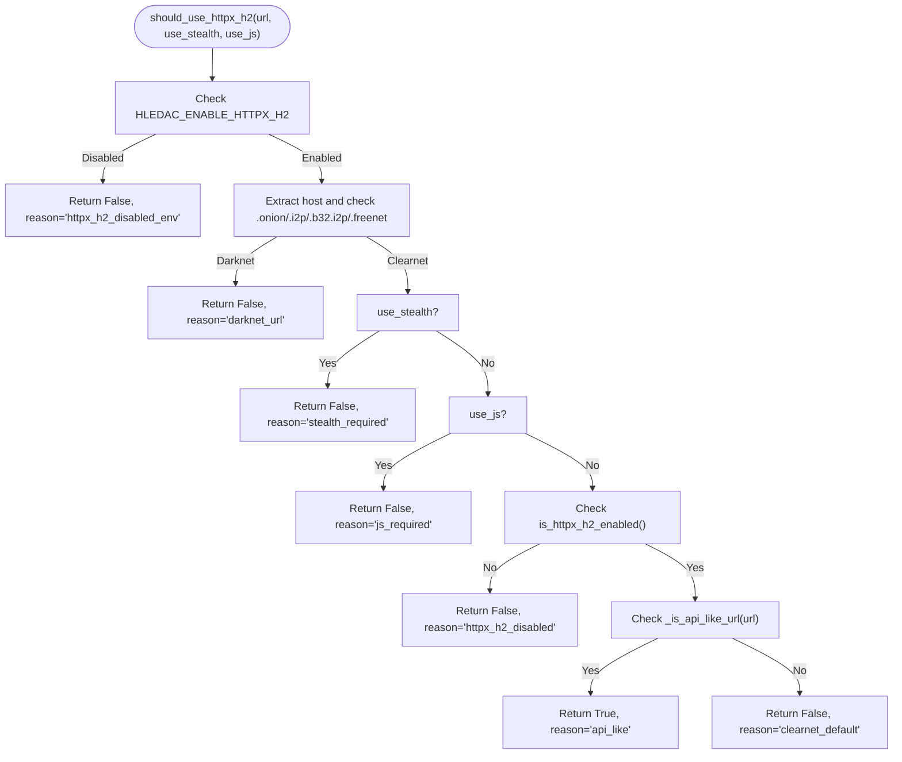
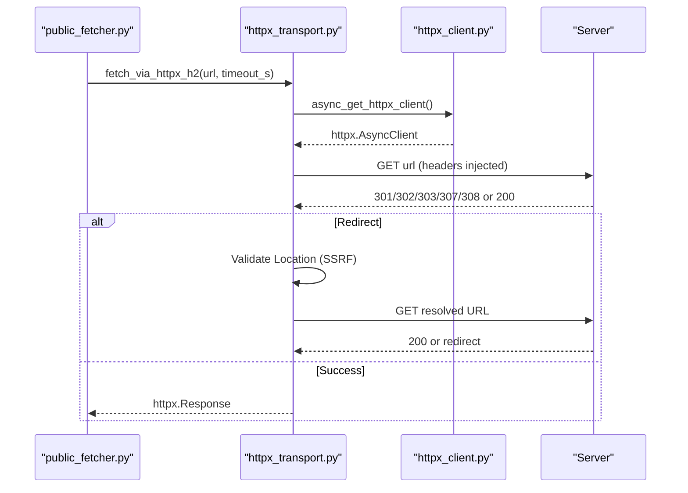
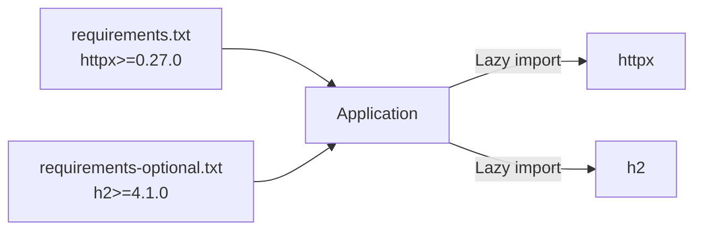

# HTTPX Transport

<cite>
**Referenced Files in This Document**
- [httpx_transport.py](file://transport/httpx_transport.py)
- [httpx_client.py](file://transport/httpx_client.py)
- [public_fetcher.py](file://fetching/public_fetcher.py)
- [requirements.txt](file://requirements.txt)
- [requirements-optional.txt](file://requirements-optional.txt)
- [test_httpx_transport.py](file://tests/probe_transport_cap_2026/test_httpx_transport.py)
- [test_e2e_readiness.py](file://tests/probe_e2e_readiness/test_e2e_readiness.py)
</cite>

## Table of Contents
1. [Introduction](#introduction)
2. [Project Structure](#project-structure)
3. [Core Components](#core-components)
4. [Architecture Overview](#architecture-overview)
5. [Detailed Component Analysis](#detailed-component-analysis)
6. [Dependency Analysis](#dependency-analysis)
7. [Performance Considerations](#performance-considerations)
8. [Troubleshooting Guide](#troubleshooting-guide)
9. [Conclusion](#conclusion)
10. [Appendices](#appendices)

## Introduction
This document explains the HTTPX transport subsystem with a focus on the HTTP/2 “lane” introduced in Sprint F206K. It covers:
- URL classification logic for API-like and same-host patterns
- Transport routing policy gates (environment, darknet, stealth, JS rendering)
- The should_use_httpx_h2() function and fetch_via_httpx_h2() method, including parameters, return values, and error handling
- Security measures: SSRF protection, redirect validation, and browser-like header injection
- Practical examples of transport selection scenarios and configuration options to enable HTTPX H2

## Project Structure
The HTTPX H2 capability is implemented as a layered feature:
- URL classification and policy gating live in transport/httpx_transport.py
- HTTPX client initialization and capability detection live in transport/httpx_client.py
- Integration into the main fetching pipeline occurs in fetching/public_fetcher.py
- Optional dependencies are declared in requirements.txt and requirements-optional.txt
- Behavioral tests reside under tests/probe_transport_cap_2026/

**Diagram sources**
- [public_fetcher.py:817-901](file://fetching/public_fetcher.py#L817-L901)
- [httpx_transport.py:149-218](file://transport/httpx_transport.py#L149-L218)
- [httpx_client.py:93-152](file://transport/httpx_client.py#L93-L152)
- [requirements.txt:15-15](file://requirements.txt#L15-L15)
- [requirements-optional.txt:50-50](file://requirements-optional.txt#L50-L50)

**Section sources**
- [httpx_transport.py:1-41](file://transport/httpx_transport.py#L1-L41)
- [httpx_client.py:1-30](file://transport/httpx_client.py#L1-L30)
- [public_fetcher.py:809-901](file://fetching/public_fetcher.py#L809-L901)
- [requirements.txt:15-15](file://requirements.txt#L15-L15)
- [requirements-optional.txt:50-50](file://requirements-optional.txt#L50-L50)

## Core Components
- URL classification helpers:
  - _is_api_like_url(): Lightweight, deterministic classification of API/CDN endpoints based on hostname and path patterns
  - _extract_host(): Parses and normalizes hostnames from URLs
- Transport policy:
  - should_use_httpx_h2(): Central decision function that evaluates environment, darknet, stealth, JS, and capability gates
- HTTP/2 fetch path:
  - fetch_via_httpx_h2(): Executes HTTP GET via HTTPX AsyncClient with manual redirect handling and SSRF protections
- HTTPX client surface:
  - async_get_httpx_client(), is_httpx_h2_enabled(), close_httpx_client_async(): Lazy initialization, capability checks, and lifecycle management

Key behaviors:
- HTTPX H2 is optional and only for clearnet
- It is disabled for .onion, .i2p, .b32.i2p, .freenet, stealth mode, and JS rendering
- It activates when environment variable HLEDAC_ENABLE_HTTPX_H2 is set and h2 is installed
- It targets API-like and same-host batch patterns for HTTP/2 multiplexing benefits

**Section sources**
- [httpx_transport.py:88-130](file://transport/httpx_transport.py#L88-L130)
- [httpx_transport.py:149-218](file://transport/httpx_transport.py#L149-L218)
- [httpx_transport.py:225-306](file://transport/httpx_transport.py#L225-L306)
- [httpx_client.py:48-82](file://transport/httpx_client.py#L48-L82)
- [httpx_client.py:93-152](file://transport/httpx_client.py#L93-L152)

## Architecture Overview
The HTTPX H2 lane sits alongside the default aiohttp path and other lanes. The policy decision determines whether to use HTTPX H2 or fall back to aiohttp. The HTTPX client is lazily initialized and configured for HTTP/2 with conservative limits.

**Diagram sources**
- [public_fetcher.py:817-901](file://fetching/public_fetcher.py#L817-L901)
- [httpx_transport.py:149-218](file://transport/httpx_transport.py#L149-L218)
- [httpx_client.py:93-152](file://transport/httpx_client.py#L93-L152)

## Detailed Component Analysis

### URL Classification and Host Suffix Matching
- API-like URL detection:
  - Hostname suffixes: cloudflare.com, akamai.com, fastly.com, cloudfront.net, workers.dev, azureedge.net, azure.com, digitaloceanspaces.com, linode.com, vultr.com
  - Host prefixes: api.*
  - Patterns: cdn., static., .workers.dev, .on.microsoft.com
  - Paths: /api/, /api/vN/, /vN/api/
- Helper functions:
  - _is_api_like_url(): Deterministic, regex-based classification without network calls
  - _extract_host(): Robust parsing and normalization of hostnames

Practical examples:
- API-like: https://api.github.com/users, https://cdn.jsdelivr.net/npm/pkg
- CDN-like: https://static.example.com/img, https://abc.workers.dev
- Path-based: https://example.com/api/v2/search, https://example.com/v1/api/data
- Non-API: https://example.com/page, https://httpbin.org/html

Security note:
- Classification does not rely on DNS or connectivity; it is deterministic and side-effect free.

**Section sources**
- [httpx_transport.py:60-86](file://transport/httpx_transport.py#L60-L86)
- [httpx_transport.py:88-130](file://transport/httpx_transport.py#L88-L130)
- [httpx_transport.py:132-142](file://transport/httpx_transport.py#L132-L142)

### Transport Routing Policy and should_use_httpx_h2()
Decision criteria:
- Environment gate: HLEDAC_ENABLE_HTTPX_H2 must be set (disabled by default)
- Darknet URLs: .onion, .i2p, .b32.i2p, .freenet are never routed to HTTPX H2
- Mode exclusions: use_stealth=True or use_js=True prevent HTTPX H2 selection
- Capability gate: h2 must be installed (HTTPX HTTP/2 support)
- Eligibility: URL must be API-like or benefit from same-host batching

Return value:
- Tuple of (should_use_httpx: bool, reason: str)
- Reason codes include: api_like, stealth_required, js_required, darknet_url, httpx_h2_disabled_env, httpx_h2_disabled, clearnet_default

**Diagram sources**
- [httpx_transport.py:149-218](file://transport/httpx_transport.py#L149-L218)
- [httpx_client.py:155-160](file://transport/httpx_client.py#L155-L160)

**Section sources**
- [httpx_transport.py:149-218](file://transport/httpx_transport.py#L149-L218)

### HTTP/2 Fetch Path and Security Controls: fetch_via_httpx_h2()
Purpose:
- Execute HTTP GET via HTTPX AsyncClient for eligible URLs
- Manually handle redirects with strict SSRF validation
- Inject browser-like headers to reduce fingerprinting

Parameters:
- url: Target URL
- timeout_s: Per-request timeout in seconds
- _max_bytes: Reserved for future size enforcement
- _max_redirects: Maximum number of redirects to follow

Returns:
- httpx.Response (caller must inspect status and read body)

Error handling:
- Raises RuntimeError if HTTPX H2 client is not available
- Propagates asyncio.CancelledError
- Redirect loop detection and excessive redirect protection
- Redirect URL validation against private IPs, reserved ranges, and DNS rebinding

Security measures:
- Browser-like headers: User-Agent, Accept, Accept-Language, Accept-Encoding, Sec-Fetch-* headers, Upgrade-Insecure-Requests
- Redirect validation:
  - Detects loops and enforces max_redirects
  - Blocks unsafe schemes (data:, javascript:, vbscript:)
  - Validates literal IPs and resolves domains to block private/reserved ranges
  - Fails safe on DNS resolution errors

**Diagram sources**
- [httpx_transport.py:225-306](file://transport/httpx_transport.py#L225-L306)
- [httpx_client.py:93-152](file://transport/httpx_client.py#L93-L152)

**Section sources**
- [httpx_transport.py:225-306](file://transport/httpx_transport.py#L225-L306)
- [httpx_client.py:93-152](file://transport/httpx_client.py#L93-L152)

### Integration in the Fetch Pipeline
- Public fetcher evaluates should_use_httpx_h2() and, if true, executes fetch_via_httpx_h2()
- On success, it builds a FetchResult with selected_transport="httpx_h2" and records HTTP version and transport policy reason
- On exception, it logs a fallback and continues with aiohttp, recording transport_fallback_reason

Telemetry highlights:
- selected_transport: httpx_h2
- http_version: detected from response extensions
- transport_policy_reason: reason from should_use_httpx_h2()
- transport_fallback_reason: set when HTTPX H2 fails

**Section sources**
- [public_fetcher.py:817-901](file://fetching/public_fetcher.py#L817-L901)
- [public_fetcher.py:134-173](file://fetching/public_fetcher.py#L134-L173)

## Dependency Analysis
- HTTPX core dependency:
  - httpx>=0.27.0 is required for HTTPX usage
- HTTP/2 support:
  - h2>=4.1.0 is required for HTTP/2 capability
  - The presence of h2 gates HTTP/2 activation
- Optional installation:
  - Install optional extras to enable HTTP/2: pip install -r requirements-optional.txt

**Diagram sources**
- [requirements.txt:15-15](file://requirements.txt#L15-L15)
- [requirements-optional.txt:50-50](file://requirements-optional.txt#L50-L50)

**Section sources**
- [requirements.txt:15-15](file://requirements.txt#L15-L15)
- [requirements-optional.txt:50-50](file://requirements-optional.txt#L50-L50)

## Performance Considerations
- HTTP/2 multiplexing benefits:
  - Higher connection limits and per-host limits designed for API batch workloads
  - Adaptive HTTP/2 with graceful fallback to HTTP/1.1
- Concurrency and timeouts:
  - Conservative limits (max_connections=25, max_keepalive_connections=10) favor API-style same-host batching
  - Separate connect/read/write timeouts tuned for reliability
- Streaming reads:
  - Chunked iteration with size caps prevents memory spikes

Operational tips:
- Enable HTTPX H2 only for API-like and same-host patterns to maximize multiplexing gains
- Monitor transport counters to assess adoption and fallback rates

**Section sources**
- [httpx_client.py:121-149](file://transport/httpx_client.py#L121-L149)
- [public_fetcher.py:837-867](file://fetching/public_fetcher.py#L837-L867)

## Troubleshooting Guide
Common issues and diagnostics:
- Environment disabled:
  - Symptom: HTTPX H2 not selected even for API-like URLs
  - Cause: HLEDAC_ENABLE_HTTPX_H2 not set
  - Resolution: Set HLEDAC_ENABLE_HTTPX_H2=1
- h2 missing:
  - Symptom: HTTPX H2 disabled despite env enabled
  - Cause: h2 not installed
  - Resolution: Install h2 via optional dependencies
- Darknet URL:
  - Symptom: HTTPX H2 not selected for .onion/.i2p/.b32.i2p/.freenet
  - Cause: Policy explicitly forbids
  - Resolution: Use appropriate transport lanes (Tor/I2P/Freenet)
- Stealth or JS rendering:
  - Symptom: HTTPX H2 not selected when use_stealth or use_js is True
  - Cause: Policy excludes these modes
  - Resolution: Switch lanes accordingly
- Redirect safety errors:
  - Symptom: Redirect validation failures (private IP, DNS rebinding, unsafe scheme)
  - Cause: Malformed or malicious redirect target
  - Resolution: Inspect redirect_target and adjust URL or disable HTTPX H2 for that host

Validation references:
- Tests confirm environment gating and h2 capability checks
- E2E readiness confirms fetch_via_httpx_h2 is callable

**Section sources**
- [test_httpx_transport.py:20-42](file://tests/probe_transport_cap_2026/test_httpx_transport.py#L20-L42)
- [test_httpx_transport.py:92-113](file://tests/probe_transport_cap_2026/test_httpx_transport.py#L92-L113)
- [test_e2e_readiness.py:120-131](file://tests/probe_e2e_readiness/test_e2e_readiness.py#L120-L131)

## Conclusion
The HTTPX H2 lane provides an optional, fail-soft HTTP/2 transport for clearnet API-like and same-host batch requests. Its design emphasizes safety (SSRF protections, redirect validation), determinism (environment-controlled activation), and performance (multiplexing-friendly limits). Integration into the public fetcher is seamless, with robust fallback to aiohttp and comprehensive telemetry for observability.

## Appendices

### Practical Examples of Transport Selection Scenarios
- API-like URL with env enabled and h2 present:
  - should_use_httpx_h2 returns True with reason "api_like"
  - fetch_via_httpx_h2 executes and returns HTTPX response
- API-like URL with env disabled:
  - should_use_httpx_h2 returns False with reason "httpx_h2_disabled_env"
  - Fallback to aiohttp
- .onion URL:
  - should_use_httpx_h2 returns False with reason "darknet_url"
  - Fallback to Tor transport
- Stealth mode:
  - should_use_httpx_h2 returns False with reason "stealth_required"
  - Fallback to aiohttp/StealthSession
- JS rendering:
  - should_use_httpx_h2 returns False with reason "js_required"
  - Fallback to JS renderer
- Fallback on HTTPX H2 failure:
  - fetch_via_httpx_h2 raises exception
  - public fetcher logs fallback and continues with aiohttp

**Section sources**
- [httpx_transport.py:149-218](file://transport/httpx_transport.py#L149-L218)
- [httpx_transport.py:225-306](file://transport/httpx_transport.py#L225-L306)
- [public_fetcher.py:896-901](file://fetching/public_fetcher.py#L896-L901)

### Configuration Options for Enabling HTTPX H2
- Environment variable:
  - HLEDAC_ENABLE_HTTPX_H2: Set to any non-empty value to enable the HTTPX H2 policy gate
- Dependencies:
  - httpx>=0.27.0 (required)
  - h2>=4.1.0 (required for HTTP/2)
- Installation:
  - Install optional extras: pip install -r requirements-optional.txt

**Section sources**
- [httpx_transport.py:186-190](file://transport/httpx_transport.py#L186-L190)
- [requirements.txt:15-15](file://requirements.txt#L15-L15)
- [requirements-optional.txt:50-50](file://requirements-optional.txt#L50-L50)