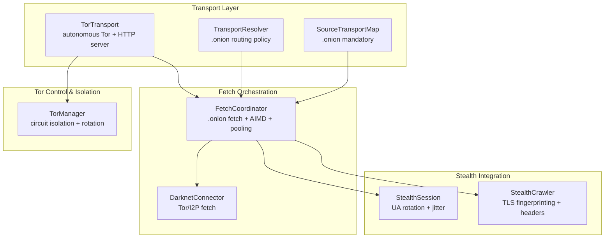
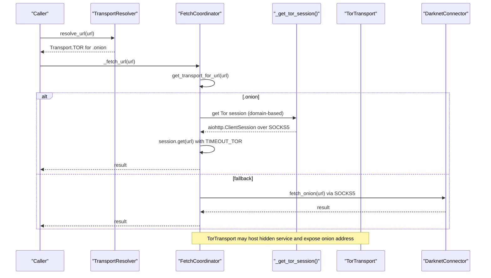
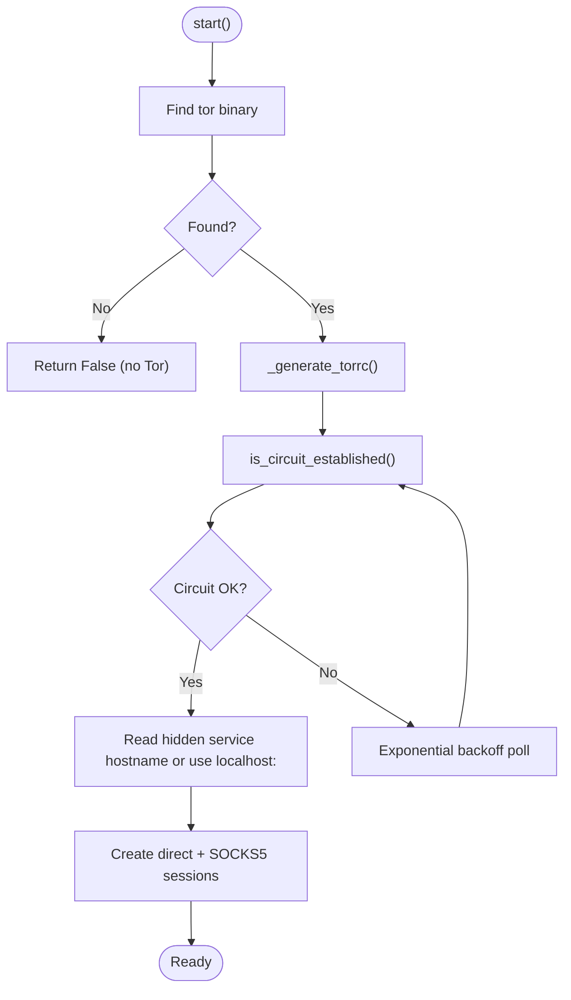
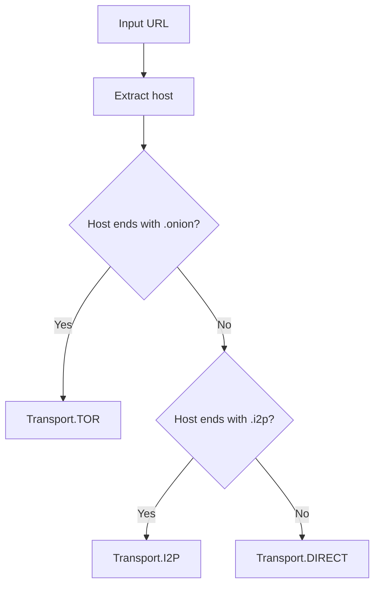
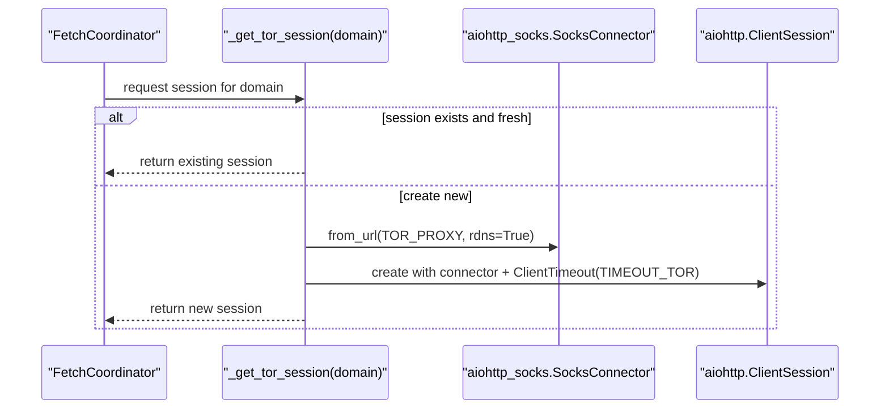
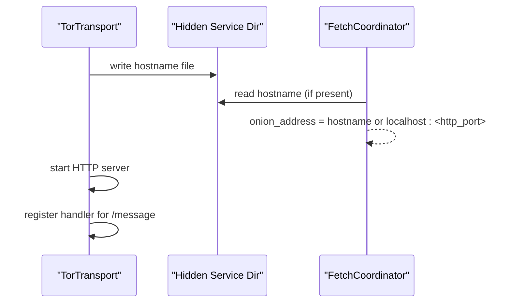
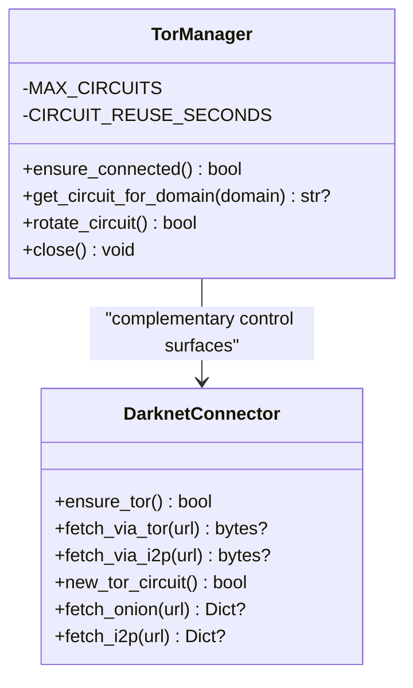
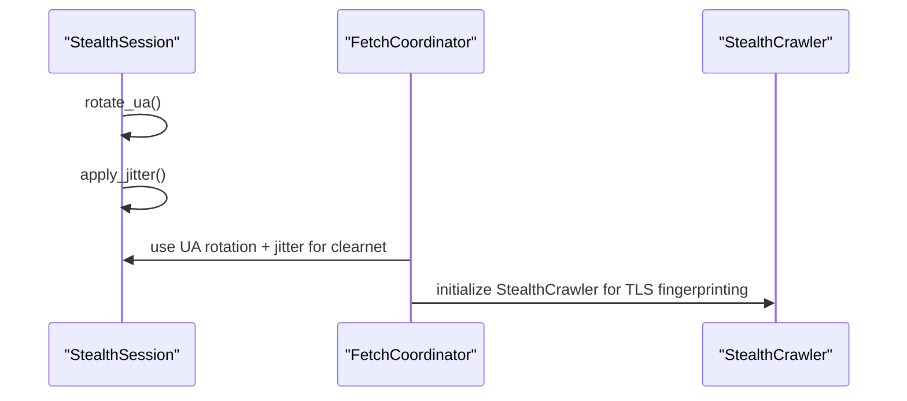
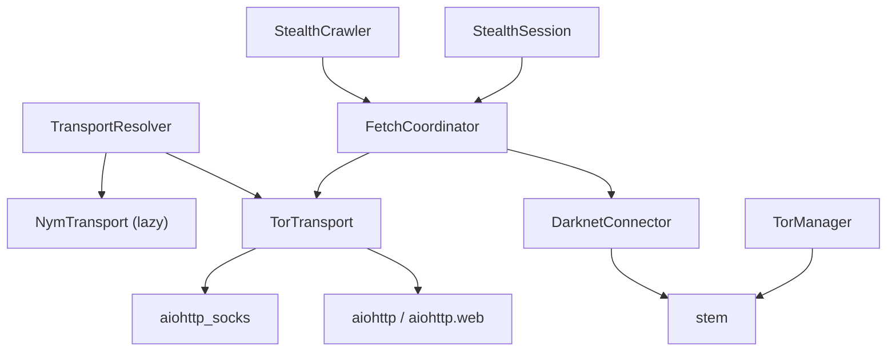

# Tor Transport

<cite>
**Referenced Files in This Document**
- [tor_transport.py](file://transport/tor_transport.py)
- [transport_resolver.py](file://transport/transport_resolver.py)
- [fetch_coordinator.py](file://coordinators/fetch_coordinator.py)
- [paths.py](file://paths.py)
- [darknet.py](file://tools/darknet.py)
- [tor_manager.py](file://network/tor_manager.py)
- [stealth_session.py](file://stealth/stealth_session.py)
- [public_fetcher.py](file://fetching/public_fetcher.py)
- [stealth_crawler.py](file://intelligence/stealth_crawler.py)
- [test_source_transport_map_mandatory.py](file://tests/probe_8pa/test_source_transport_map_mandatory.py)
- [test_transport_resolver_onion_routing.py](file://tests/probe_8pa/test_transport_resolver_onion_routing.py)
- [test_torrc_generated.py](file://tests/probe_8sc/test_torrc_generated.py)
</cite>

## Table of Contents
1. [Introduction](#introduction)
2. [Project Structure](#project-structure)
3. [Core Components](#core-components)
4. [Architecture Overview](#architecture-overview)
5. [Detailed Component Analysis](#detailed-component-analysis)
6. [Dependency Analysis](#dependency-analysis)
7. [Performance Considerations](#performance-considerations)
8. [Troubleshooting Guide](#troubleshooting-guide)
9. [Conclusion](#conclusion)
10. [Appendices](#appendices)

## Introduction
This document explains the Tor transport layer implementation, focusing on Tor circuit establishment, onion service connectivity, and stealth browsing capabilities. It documents the transport resolver integration for .onion URL handling, SOCKS proxy configuration, and circuit management. Concrete examples illustrate Tor-enabled fetch operations, connection pooling, and error handling strategies. Security considerations, latency implications, and performance optimization techniques are addressed alongside the relationship between Tor transport and stealth sessions, and how Tor integrates with the broader transport resolution system.

## Project Structure
The Tor transport implementation spans several modules:
- Transport layer: TorTransport class, transport resolver, and path management
- Fetch orchestration: FetchCoordinator orchestrates .onion fetching with Tor pooling
- Darknet connectivity: DarknetConnector for Tor/I2P access
- Tor control and isolation: TorManager for circuit management
- Stealth integration: StealthSession and StealthCrawler for anti-detection browsing
- Tests: Behavioral validation for .onion routing and torrc generation

**Diagram sources**
- [tor_transport.py:37-206](file://transport/tor_transport.py#L37-L206)
- [transport_resolver.py:69-175](file://transport/transport_resolver.py#L69-L175)
- [fetch_coordinator.py:782-849](file://coordinators/fetch_coordinator.py#L782-L849)
- [darknet.py:41-159](file://tools/darknet.py#L41-L159)
- [tor_manager.py:21-146](file://network/tor_manager.py#L21-L146)
- [stealth_session.py:55-143](file://stealth/stealth_session.py#L55-L143)
- [stealth_crawler.py:56-82](file://intelligence/stealth_crawler.py#L56-L82)

**Section sources**
- [tor_transport.py:1-345](file://transport/tor_transport.py#L1-L345)
- [transport_resolver.py:1-322](file://transport/transport_resolver.py#L1-L322)
- [fetch_coordinator.py:1-1419](file://coordinators/fetch_coordinator.py#L1-L1419)
- [paths.py:254-276](file://paths.py#L254-L276)

## Core Components
- TorTransport: Autonomous Tor daemon startup, SOCKS proxy session creation, hidden service hosting, and circuit readiness checks. Provides a local HTTP server for inter-service messaging and a Tor-backed aiohttp session.
- TransportResolver and SourceTransportMap: Policy gates for .onion routing, ensuring mandatory Tor for .onion domains and classifying other domains to DIRECT or I2P.
- FetchCoordinator: Orchestrates .onion fetches with Tor connection pooling, AIMD concurrency control, timeouts, and fallbacks to DarknetConnector.
- DarknetConnector: Provides Tor/I2P fetch via SOCKS proxies and Tor circuit rotation via stem.
- TorManager: Manages Tor circuits with isolation and rotation for domain-bound traffic.
- StealthSession and StealthCrawler: Provide UA rotation, jitter, and TLS fingerprinting for stealth browsing on clearnet; complement Tor transport for mixed workloads.

**Section sources**
- [tor_transport.py:37-206](file://transport/tor_transport.py#L37-L206)
- [transport_resolver.py:69-175](file://transport/transport_resolver.py#L69-L175)
- [fetch_coordinator.py:782-849](file://coordinators/fetch_coordinator.py#L782-L849)
- [darknet.py:41-159](file://tools/darknet.py#L41-L159)
- [tor_manager.py:21-146](file://network/tor_manager.py#L21-L146)
- [stealth_session.py:55-143](file://stealth/stealth_session.py#L55-L143)
- [stealth_crawler.py:56-82](file://intelligence/stealth_crawler.py#L56-L82)

## Architecture Overview
The Tor transport architecture integrates autonomous Tor startup, policy-driven routing, and robust fetch orchestration:

**Diagram sources**
- [transport_resolver.py:152-170](file://transport/transport_resolver.py#L152-L170)
- [fetch_coordinator.py:1148-1174](file://coordinators/fetch_coordinator.py#L1148-L1174)
- [fetch_coordinator.py:782-821](file://coordinators/fetch_coordinator.py#L782-L821)
- [darknet.py:126-141](file://tools/darknet.py#L126-L141)
- [tor_transport.py:155-164](file://transport/tor_transport.py#L155-L164)

## Detailed Component Analysis

### TorTransport: Autonomous Tor Startup and Messaging
- Autonomous Tor startup: Searches for tor binary, generates minimal torrc if missing, starts Tor as a subprocess, and polls for circuit establishment with exponential backoff.
- Hidden service hosting: Starts a local HTTP server and attempts to read the onion address from the hidden service hostname file; falls back to localhost if unavailable.
- SOCKS proxy sessions: Creates two aiohttp sessions—one direct and one proxied via SOCKS5—to route messages to local endpoints or .onion targets.
- Circuit readiness: Two-stage health check—SOCKS port reachability plus optional stem-based circuit status when available.
- Graceful shutdown: Terminates Tor process, closes sessions, and cleans up HTTP server.

**Diagram sources**
- [tor_transport.py:84-164](file://transport/tor_transport.py#L84-L164)
- [tor_transport.py:15-31](file://transport/tor_transport.py#L15-L31)
- [tor_transport.py:211-240](file://transport/tor_transport.py#L211-L240)

**Section sources**
- [tor_transport.py:15-31](file://transport/tor_transport.py#L15-L31)
- [tor_transport.py:84-164](file://transport/tor_transport.py#L84-L164)
- [tor_transport.py:211-240](file://transport/tor_transport.py#L211-L240)
- [tor_transport.py:246-276](file://transport/tor_transport.py#L246-L276)

### Transport Resolver Integration for .onion Routing
- SourceTransportMap: Maps .onion to mandatory TOR transport and .i2p to I2P transport, ensuring .onion cannot be overridden to DIRECT.
- TransportResolver: Provides policy classification and optional transport selection based on risk/anonymity needs. While resolve() is currently dormant, resolve_url() and is_tor_mandatory() are fast, deterministic helpers used by FetchCoordinator.

**Diagram sources**
- [transport_resolver.py:27-38](file://transport/transport_resolver.py#L27-L38)
- [transport_resolver.py:152-170](file://transport/transport_resolver.py#L152-L170)
- [transport_resolver.py:69-85](file://transport/transport_resolver.py#L69-L85)

**Section sources**
- [transport_resolver.py:69-85](file://transport/transport_resolver.py#L69-L85)
- [transport_resolver.py:152-175](file://transport/transport_resolver.py#L152-L175)
- [transport_resolver.py:268-301](file://transport/transport_resolver.py#L268-L301)

### Tor Connection Pooling in FetchCoordinator
- Domain-scoped pooling: Maintains a bounded number of Tor sessions keyed by domain, with TTL-based cleanup and enforced limits.
- SOCKS proxy configuration: Uses environment variable TOR_PROXY with default socks5://127.0.0.1:9050.
- Timeout matrix: Applies TIMEOUT_TOR for Tor sessions; fetches are wrapped with AIMD concurrency control and failure handling.

**Diagram sources**
- [fetch_coordinator.py:782-821](file://coordinators/fetch_coordinator.py#L782-L821)
- [fetch_coordinator.py:823-849](file://coordinators/fetch_coordinator.py#L823-L849)

**Section sources**
- [fetch_coordinator.py:782-821](file://coordinators/fetch_coordinator.py#L782-L821)
- [fetch_coordinator.py:823-849](file://coordinators/fetch_coordinator.py#L823-L849)

### Onion Service Connectivity and Messaging
- Hidden service address: TorTransport writes a hostname file; FetchCoordinator reads it to configure onion address exposure. If unavailable, it falls back to localhost:<http_port>.
- Inter-service messaging: TorTransport exposes a local HTTP endpoint for message exchange; messages are routed to registered handlers.

**Diagram sources**
- [tor_transport.py:137-147](file://transport/tor_transport.py#L137-L147)
- [tor_transport.py:266-276](file://transport/tor_transport.py#L266-L276)
- [fetch_coordinator.py:1151-1173](file://coordinators/fetch_coordinator.py#L1151-L1173)

**Section sources**
- [tor_transport.py:137-147](file://transport/tor_transport.py#L137-L147)
- [tor_transport.py:266-276](file://transport/tor_transport.py#L266-L276)
- [fetch_coordinator.py:1151-1173](file://coordinators/fetch_coordinator.py#L1151-L1173)

### Tor Circuit Management and Isolation
- TorManager: Provides domain-scoped circuit isolation with bounded concurrency and expiration. Uses stem to create and manage circuits when available.
- DarknetConnector: Offers Tor circuit rotation via NEWNYM and direct SOCKS-based fetch for .onion and .i2p URLs.

**Diagram sources**
- [tor_manager.py:21-146](file://network/tor_manager.py#L21-L146)
- [darknet.py:41-159](file://tools/darknet.py#L41-L159)

**Section sources**
- [tor_manager.py:21-146](file://network/tor_manager.py#L21-L146)
- [darknet.py:96-106](file://tools/darknet.py#L96-L106)

### Stealth Sessions and Tor Integration
- StealthSession: Provides UA rotation and jitter for clearnet requests; complements Tor transport by avoiding correlation across different surfaces.
- StealthCrawler: Uses curl_cffi TLS fingerprinting and header spoofing for stealth on clearnet; Tor transport remains the primary mechanism for .onion connectivity.

**Diagram sources**
- [stealth_session.py:88-116](file://stealth/stealth_session.py#L88-L116)
- [stealth_crawler.py:56-82](file://intelligence/stealth_crawler.py#L56-L82)

**Section sources**
- [stealth_session.py:55-143](file://stealth/stealth_session.py#L55-L143)
- [stealth_crawler.py:56-82](file://intelligence/stealth_crawler.py#L56-L82)

### Concrete Examples

- Tor-enabled fetch operation:
  - FetchCoordinator determines Transport.TOR for .onion URLs, retrieves a Tor session from the pool, and performs an HTTP GET with TIMEOUT_TOR. On failure, it records AIMD failure and may fall back to DarknetConnector.

- Connection pooling:
  - _get_tor_session maintains up to CONCURRENCY_TOR sessions, keyed by domain, with 5-minute TTL and automatic cleanup of oldest sessions when the limit is exceeded.

- Error handling strategies:
  - TorTransport gracefully degrades to localhost messaging when Tor is unavailable, logs warnings, and sets security level to local.
  - FetchCoordinator handles timeouts and failures with AIMD adjustments and retries, and rotates credentials on 401/403 responses.

- SOCKS proxy configuration:
  - TOR_PROXY environment variable controls the SOCKS5 endpoint; defaults to socks5://127.0.0.1:9050.

- Tor-specific security considerations:
  - TorManager enforces domain-scoped circuit isolation and rotation.
  - TorTransport isolates SOCKS authentication and sets MaxCircuitDirtiness and NumEntryGuards for resilience.
  - Paths module ensures sensitive Tor directories are created with restricted permissions.

**Section sources**
- [fetch_coordinator.py:782-849](file://coordinators/fetch_coordinator.py#L782-L849)
- [fetch_coordinator.py:1148-1174](file://coordinators/fetch_coordinator.py#L1148-L1174)
- [tor_transport.py:15-31](file://transport/tor_transport.py#L15-L31)
- [paths.py:374-375](file://paths.py#L374-L375)

## Dependency Analysis
Key dependencies and relationships:
- TorTransport depends on aiohttp/aiohttp.web and aiohttp_socks for HTTP and SOCKS proxy support.
- TransportResolver imports TorTransport and NymTransport lazily to avoid hard dependencies.
- FetchCoordinator depends on DarknetConnector and Tor session pooling for .onion fetches.
- TorManager and DarknetConnector both rely on stem for Tor control.
- StealthSession and StealthCrawler integrate with FetchCoordinator for mixed-mode operations.

**Diagram sources**
- [tor_transport.py:44-61](file://transport/tor_transport.py#L44-L61)
- [transport_resolver.py:134-148](file://transport/transport_resolver.py#L134-L148)
- [fetch_coordinator.py:471-477](file://coordinators/fetch_coordinator.py#L471-L477)
- [darknet.py:22-30](file://tools/darknet.py#L22-L30)
- [tor_manager.py:10-18](file://network/tor_manager.py#L10-L18)
- [stealth_session.py:55-143](file://stealth/stealth_session.py#L55-L143)
- [stealth_crawler.py:56-82](file://intelligence/stealth_crawler.py#L56-L82)

**Section sources**
- [tor_transport.py:44-61](file://transport/tor_transport.py#L44-L61)
- [transport_resolver.py:134-148](file://transport/transport_resolver.py#L134-L148)
- [fetch_coordinator.py:471-477](file://coordinators/fetch_coordinator.py#L471-L477)
- [darknet.py:22-30](file://tools/darknet.py#L22-L30)
- [tor_manager.py:10-18](file://network/tor_manager.py#L10-L18)
- [stealth_session.py:55-143](file://stealth/stealth_session.py#L55-L143)
- [stealth_crawler.py:56-82](file://intelligence/stealth_crawler.py#L56-L82)

## Performance Considerations
- Latency implications:
  - Tor introduces significant latency due to multi-hop routing and hidden service rendezvous. TIMEOUT_TOR is set to 75 seconds to accommodate worst-case scenarios.
  - AIMD concurrency control dynamically adjusts parallelism based on success/failure feedback to balance throughput and reliability.

- Connection pooling:
  - Tor sessions are domain-scoped and reused with TTL-based cleanup, limiting overhead while preventing resource exhaustion.

- Operational optimizations:
  - TorTransport’s exponential backoff reduces busy-waiting during circuit establishment.
  - TorManager bounds concurrent circuits and enforces expiration to prevent long-lived circuit accumulation.

- Stealth vs. Tor:
  - StealthSession jitter and UA rotation reduce correlation on clearnet; Tor transport remains the primary mechanism for .onion access.

[No sources needed since this section provides general guidance]

## Troubleshooting Guide
Common issues and remedies:
- Tor binary not found:
  - TorTransport logs an error and returns False. Install Tor and ensure it is discoverable via PATH.

- Circuit not established:
  - TorTransport uses exponential backoff polling and raises an error after a maximum wait. Verify torrc generation and ports.

- Hidden service hostname missing:
  - TorTransport falls back to localhost:<http_port> and marks security level as local. Ensure hidden service directory is writable.

- SOCKS proxy unreachable:
  - is_circuit_established() performs a two-stage check (SOCKS port + stem). If stem is unavailable, SOCKS check is used as a fallback.

- Fetch failures:
  - FetchCoordinator records AIMD failures on timeouts and other errors, and retries with exponential backoff. Review logs for specific failure reasons.

- Environment configuration:
  - TOR_PROXY controls the SOCKS endpoint for Tor sessions. Ensure it points to the correct local Tor SOCKS port.

**Section sources**
- [tor_transport.py:86-89](file://transport/tor_transport.py#L86-L89)
- [tor_transport.py:122-135](file://transport/tor_transport.py#L122-L135)
- [tor_transport.py:149-152](file://transport/tor_transport.py#L149-L152)
- [tor_transport.py:211-240](file://transport/tor_transport.py#L211-L240)
- [fetch_coordinator.py:841-849](file://coordinators/fetch_coordinator.py#L841-L849)

## Conclusion
The Tor transport layer integrates autonomous Tor startup, policy-driven routing, and robust fetch orchestration. TorTransport provides a resilient SOCKS-backed session and hidden service hosting, while TransportResolver and SourceTransportMap enforce .onion routing mandates. FetchCoordinator’s Tor pooling, AIMD control, and fallback mechanisms ensure reliable .onion connectivity. TorManager and DarknetConnector complement these capabilities with circuit isolation and rotation. Together with StealthSession and StealthCrawler, the system balances stealth browsing with Tor transport for secure and anonymous access to onion services.

[No sources needed since this section summarizes without analyzing specific files]

## Appendices

### Appendix A: Test Coverage Highlights
- Mandatory .onion routing: SourceTransportMap and TransportResolver enforce .onion → TOR and never DIRECT.
- torrc generation: Automated creation of minimal torrc with required directives.
- Fast classification: resolve_url() performs fast, deterministic classification suitable for high-throughput routing.

**Section sources**
- [test_source_transport_map_mandatory.py:10-32](file://tests/probe_8pa/test_source_transport_map_mandatory.py#L10-L32)
- [test_transport_resolver_onion_routing.py:10-65](file://tests/probe_8pa/test_transport_resolver_onion_routing.py#L10-L65)
- [test_torrc_generated.py:12-26](file://tests/probe_8sc/test_torrc_generated.py#L12-L26)