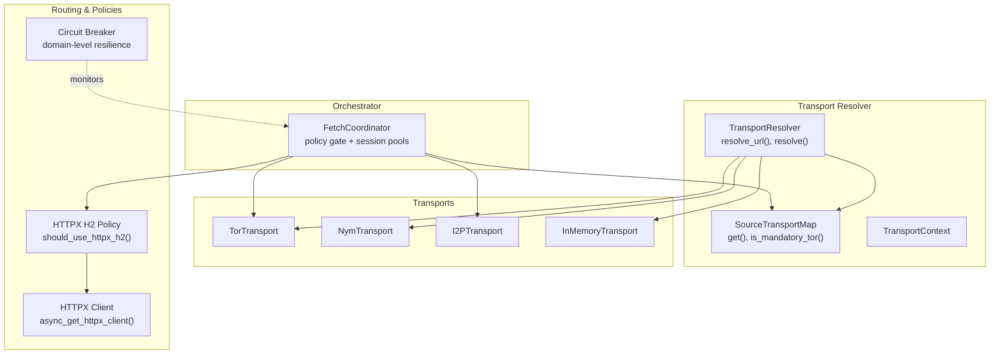
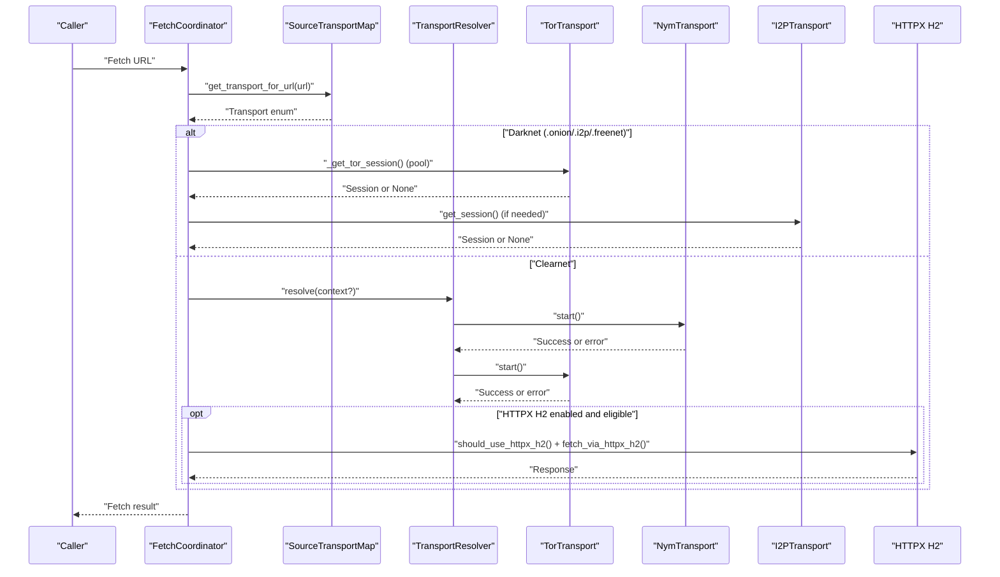
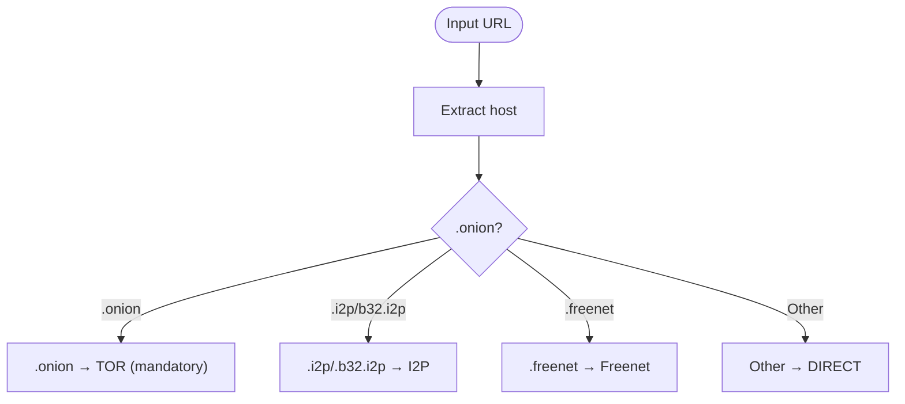
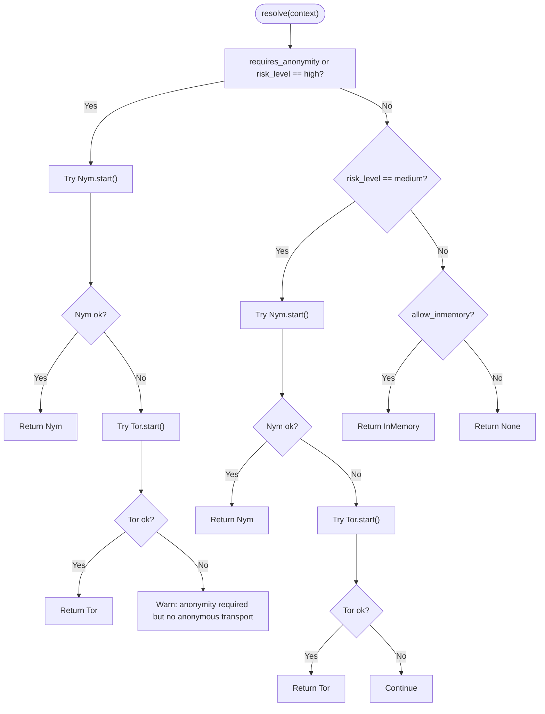
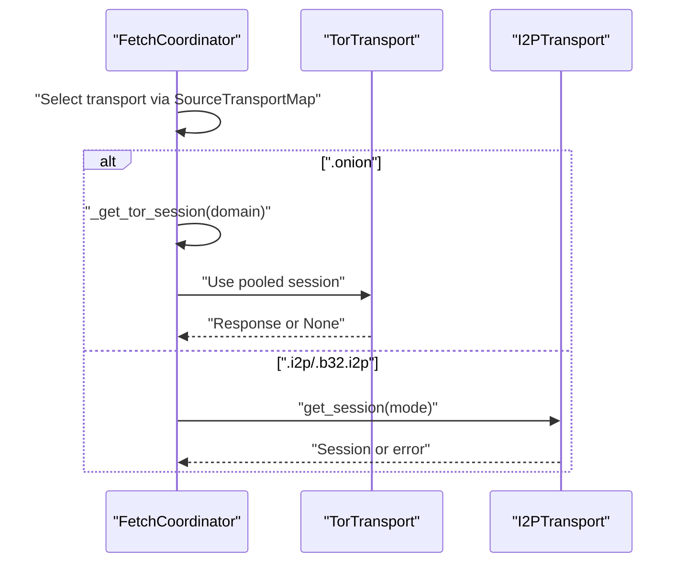
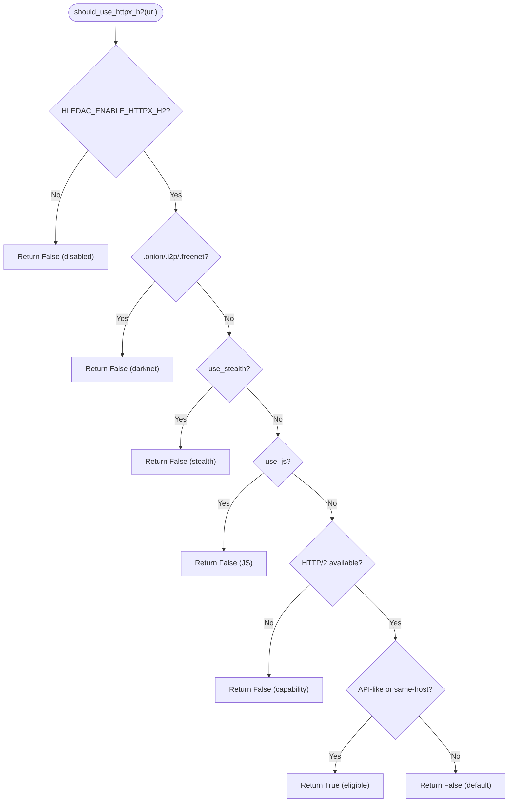
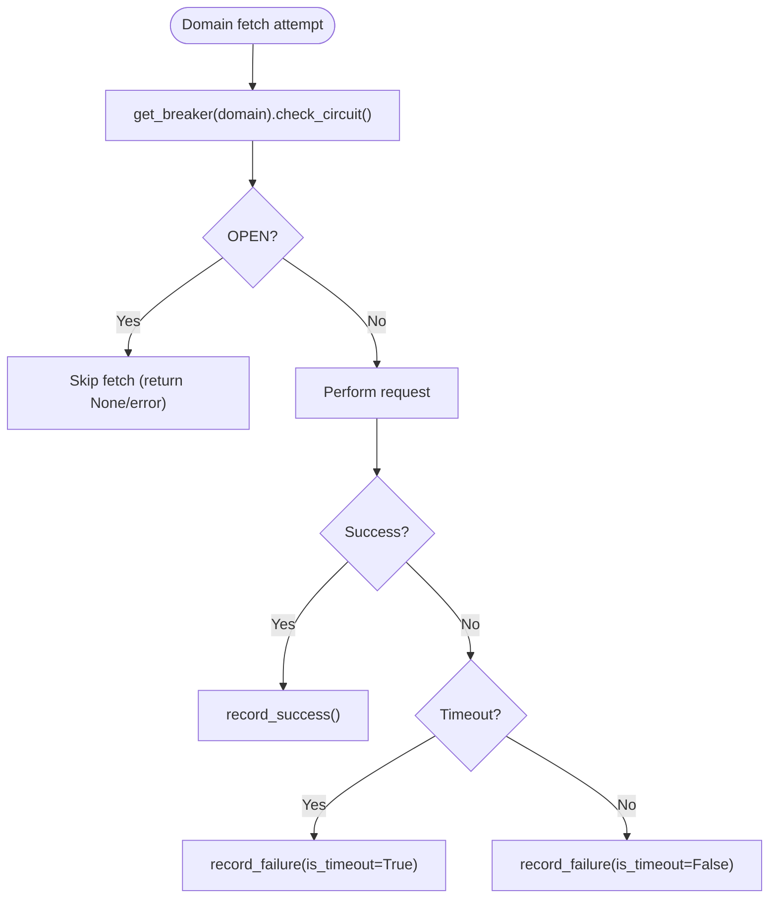
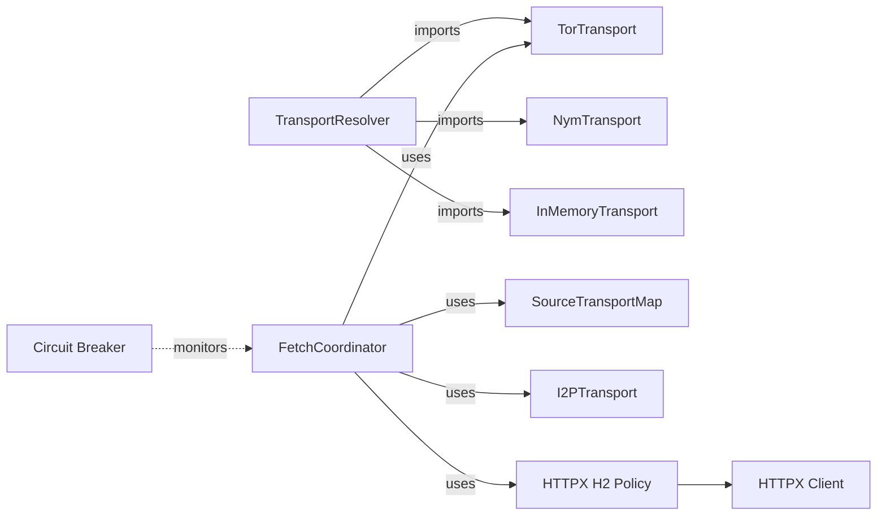

# Transport Resolver

<cite>
**Referenced Files in This Document**
- [transport_resolver.py](file://transport/transport_resolver.py)
- [base.py](file://transport/base.py)
- [tor_transport.py](file://transport/tor_transport.py)
- [nym_transport.py](file://transport/nym_transport.py)
- [i2p_transport.py](file://transport/i2p_transport.py)
- [inmemory_transport.py](file://transport/inmemory_transport.py)
- [httpx_transport.py](file://transport/httpx_transport.py)
- [httpx_client.py](file://transport/httpx_client.py)
- [circuit_breaker.py](file://transport/circuit_breaker.py)
- [fetch_coordinator.py](file://coordinators/fetch_coordinator.py)
- [test_sprint64_transport_resolver.py](file://tests/test_sprint64_transport_resolver.py)
</cite>

## Table of Contents
1. [Introduction](#introduction)
2. [Project Structure](#project-structure)
3. [Core Components](#core-components)
4. [Architecture Overview](#architecture-overview)
5. [Detailed Component Analysis](#detailed-component-analysis)
6. [Dependency Analysis](#dependency-analysis)
7. [Performance Considerations](#performance-considerations)
8. [Troubleshooting Guide](#troubleshooting-guide)
9. [Conclusion](#conclusion)
10. [Appendices](#appendices)

## Introduction
This document explains the transport resolver system that autonomously selects and routes network transports for fetch operations. It covers URL classification algorithms, transport capability evaluation, routing decision logic, and integration with Tor, I2P, and HTTPX H2 lanes. It also documents policy configuration, fallback mechanisms, load balancing, failover strategies, and performance optimization. The resolver coordinates with other transport components to maintain consistency across request types and network conditions.

## Project Structure
The transport resolver resides in the transport package and integrates with the fetch coordinator and auxiliary transport modules. Key areas:
- URL classification and policy gating
- Transport capability probing and selection
- HTTPX H2 capability and routing
- Circuit breaker domain-level resilience
- Tor/I2P session pools and HTTPX client surfaces

**Diagram sources**
- [transport_resolver.py:95-322](file://transport/transport_resolver.py#L95-L322)
- [httpx_transport.py:149-218](file://transport/httpx_transport.py#L149-L218)
- [httpx_client.py:93-152](file://transport/httpx_client.py#L93-L152)
- [circuit_breaker.py:78-186](file://transport/circuit_breaker.py#L78-L186)
- [fetch_coordinator.py:823-849](file://coordinators/fetch_coordinator.py#L823-L849)

**Section sources**
- [transport_resolver.py:1-322](file://transport/transport_resolver.py#L1-L322)
- [httpx_transport.py:1-391](file://transport/httpx_transport.py#L1-L391)
- [httpx_client.py:1-213](file://transport/httpx_client.py#L1-L213)
- [circuit_breaker.py:1-428](file://transport/circuit_breaker.py#L1-L428)
- [fetch_coordinator.py:1-1419](file://coordinators/fetch_coordinator.py#L1-L1419)

## Core Components
- TransportResolver: Autonomous selection without configuration toggles. Uses runtime signals and availability to choose transports. Priority: Nym > Tor > Direct > InMemory. Currently dormant in production; policy seam is active.
- SourceTransportMap: Fast, deterministic mapping from URL domain suffixes to transport worlds (.onion → mandatory Tor; .i2p → I2P; .freenet → Freenet; others → DIRECT).
- TransportContext: Runtime context for anonymity and risk level to guide selection.
- TorTransport: SOCKS5-based proxy transport with Tor circuit establishment, health checks, and message sending.
- NymTransport: WebSocket-based anonymous transport with circuit breaker and queueing.
- I2PTransport: Multi-mode transport supporting SOCKS, SAM, and HTTP proxies with graceful fallback.
- InMemoryTransport: Internal/testing transport for in-process message passing.
- HTTPX H2 Policy and Client: Optional HTTP/2 lane for clearnet API-like URLs; integrated via should_use_httpx_h2() and async_get_httpx_client().
- Circuit Breaker: Domain-level resilience with OPEN/HALF_OPEN/CLOSED states and LRU registry.

**Section sources**
- [transport_resolver.py:95-322](file://transport/transport_resolver.py#L95-L322)
- [base.py:1-24](file://transport/base.py#L1-L24)
- [tor_transport.py:37-345](file://transport/tor_transport.py#L37-L345)
- [nym_transport.py:14-239](file://transport/nym_transport.py#L14-L239)
- [i2p_transport.py:41-315](file://transport/i2p_transport.py#L41-L315)
- [inmemory_transport.py:8-92](file://transport/inmemory_transport.py#L8-L92)
- [httpx_transport.py:149-218](file://transport/httpx_transport.py#L149-L218)
- [httpx_client.py:93-152](file://transport/httpx_client.py#L93-L152)
- [circuit_breaker.py:78-186](file://transport/circuit_breaker.py#L78-L186)

## Architecture Overview
The resolver operates as a policy seam layered over the production fetch path. It classifies URLs and optionally selects transports based on runtime context. The fetch coordinator applies SourceTransportMap policy gates alongside dedicated session pools for Tor and I2P, and falls back to curl_cffi/StealthCrawler for stealth and JS-rendering needs. HTTPX H2 is an optional clearnet lane gated by policy and capability detection.

**Diagram sources**
- [fetch_coordinator.py:823-849](file://coordinators/fetch_coordinator.py#L823-L849)
- [transport_resolver.py:152-239](file://transport/transport_resolver.py#L152-L239)
- [httpx_transport.py:149-218](file://transport/httpx_transport.py#L149-L218)

## Detailed Component Analysis

### URL Classification and Policy Gating
- SourceTransportMap.get(url_suffix) returns the transport world for a URL’s domain suffix. Mandatory Tor for .onion; I2P for .i2p and .b32.i2p; Freenet for .freenet; DIRECT otherwise.
- get_transport_for_url(url) mirrors the mapping for explicit policy usage and builds a transport hint string for opsec policy.
- is_tor_mandatory(url) returns True for .onion suffixes.

**Diagram sources**
- [transport_resolver.py:27-37](file://transport/transport_resolver.py#L27-L37)
- [transport_resolver.py:268-301](file://transport/transport_resolver.py#L268-L301)

**Section sources**
- [transport_resolver.py:69-85](file://transport/transport_resolver.py#L69-L85)
- [transport_resolver.py:268-318](file://transport/transport_resolver.py#L268-L318)

### Transport Capability Evaluation and Selection
- TransportResolver.resolve_url(url) performs fast, deterministic classification without side effects.
- TransportResolver.resolve(context) evaluates anonymity and risk:
  - High anonymity/risk → prefer Nym; if unavailable, fallback to Tor; warn if neither available.
  - Medium risk → attempt Nym or Tor if available.
  - Low risk or fallback → return InMemory if allow_inmemory is True; otherwise return None.
- Availability is lazily checked by importing transport modules; graceful fallbacks are logged.

**Diagram sources**
- [transport_resolver.py:176-239](file://transport/transport_resolver.py#L176-L239)

**Section sources**
- [transport_resolver.py:124-151](file://transport/transport_resolver.py#L124-L151)
- [transport_resolver.py:176-239](file://transport/transport_resolver.py#L176-L239)

### Integration with Tor and I2P
- Tor: FetchCoordinator maintains a per-domain SOCKS5 session pool for .onion with timeouts and AIMD adjustments. Health checks verify SOCKS connectivity and optional stem circuit status.
- I2P: I2PTransport attempts SOCKS, SAM, and HTTP modes in order, falling back gracefully. FetchCoordinator can use I2P sessions for .i2p/.b32.i2p URLs.

**Diagram sources**
- [fetch_coordinator.py:804-821](file://coordinators/fetch_coordinator.py#L804-L821)
- [fetch_coordinator.py:823-849](file://coordinators/fetch_coordinator.py#L823-L849)
- [i2p_transport.py:244-274](file://transport/i2p_transport.py#L244-L274)

**Section sources**
- [fetch_coordinator.py:804-821](file://coordinators/fetch_coordinator.py#L804-L821)
- [fetch_coordinator.py:823-849](file://coordinators/fetch_coordinator.py#L823-L849)
- [i2p_transport.py:93-123](file://transport/i2p_transport.py#L93-L123)

### HTTPX H2 Routing Decision Logic
- should_use_httpx_h2(url, use_stealth, use_js) returns whether HTTPX H2 is eligible:
  - Clearnet only (rejects .onion/.i2p/.freenet)
  - Disables stealth and JS rendering modes
  - Requires HTTP/2 capability and environment gate
  - Eligible if API-like or same-host batch pattern
- fetch_via_httpx_h2(url, ...) executes HTTP/2 fetch with manual redirect handling and SSRF protections.

**Diagram sources**
- [httpx_transport.py:149-218](file://transport/httpx_transport.py#L149-L218)

**Section sources**
- [httpx_transport.py:149-218](file://transport/httpx_transport.py#L149-L218)
- [httpx_client.py:93-152](file://transport/httpx_client.py#L93-L152)

### Circuit Breaker and Resilience
- Domain-level circuit breaker tracks consecutive failures and timeouts, transitioning between CLOSED, OPEN, and HALF_OPEN states.
- FetchCoordinator uses domain breaker checks before making requests and adjusts concurrency via AIMD on failures.
- HTTPX H2 path uses the same breaker for resilience.

**Diagram sources**
- [circuit_breaker.py:100-146](file://transport/circuit_breaker.py#L100-L146)
- [circuit_breaker.py:326-379](file://transport/circuit_breaker.py#L326-L379)

**Section sources**
- [circuit_breaker.py:78-186](file://transport/circuit_breaker.py#L78-L186)
- [circuit_breaker.py:326-379](file://transport/circuit_breaker.py#L326-L379)
- [fetch_coordinator.py:841-849](file://coordinators/fetch_coordinator.py#L841-L849)

### Transport Resolution Scenarios and Examples
- .onion URL: SourceTransportMap mandates TOR; resolver.resolve_url returns TOR; FetchCoordinator uses Tor session pool.
- .i2p URL: SourceTransportMap returns I2P; resolver.resolve_url returns I2P; FetchCoordinator uses I2P session.
- .freenet URL: SourceTransportMap returns FREENET; FetchCoordinator routes via HTTP proxy.
- Clearnet API-like URL: HTTPX H2 policy may select HTTPX H2 if enabled and eligible; otherwise aiohttp is used.
- High-risk request: TransportResolver prefers Nym; if unavailable, Tor; warns if neither available.
- Low-risk internal test: TransportResolver returns InMemory if allow_inmemory is True.

**Section sources**
- [transport_resolver.py:152-175](file://transport/transport_resolver.py#L152-L175)
- [transport_resolver.py:268-301](file://transport/transport_resolver.py#L268-L301)
- [httpx_transport.py:149-218](file://transport/httpx_transport.py#L149-L218)
- [fetch_coordinator.py:823-849](file://coordinators/fetch_coordinator.py#L823-L849)

### Policy Configuration and Fallback Mechanisms
- No configuration toggles in transport module: decisions are runtime-driven.
- get_transport_for_url() and SourceTransportMap provide explicit policy classification without changing execution.
- Fallbacks:
  - Anonymous transports unavailable → warn and continue with lower-priority lanes.
  - HTTPX H2 disabled or unavailable → fallback to aiohttp.
  - I2P mode detection fails → mark transport unavailable and continue.
  - InMemory transport used only when explicitly allowed.

**Section sources**
- [transport_resolver.py:1-17](file://transport/transport_resolver.py#L1-L17)
- [transport_resolver.py:268-318](file://transport/transport_resolver.py#L268-L318)
- [httpx_client.py:48-81](file://transport/httpx_client.py#L48-L81)
- [i2p_transport.py:93-123](file://transport/i2p_transport.py#L93-L123)

### Load Balancing, Failover, and Performance Optimization
- Concurrency matrices and AIMD:
  - FetchCoordinator defines per-transport concurrency caps and adaptive windowing to balance throughput and stability.
  - On timeouts/errors, concurrency is reduced; on sustained success, increased gradually.
- HTTPX H2:
  - Higher connection limits and HTTP/2 multiplexing for same-host API batches.
  - Manual redirect handling and SSRF protections reduce overhead and attack surface.
- Tor/I2P:
  - Session pooling reduces handshake costs.
  - Health checks and graceful fallbacks minimize downtime.

**Section sources**
- [fetch_coordinator.py:123-146](file://coordinators/fetch_coordinator.py#L123-L146)
- [httpx_client.py:121-149](file://transport/httpx_client.py#L121-L149)
- [tor_transport.py:211-240](file://transport/tor_transport.py#L211-L240)
- [i2p_transport.py:244-274](file://transport/i2p_transport.py#L244-L274)

## Dependency Analysis
The resolver depends on transport implementations and policy modules. FetchCoordinator integrates SourceTransportMap and maintains transport-specific session pools. HTTPX H2 is optional and gated by environment and capability checks. Circuit breaker is shared across clearnet fetch paths.

**Diagram sources**
- [transport_resolver.py:124-151](file://transport/transport_resolver.py#L124-L151)
- [fetch_coordinator.py:823-849](file://coordinators/fetch_coordinator.py#L823-L849)
- [httpx_transport.py:149-218](file://transport/httpx_transport.py#L149-L218)
- [httpx_client.py:93-152](file://transport/httpx_client.py#L93-L152)
- [circuit_breaker.py:198-205](file://transport/circuit_breaker.py#L198-L205)

**Section sources**
- [transport_resolver.py:124-151](file://transport/transport_resolver.py#L124-L151)
- [fetch_coordinator.py:823-849](file://coordinators/fetch_coordinator.py#L823-L849)
- [httpx_transport.py:149-218](file://transport/httpx_transport.py#L149-L218)
- [circuit_breaker.py:198-205](file://transport/circuit_breaker.py#L198-L205)

## Performance Considerations
- Fast classification: SourceTransportMap and get_transport_for_url() rely on suffix checks and dictionary lookups for O(1) performance.
- Lazy initialization: HTTPX client and transport instances are created on first use to avoid startup overhead.
- Connection reuse: Tor and I2P session pools reduce handshake latency.
- Adaptive concurrency: AIMD adjusts window sizes based on observed success/failure rates.
- HTTP/2 multiplexing: For same-host API batches, HTTPX H2 reduces head-of-line blocking and improves throughput.

[No sources needed since this section provides general guidance]

## Troubleshooting Guide
- Tor not available:
  - Symptoms: TorTransport.start() fails or returns False; warnings logged.
  - Actions: Install Tor, verify tor binary and torrc; check SOCKS/control ports; review health checks.
- Nym not available:
  - Symptoms: NymTransport.start() raises or circuit breaker opens; warnings logged.
  - Actions: Ensure nym-client is installed and reachable; monitor websocket connectivity; circuit breaker resets after timeout.
- HTTPX H2 disabled:
  - Symptoms: should_use_httpx_h2() returns False due to environment or capability checks.
  - Actions: Install httpx and h2; set HLEDAC_ENABLE_HTTPX_H2; verify async_get_httpx_client() availability.
- I2P mode detection:
  - Symptoms: I2PTransport.start() fails to establish any mode; available becomes False.
  - Actions: Verify I2P router SOCKS/SAM/HTTP proxy availability; check ports and firewall.
- Circuit breaker open:
  - Symptoms: Requests skipped or delayed; breaker reports OPEN/HALF_OPEN.
  - Actions: Investigate domain-specific failures; allow recovery timeout; reduce load or improve upstream reliability.

**Section sources**
- [tor_transport.py:84-164](file://transport/tor_transport.py#L84-L164)
- [nym_transport.py:52-96](file://transport/nym_transport.py#L52-L96)
- [httpx_client.py:48-81](file://transport/httpx_client.py#L48-L81)
- [i2p_transport.py:93-123](file://transport/i2p_transport.py#L93-L123)
- [circuit_breaker.py:91-146](file://transport/circuit_breaker.py#L91-L146)

## Conclusion
The transport resolver provides a policy-first, runtime-driven approach to transport selection. It cleanly separates classification from execution, integrates with Tor/I2P pools and HTTPX H2, and leverages a domain-level circuit breaker for resilience. While the resolver’s resolve() method is currently dormant, SourceTransportMap and get_transport_for_url() serve as robust policy seams that the fetch coordinator uses to route requests efficiently across clearnet, Tor, I2P, and optional HTTPX H2 lanes.

## Appendices

### API Definitions and Behavior Guarantees
- get_transport_for_url(url): Deterministic, side-effect-free classification; returns TOR/I2P/FREENET/DIRECT.
- TransportResolver.resolve_url(url): Same semantics as policy classification; fast and deterministic.
- TransportResolver.resolve(context): Asynchronous selection with availability probing and fallbacks.
- HTTPX H2 policy: Environment-gated, capability-checked, and restricted to clearnet API-like URLs.

**Section sources**
- [transport_resolver.py:268-318](file://transport/transport_resolver.py#L268-L318)
- [transport_resolver.py:176-239](file://transport/transport_resolver.py#L176-L239)
- [httpx_transport.py:149-218](file://transport/httpx_transport.py#L149-L218)

### Test Coverage Highlights
- Import safety without dependencies.
- TransportResolver instantiation and context creation.
- Fallback behavior to InMemory and None.
- InMemoryTransport basic operations and peer registration.

**Section sources**
- [test_sprint64_transport_resolver.py:13-138](file://tests/test_sprint64_transport_resolver.py#L13-L138)