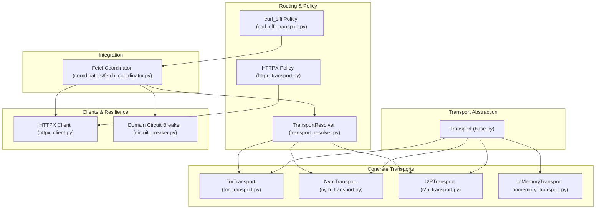
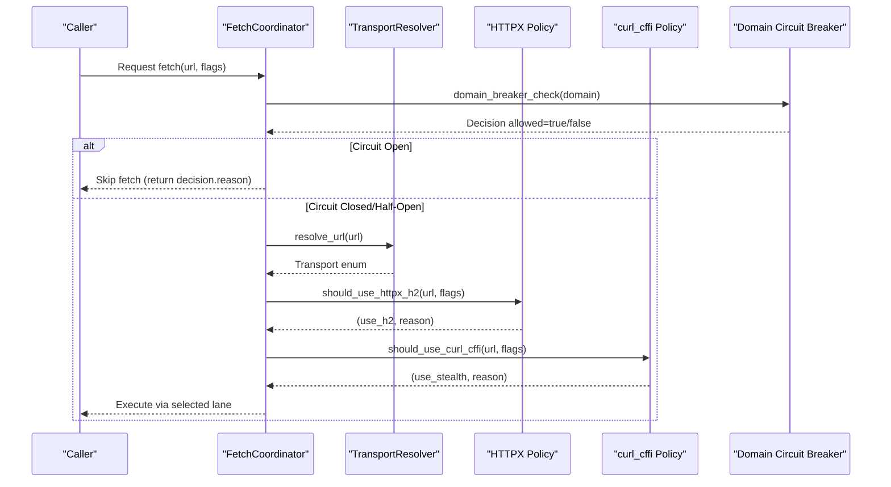
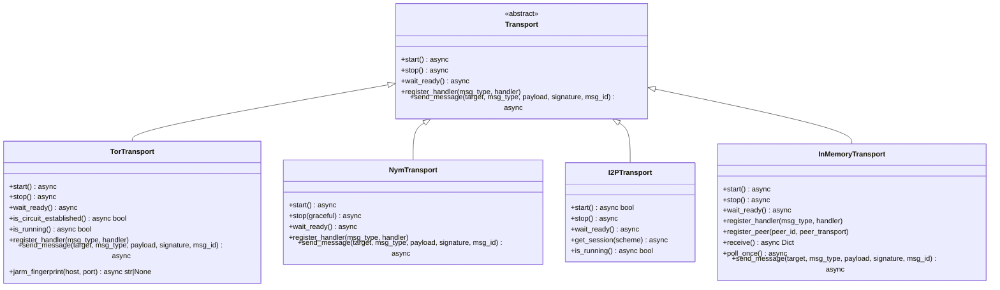
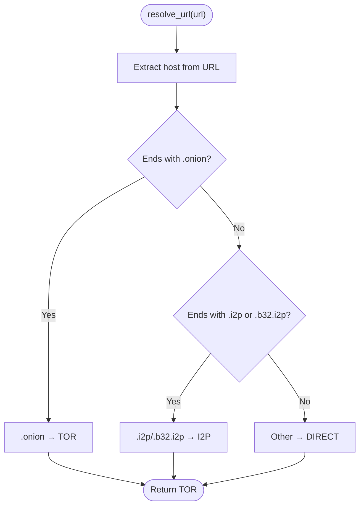
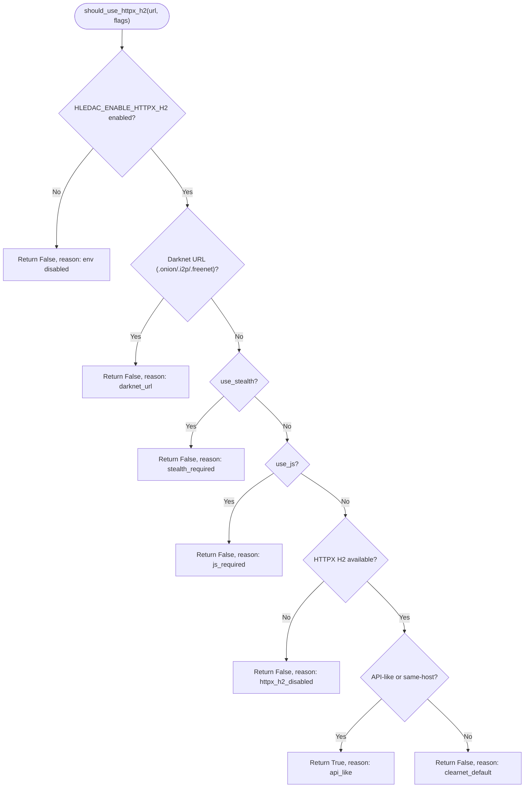
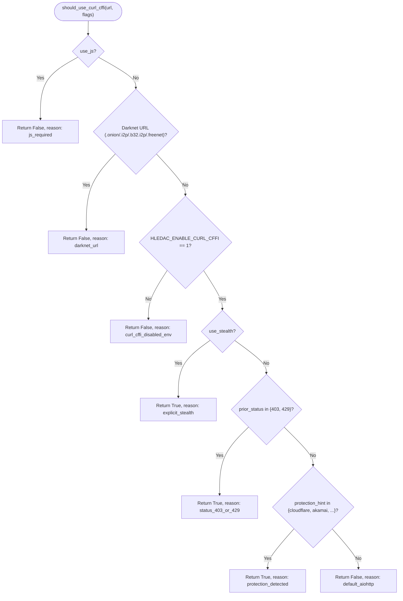
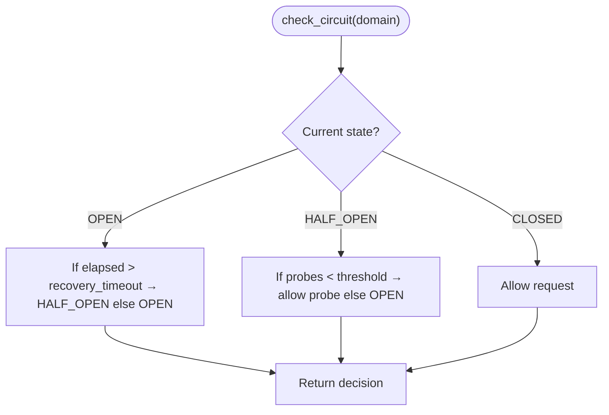
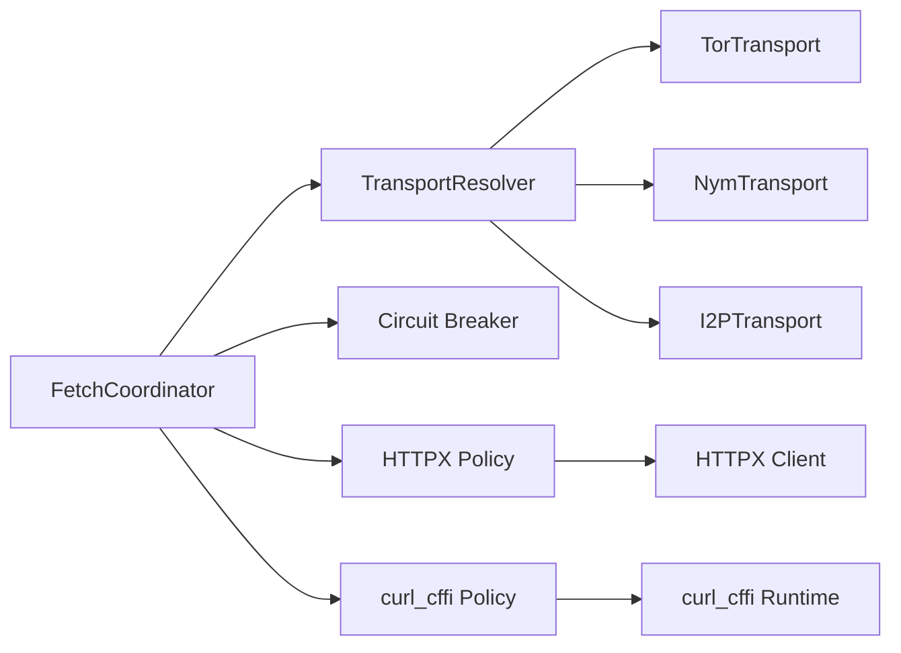

# Transport and Networking

<cite>
**Referenced Files in This Document**
- [transport/__init__.py](file://transport/__init__.py)
- [transport/base.py](file://transport/base.py)
- [transport/transport_resolver.py](file://transport/transport_resolver.py)
- [transport/tor_transport.py](file://transport/tor_transport.py)
- [transport/nym_transport.py](file://transport/nym_transport.py)
- [transport/i2p_transport.py](file://transport/i2p_transport.py)
- [transport/inmemory_transport.py](file://transport/inmemory_transport.py)
- [transport/httpx_transport.py](file://transport/httpx_transport.py)
- [transport/httpx_client.py](file://transport/httpx_client.py)
- [transport/curl_cffi_transport.py](file://transport/curl_cffi_transport.py)
- [transport/curl_cffi_runtime.py](file://transport/curl_cffi_runtime.py)
- [transport/circuit_breaker.py](file://transport/circuit_breaker.py)
- [coordinators/fetch_coordinator.py](file://coordinators/fetch_coordinator.py)
</cite>

## Table of Contents
1. [Introduction](#introduction)
2. [Project Structure](#project-structure)
3. [Core Components](#core-components)
4. [Architecture Overview](#architecture-overview)
5. [Detailed Component Analysis](#detailed-component-analysis)
6. [Dependency Analysis](#dependency-analysis)
7. [Performance Considerations](#performance-considerations)
8. [Troubleshooting Guide](#troubleshooting-guide)
9. [Conclusion](#conclusion)
10. [Appendices](#appendices)

## Introduction
This document explains the transport and networking subsystem that powers secure, resilient, and efficient data fetching across clearnet, Tor, I2P, and stealth lanes. It covers the transport abstraction, routing policies, protocol support, security controls, and integration points with the broader system. The focus is on practical usage, configuration, and operational guidance for both newcomers and experienced engineers.

## Project Structure
The transport layer is organized around a small set of cohesive modules:
- A base transport interface that defines the contract for all transports
- Concrete transports for Tor, Nym, I2P, and in-memory testing
- A transport resolver that classifies URLs and selects transports based on runtime context
- HTTPX and curl_cffi capability lanes for optimized and stealth HTTP fetching
- A domain circuit breaker for resilience against cascading failures
- Integration with the FetchCoordinator for production fetch orchestration

**Diagram sources**
- [transport/base.py:1-24](file://transport/base.py#L1-L24)
- [transport/tor_transport.py:37-345](file://transport/tor_transport.py#L37-L345)
- [transport/nym_transport.py:14-239](file://transport/nym_transport.py#L14-L239)
- [transport/i2p_transport.py:41-315](file://transport/i2p_transport.py#L41-L315)
- [transport/inmemory_transport.py:8-92](file://transport/inmemory_transport.py#L8-L92)
- [transport/transport_resolver.py:95-322](file://transport/transport_resolver.py#L95-L322)
- [transport/httpx_transport.py:1-391](file://transport/httpx_transport.py#L1-L391)
- [transport/httpx_client.py:1-213](file://transport/httpx_client.py#L1-L213)
- [transport/curl_cffi_transport.py:1-86](file://transport/curl_cffi_transport.py#L1-L86)
- [transport/circuit_breaker.py:1-428](file://transport/circuit_breaker.py#L1-L428)
- [coordinators/fetch_coordinator.py:1-800](file://coordinators/fetch_coordinator.py#L1-L800)

**Section sources**
- [transport/__init__.py:1-16](file://transport/__init__.py#L1-L16)
- [transport/base.py:1-24](file://transport/base.py#L1-L24)
- [transport/transport_resolver.py:1-322](file://transport/transport_resolver.py#L1-L322)
- [transport/httpx_transport.py:1-391](file://transport/httpx_transport.py#L1-L391)
- [transport/circuit_breaker.py:1-428](file://transport/circuit_breaker.py#L1-L428)
- [coordinators/fetch_coordinator.py:1-800](file://coordinators/fetch_coordinator.py#L1-L800)

## Core Components
- Transport interface: Defines the lifecycle and messaging contract for all transports.
- Concrete transports:
  - TorTransport: SOCKS5-based Tor with optional local fallback and hidden service support.
  - NymTransport: WebSocket-based anonymous messaging with circuit breaker and reconnection.
  - I2PTransport: SOCKS5/SAM/HTTP proxy modes for I2P with graceful fallback.
  - InMemoryTransport: In-process messaging for testing and internal buses.
- Routing and policy:
  - TransportResolver: URL-based classification and optional context-driven selection.
  - HTTPX policy and client: Optional HTTP/2 lane with capability detection and safety.
  - curl_cffi policy and runtime: Optional stealth lane with session caching and LRU eviction.
- Resilience:
  - Domain Circuit Breaker: Tracks failures per domain and opens the circuit to prevent cascading failures.

**Section sources**
- [transport/base.py:4-24](file://transport/base.py#L4-L24)
- [transport/tor_transport.py:37-345](file://transport/tor_transport.py#L37-L345)
- [transport/nym_transport.py:14-239](file://transport/nym_transport.py#L14-L239)
- [transport/i2p_transport.py:41-315](file://transport/i2p_transport.py#L41-L315)
- [transport/inmemory_transport.py:8-92](file://transport/inmemory_transport.py#L8-L92)
- [transport/transport_resolver.py:95-322](file://transport/transport_resolver.py#L95-L322)
- [transport/httpx_transport.py:149-391](file://transport/httpx_transport.py#L149-L391)
- [transport/httpx_client.py:48-213](file://transport/httpx_client.py#L48-L213)
- [transport/curl_cffi_transport.py:34-86](file://transport/curl_cffi_transport.py#L34-L86)
- [transport/curl_cffi_runtime.py:37-181](file://transport/curl_cffi_runtime.py#L37-L181)
- [transport/circuit_breaker.py:78-228](file://transport/circuit_breaker.py#L78-L228)

## Architecture Overview
The transport subsystem is intentionally modular and layered:
- The TransportResolver class provides policy classification and optional transport selection.
- Concrete transports encapsulate protocol-specific connectors and lifecycles.
- HTTPX and curl_cffi are optional capability lanes integrated via policy functions.
- The FetchCoordinator coordinates fetches, applies domain circuit breaking, and manages concurrency.

**Diagram sources**
- [transport/transport_resolver.py:152-175](file://transport/transport_resolver.py#L152-L175)
- [transport/httpx_transport.py:149-218](file://transport/httpx_transport.py#L149-L218)
- [transport/curl_cffi_transport.py:34-86](file://transport/curl_cffi_transport.py#L34-L86)
- [transport/circuit_breaker.py:307-324](file://transport/circuit_breaker.py#L307-L324)
- [coordinators/fetch_coordinator.py:1-800](file://coordinators/fetch_coordinator.py#L1-L800)

## Detailed Component Analysis

### Transport Interface and Implementations
The Transport interface defines the contract that all transports must implement. Concrete transports encapsulate protocol-specific connectors and lifecycle management.

Key behaviors:
- TorTransport: Starts a local Tor process, establishes a circuit, and exposes hidden service address. Provides TLS probing via JARM-like fingerprinting.
- NymTransport: Manages a WebSocket connection to a Nym client with sender/receiver loops, circuit breaker, and health checks.
- I2PTransport: Detects available I2P modes (SOCKS, SAM, HTTP) and provides sessions accordingly.
- InMemoryTransport: In-process message passing with bounded peers and queue processing.

**Diagram sources**
- [transport/base.py:4-24](file://transport/base.py#L4-L24)
- [transport/tor_transport.py:37-345](file://transport/tor_transport.py#L37-L345)
- [transport/nym_transport.py:14-239](file://transport/nym_transport.py#L14-L239)
- [transport/i2p_transport.py:41-315](file://transport/i2p_transport.py#L41-L315)
- [transport/inmemory_transport.py:8-92](file://transport/inmemory_transport.py#L8-L92)

**Section sources**
- [transport/base.py:4-24](file://transport/base.py#L4-L24)
- [transport/tor_transport.py:37-345](file://transport/tor_transport.py#L37-L345)
- [transport/nym_transport.py:14-239](file://transport/nym_transport.py#L14-L239)
- [transport/i2p_transport.py:41-315](file://transport/i2p_transport.py#L41-L315)
- [transport/inmemory_transport.py:8-92](file://transport/inmemory_transport.py#L8-L92)

### Transport Resolver and Policy
The TransportResolver class classifies URLs into transport categories and optionally selects transports based on context. It also exposes fast classification helpers for policy gates.

**Diagram sources**
- [transport/transport_resolver.py:152-175](file://transport/transport_resolver.py#L152-L175)

Additional helpers:
- is_tor_mandatory(url): Returns whether a URL must use Tor.
- get_transport_for_url(url): Policy gate used by FetchCoordinator.
- get_transport_hint_string(url): Hint string for OPSEC policy.

**Section sources**
- [transport/transport_resolver.py:69-85](file://transport/transport_resolver.py#L69-L85)
- [transport/transport_resolver.py:152-175](file://transport/transport_resolver.py#L152-L175)
- [transport/transport_resolver.py:268-301](file://transport/transport_resolver.py#L268-L301)
- [transport/transport_resolver.py:303-318](file://transport/transport_resolver.py#L303-L318)

### HTTPX Capability Lane
HTTPX provides an optional HTTP/2 lane for clearnet API-like endpoints. The policy determines eligibility, and the client is lazily initialized with safety and performance bounds.

**Diagram sources**
- [transport/httpx_transport.py:149-218](file://transport/httpx_transport.py#L149-L218)

Client behavior:
- Lazy import and singleton initialization.
- HTTP/2 enabled with connection limits and timeouts.
- Manual redirect handling with SSRF protections.

**Section sources**
- [transport/httpx_transport.py:149-391](file://transport/httpx_transport.py#L149-L391)
- [transport/httpx_client.py:48-213](file://transport/httpx_client.py#L48-L213)

### curl_cffi Stealth Lane
curl_cffi provides a stealth HTTP lane with browser impersonation profiles. The policy evaluates multiple signals and environment gates.

**Diagram sources**
- [transport/curl_cffi_transport.py:34-86](file://transport/curl_cffi_transport.py#L34-L86)

Runtime:
- Lazy availability checks and bounded session cache with LRU eviction.
- Multiple fallback profiles for impersonation.

**Section sources**
- [transport/curl_cffi_transport.py:34-86](file://transport/curl_cffi_transport.py#L34-L86)
- [transport/curl_cffi_runtime.py:37-181](file://transport/curl_cffi_runtime.py#L37-L181)

### Domain Circuit Breaker
The circuit breaker protects domains from cascading failures by opening the circuit after repeated failures/timeouts. It maintains bounded state and supports half-open probes.

**Diagram sources**
- [transport/circuit_breaker.py:100-146](file://transport/circuit_breaker.py#L100-L146)

External helpers:
- domain_breaker_check(domain): Returns decision before making a request.
- checked_aiohttp_get/post: Wrapper that consults the breaker and records outcomes.

**Section sources**
- [transport/circuit_breaker.py:78-228](file://transport/circuit_breaker.py#L78-L228)
- [transport/circuit_breaker.py:307-427](file://transport/circuit_breaker.py#L307-L427)

### Integration with FetchCoordinator
FetchCoordinator orchestrates fetches, applies domain circuit breaking, and manages concurrency. It integrates transport policy and resilience.

Key integration points:
- URL classification and transport hints via SourceTransportMap and TransportResolver.
- Domain circuit breaker checks before HTTP requests.
- HTTPX and curl_cffi policy decisions.
- Tor session pooling and timeouts.

**Section sources**
- [coordinators/fetch_coordinator.py:119-156](file://coordinators/fetch_coordinator.py#L119-L156)
- [coordinators/fetch_coordinator.py:440-536](file://coordinators/fetch_coordinator.py#L440-L536)
- [coordinators/fetch_coordinator.py:782-800](file://coordinators/fetch_coordinator.py#L782-L800)
- [transport/transport_resolver.py:268-301](file://transport/transport_resolver.py#L268-L301)

## Dependency Analysis
- Coupling:
  - FetchCoordinator depends on policy helpers and resilience utilities but not directly on transport instances.
  - HTTPX and curl_cffi are optional and gated by environment variables and capability checks.
- Cohesion:
  - Each transport encapsulates its own connector/session management.
  - Policy functions are pure and deterministic, minimizing side effects.
- External dependencies:
  - aiohttp/aiohttp_socks for proxy-aware connectors.
  - httpx/h2 for HTTP/2 capability.
  - curl_cffi for stealth impersonation.
  - websockets for Nym messaging.

**Diagram sources**
- [coordinators/fetch_coordinator.py:1-800](file://coordinators/fetch_coordinator.py#L1-L800)
- [transport/transport_resolver.py:95-322](file://transport/transport_resolver.py#L95-L322)
- [transport/httpx_transport.py:149-391](file://transport/httpx_transport.py#L149-L391)
- [transport/curl_cffi_transport.py:34-86](file://transport/curl_cffi_transport.py#L34-L86)
- [transport/httpx_client.py:93-152](file://transport/httpx_client.py#L93-L152)
- [transport/curl_cffi_runtime.py:61-139](file://transport/curl_cffi_runtime.py#L61-L139)

**Section sources**
- [transport/transport_resolver.py:95-322](file://transport/transport_resolver.py#L95-L322)
- [transport/httpx_transport.py:149-391](file://transport/httpx_transport.py#L149-L391)
- [transport/curl_cffi_transport.py:34-86](file://transport/curl_cffi_transport.py#L34-L86)
- [transport/httpx_client.py:93-152](file://transport/httpx_client.py#L93-L152)
- [transport/curl_cffi_runtime.py:61-139](file://transport/curl_cffi_runtime.py#L61-L139)
- [coordinators/fetch_coordinator.py:1-800](file://coordinators/fetch_coordinator.py#L1-L800)

## Performance Considerations
- HTTPX H2:
  - Enabled only when environment gate and capability checks pass.
  - Limits tuned for API batching; manual redirect handling avoids SSRF risks.
- curl_cffi:
  - Bounded session cache with LRU eviction to control memory.
  - Profile fallback chain ensures robustness.
- Tor/Nym/I2P:
  - Lazy initialization and graceful fallbacks reduce startup overhead.
  - TorTransport includes JARM probing to detect malicious fingerprints.
- Domain Circuit Breaker:
  - Bounded registry with LRU eviction and exponential backoff for recovery.
  - Half-open probes minimize latency under transient failures.

[No sources needed since this section provides general guidance]

## Troubleshooting Guide
Common issues and resolutions:
- Tor not available:
  - Symptom: TorTransport reports unavailable or circuit not established.
  - Resolution: Install Tor, ensure socks/control ports reachable, and verify torrc generation.
- Nym client not found:
  - Symptom: RuntimeError indicating nym-client not found.
  - Resolution: Install Nym client and ensure executable path is correct.
- HTTPX H2 disabled:
  - Symptom: HTTPX policy returns disabled.
  - Resolution: Install httpx with HTTP/2 support and set environment gate.
- curl_cffi missing:
  - Symptom: Availability checks fail.
  - Resolution: Install curl_cffi and ensure environment gate is set.
- Domain circuit breaker open:
  - Symptom: Requests skipped with circuit_breaker_open reason.
  - Resolution: Wait for recovery timeout or reduce failures; monitor breaker snapshots.

Operational tips:
- Use domain_breaker_check before making requests to avoid wasted attempts.
- Monitor breaker snapshots for diagnosis.
- For Tor, confirm circuit establishment and hidden service address readiness.

**Section sources**
- [transport/tor_transport.py:84-164](file://transport/tor_transport.py#L84-L164)
- [transport/nym_transport.py:52-97](file://transport/nym_transport.py#L52-L97)
- [transport/httpx_client.py:48-82](file://transport/httpx_client.py#L48-L82)
- [transport/curl_cffi_runtime.py:37-59](file://transport/curl_cffi_runtime.py#L37-L59)
- [transport/circuit_breaker.py:307-324](file://transport/circuit_breaker.py#L307-L324)

## Conclusion
The transport and networking subsystem balances flexibility, security, and resilience. It provides clear separation of concerns between policy, transports, and resilience mechanisms, while integrating seamlessly with the fetch orchestration layer. Optional lanes (HTTPX H2, curl_cffi) offer performance and stealth advantages when applicable, and the circuit breaker mitigates systemic risks. The design emphasizes fail-soft behavior, bounded resources, and deterministic policy gates.

[No sources needed since this section summarizes without analyzing specific files]

## Appendices

### Configuration Options and Parameters
- Environment gates:
  - HLEDAC_ENABLE_HTTPX_H2: Enable HTTPX H2 lane.
  - HLEDAC_ENABLE_CURL_CFFI: Enable curl_cffi stealth lane.
- HTTPX client:
  - Limits: max connections and per-host limits.
  - Timeout: connect/read/write/pool timeouts.
  - Redirect handling: manual with SSRF validation.
- curl_cffi runtime:
  - Session cache: bounded to 3 profiles with LRU eviction.
  - Profiles: fallback chain for impersonation.
- Tor/Nym/I2P:
  - Ports and data directories configurable via constructor parameters.
  - Graceful fallbacks when dependencies are missing.

**Section sources**
- [transport/httpx_client.py:121-149](file://transport/httpx_client.py#L121-L149)
- [transport/curl_cffi_runtime.py:26-35](file://transport/curl_cffi_runtime.py#L26-L35)
- [transport/tor_transport.py:40-83](file://transport/tor_transport.py#L40-L83)
- [transport/nym_transport.py:15-51](file://transport/nym_transport.py#L15-L51)
- [transport/i2p_transport.py:56-92](file://transport/i2p_transport.py#L56-L92)