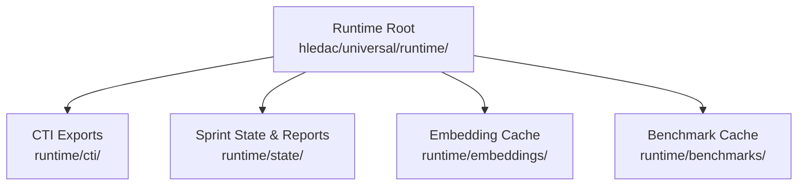
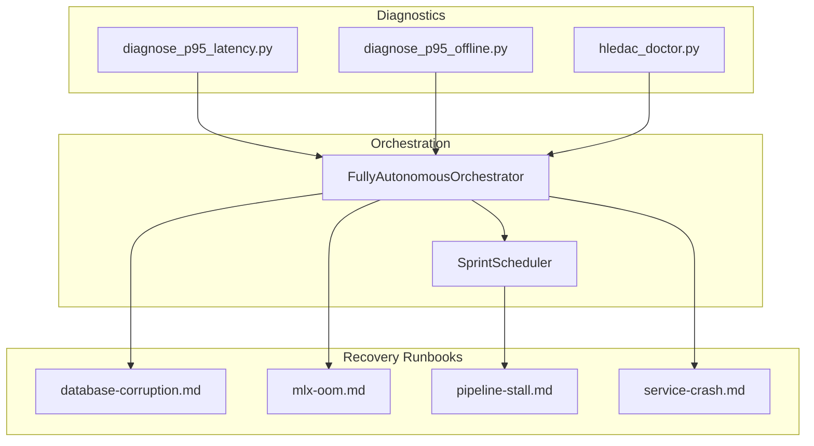
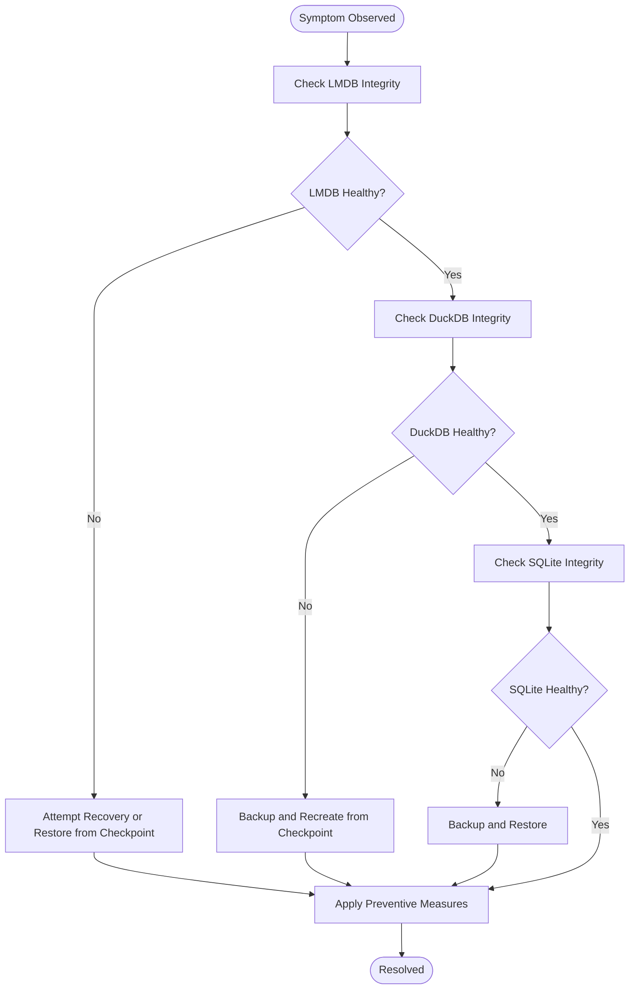
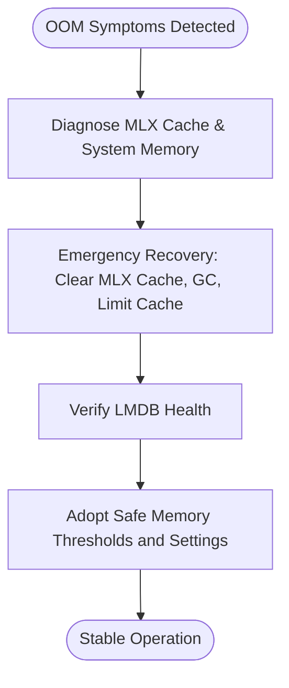
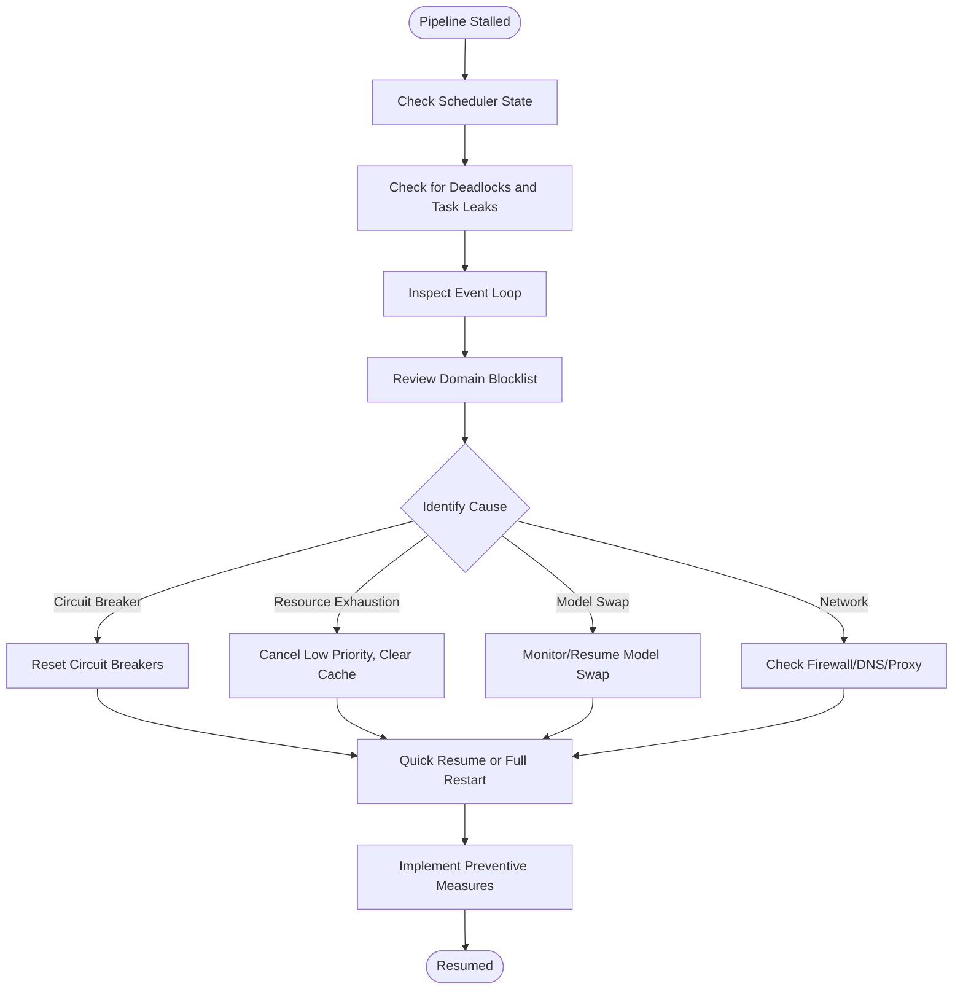
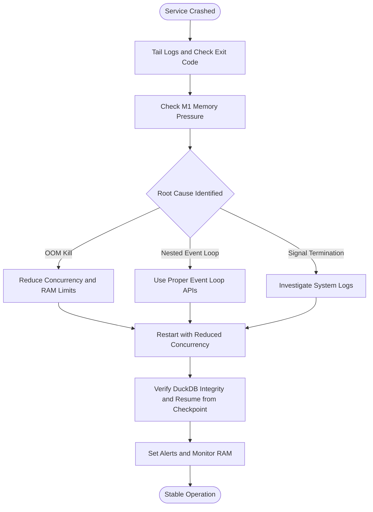
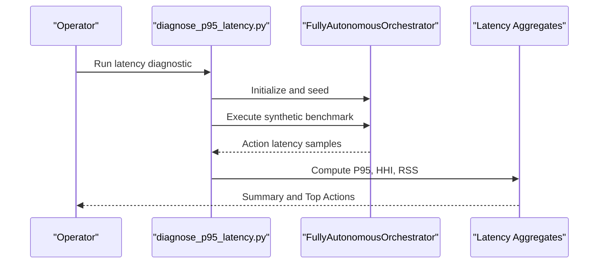
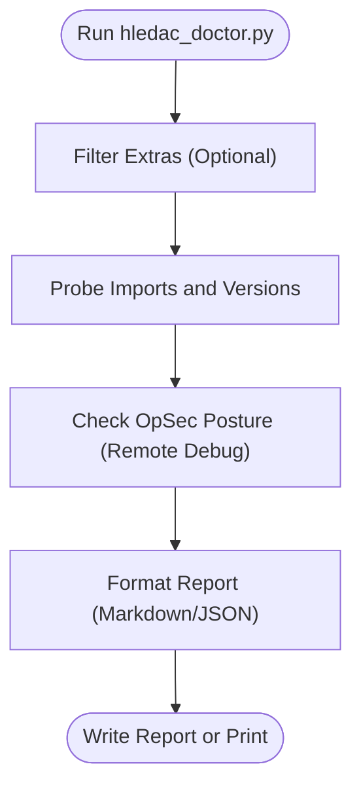
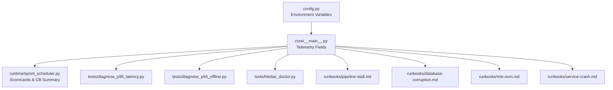

# Troubleshooting and FAQ

<cite>
**Referenced Files in This Document**
- [README.md](file://README.md)
- [known_issues.md](file://known_issues.md)
- [runbooks/database-corruption.md](file://runbooks/database-corruption.md)
- [runbooks/mlx-oom.md](file://runbooks/mlx-oom.md)
- [runbooks/pipeline-stall.md](file://runbooks/pipeline-stall.md)
- [runbooks/service-crash.md](file://runbooks/service-crash.md)
- [tests/diagnose_p95_latency.py](file://tests/diagnose_p95_latency.py)
- [tests/diagnose_p95_offline.py](file://tests/diagnose_p95_offline.py)
- [tools/hledac_doctor.py](file://tools/hledac_doctor.py)
- [utils/exceptions.py](file://utils/exceptions.py)
- [.full-review-archive/review-2026-04-29/04B-devops-findings.md](file://.full-review-archive/review-2026-04-29/04B-devops-findings.md)
- [config.py](file://config.py)
- [tests/test_sprint8l_live.py](file://tests/test_sprint8l_live.py)
- [tests/test_acquisition_fallback.py](file://tests/test_acquisition_fallback.py)
- [core/__main__.py](file://core/__main__.py)
- [runtime/sprint_scheduler.py](file://runtime/sprint_scheduler.py)
- [tools/prelive_decision_gate.py](file://tools/prelive_decision_gate.py)
</cite>

## Table of Contents
1. [Introduction](#introduction)
2. [Project Structure](#project-structure)
3. [Core Components](#core-components)
4. [Architecture Overview](#architecture-overview)
5. [Detailed Component Analysis](#detailed-component-analysis)
6. [Dependency Analysis](#dependency-analysis)
7. [Performance Considerations](#performance-considerations)
8. [Troubleshooting Guide](#troubleshooting-guide)
9. [Conclusion](#conclusion)
10. [Appendices](#appendices)

## Introduction
This document provides comprehensive troubleshooting guidance for Hledac Universal. It covers common issues, symptoms, root causes, and step-by-step resolution procedures. It also includes runbooks for critical failures, latency diagnosis tools, environment-specific troubleshooting, known issues, FAQs, preventive maintenance, diagnostic scripts usage, log analysis techniques, performance bottleneck identification, system recovery procedures, emergency response protocols, escalation guidelines, and community resources.

## Project Structure
Hledac Universal organizes runtime data under a dedicated directory and exposes diagnostic and operational runbooks alongside core orchestration and runtime components. The runtime directory layout and path constants are defined centrally and used across the system.

**Diagram sources**
- [README.md:8-17](file://README.md#L8-L17)

**Section sources**
- [README.md:1-48](file://README.md#L1-L48)

## Core Components
- Runtime paths and environment overrides are defined and initialized at import time, ensuring consistent behavior across modules.
- Diagnostics and runbooks provide structured procedures for database corruption, MLX OOM, pipeline stalls, and service crashes.
- Latency diagnostics include both online and offline tools to isolate bottlenecks and compute actionable metrics.
- Operational tools like the dependency doctor help validate environment readiness.

**Section sources**
- [README.md:19-47](file://README.md#L19-L47)
- [runbooks/database-corruption.md:1-104](file://runbooks/database-corruption.md#L1-L104)
- [runbooks/mlx-oom.md:1-77](file://runbooks/mlx-oom.md#L1-L77)
- [runbooks/pipeline-stall.md:1-134](file://runbooks/pipeline-stall.md#L1-L134)
- [runbooks/service-crash.md:1-51](file://runbooks/service-crash.md#L1-L51)
- [tests/diagnose_p95_latency.py:1-127](file://tests/diagnose_p95_latency.py#L1-L127)
- [tests/diagnose_p95_offline.py:98-139](file://tests/diagnose_p95_offline.py#L98-L139)
- [tools/hledac_doctor.py:1-389](file://tools/hledac_doctor.py#L1-L389)

## Architecture Overview
The system integrates orchestration, runtime scheduling, diagnostics, and recovery runbooks. Key runtime telemetry and diagnostics are surfaced through the orchestrator and scheduler, while environment and configuration are managed centrally.

**Diagram sources**
- [tests/diagnose_p95_latency.py:13-28](file://tests/diagnose_p95_latency.py#L13-L28)
- [tests/diagnose_p95_offline.py:137-139](file://tests/diagnose_p95_offline.py#L137-L139)
- [tools/hledac_doctor.py:367-389](file://tools/hledac_doctor.py#L367-L389)
- [runtime/sprint_scheduler.py:8203-8242](file://runtime/sprint_scheduler.py#L8203-L8242)
- [runbooks/database-corruption.md:1-104](file://runbooks/database-corruption.md#L1-L104)
- [runbooks/mlx-oom.md:1-77](file://runbooks/mlx-oom.md#L1-L77)
- [runbooks/pipeline-stall.md:1-134](file://runbooks/pipeline-stall.md#L1-L134)
- [runbooks/service-crash.md:1-51](file://runbooks/service-crash.md#L1-L51)

## Detailed Component Analysis

### Database Corruption Runbook
Symptoms include integrity errors and missing data. The runbook outlines diagnostics for DuckDB, LMDB, and SQLite, along with recovery and prevention steps.

**Diagram sources**
- [runbooks/database-corruption.md:23-104](file://runbooks/database-corruption.md#L23-L104)

**Section sources**
- [runbooks/database-corruption.md:1-104](file://runbooks/database-corruption.md#L1-L104)

### MLX OOM Runbook
Symptoms include Metal memory allocation failures and system unresponsiveness. The runbook provides immediate emergency recovery steps and safe memory thresholds.

**Diagram sources**
- [runbooks/mlx-oom.md:12-77](file://runbooks/mlx-oom.md#L12-L77)

**Section sources**
- [runbooks/mlx-oom.md:1-77](file://runbooks/mlx-oom.md#L1-L77)

### Pipeline Stall Runbook
Symptoms include lack of progress, frozen scheduler, and stuck in-progress counts. The runbook provides diagnostics for scheduler state, deadlocks, event loop, and domain blocklists, followed by recovery and prevention steps.

**Diagram sources**
- [runbooks/pipeline-stall.md:9-134](file://runbooks/pipeline-stall.md#L9-L134)

**Section sources**
- [runbooks/pipeline-stall.md:1-134](file://runbooks/pipeline-stall.md#L1-L134)

### Service Crash Runbook
Symptoms include unexpected process exit and unhandled exceptions. The runbook guides log inspection, exit code checks, and M1 memory diagnostics, with recovery and prevention recommendations.

**Diagram sources**
- [runbooks/service-crash.md:8-51](file://runbooks/service-crash.md#L8-L51)

**Section sources**
- [runbooks/service-crash.md:1-51](file://runbooks/service-crash.md#L1-L51)

### Latency Diagnosis Tools
Two diagnostic scripts compute latency statistics and highlight bottlenecks:
- Online P95 latency hunt for live orchestration
- Offline P95 latency analysis for replay scenarios

**Diagram sources**
- [tests/diagnose_p95_latency.py:13-127](file://tests/diagnose_p95_latency.py#L13-L127)

**Section sources**
- [tests/diagnose_p95_latency.py:1-127](file://tests/diagnose_p95_latency.py#L1-L127)
- [tests/diagnose_p95_offline.py:98-139](file://tests/diagnose_p95_offline.py#L98-L139)

### Dependency Doctor
The dependency doctor validates import availability across extras and warns on security posture, outputting Markdown or JSON reports.

**Diagram sources**
- [tools/hledac_doctor.py:225-389](file://tools/hledac_doctor.py#L225-L389)

**Section sources**
- [tools/hledac_doctor.py:1-389](file://tools/hledac_doctor.py#L1-L389)

### Environment-Specific Troubleshooting
- M1 8GB memory budget constraints require careful tuning of KV cache and model parameters.
- Environment variables control research modes, memory limits, and logging levels.
- Runtime state and caches are stored under the runtime directory; clearing them can resolve transient issues.

**Section sources**
- [runbooks/mlx-oom.md:8-11](file://runbooks/mlx-oom.md#L8-L11)
- [config.py:466-498](file://config.py#L466-L498)
- [README.md:28-47](file://README.md#L28-L47)

### Known Issues Database
- Smoke test failures related to semaphore proxy forwarding
- Stub test files not discovered by pytest
- Pastebin monitor bypassing fetch coordinator
- Pyright import resolution errors for optional modules

**Section sources**
- [known_issues.md:1-47](file://known_issues.md#L1-L47)

## Dependency Analysis
Operational components depend on runtime telemetry and configuration, while diagnostics rely on orchestration and scheduler internals.

**Diagram sources**
- [config.py:466-498](file://config.py#L466-L498)
- [core/__main__.py:404-523](file://core/__main__.py#L404-L523)
- [runtime/sprint_scheduler.py:8203-8242](file://runtime/sprint_scheduler.py#L8203-L8242)
- [tests/diagnose_p95_latency.py:13-28](file://tests/diagnose_p95_latency.py#L13-L28)
- [tests/diagnose_p95_offline.py:137-139](file://tests/diagnose_p95_offline.py#L137-L139)
- [tools/hledac_doctor.py:367-389](file://tools/hledac_doctor.py#L367-L389)
- [runbooks/pipeline-stall.md:73-126](file://runbooks/pipeline-stall.md#L73-L126)
- [runbooks/database-corruption.md:47-95](file://runbooks/database-corruption.md#L47-L95)
- [runbooks/mlx-oom.md:36-68](file://runbooks/mlx-oom.md#L36-L68)
- [runbooks/service-crash.md:41-50](file://runbooks/service-crash.md#L41-L50)

**Section sources**
- [core/__main__.py:404-523](file://core/__main__.py#L404-L523)
- [runtime/sprint_scheduler.py:8203-8242](file://runtime/sprint_scheduler.py#L8203-L8242)

## Performance Considerations
- Use latency diagnostics to identify slow actions and compute diversity metrics (HHI).
- Monitor memory pressure and adopt safe thresholds to prevent OOM conditions.
- Ensure transactional writes and regular checkpoints to maintain database integrity.
- Validate environment readiness with the dependency doctor before running intensive workloads.

[No sources needed since this section provides general guidance]

## Troubleshooting Guide

### Common Issues and Resolutions
- Smoke test failures due to semaphore proxy forwarding: Investigate and resolve proxy forwarding; this is out of scope for recent sprints and scheduled for later cleanup.
- Stub test files not discovered by pytest: These are intentionally isolated and do not impact execution.
- Pastebin monitor HTTP seam violation: The monitor creates its own client session; integrate with the fetch coordinator to apply circuit breaking and rate limiting.
- Pyright import resolution errors: These are cosmetic and do not affect runtime execution.

**Section sources**
- [known_issues.md:6-47](file://known_issues.md#L6-L47)

### Latency Bottleneck Identification
- Use the online P95 latency diagnostic to measure action latencies and RSS under live orchestration.
- Use the offline P95 diagnostic to analyze replayed scenarios and compute P95 per action.
- Review action selection distributions and HHI to detect over-concentration of actions.

**Section sources**
- [tests/diagnose_p95_latency.py:13-127](file://tests/diagnose_p95_latency.py#L13-L127)
- [tests/diagnose_p95_offline.py:98-139](file://tests/diagnose_p95_offline.py#L98-L139)
- [tests/test_sprint8l_live.py:45-77](file://tests/test_sprint8l_live.py#L45-L77)

### Environment-Specific Troubleshooting
- M1 8GB memory budget: Keep KV cache settings conservative; clear MLX cache and reduce cache limits when approaching thresholds.
- Environment variables: Configure research mode, memory limits, and logging level via environment variables.
- Runtime state: Clear runtime directories selectively to reset state without affecting exports.

**Section sources**
- [runbooks/mlx-oom.md:8-11](file://runbooks/mlx-oom.md#L8-L11)
- [config.py:466-498](file://config.py#L466-L498)
- [README.md:28-47](file://README.md#L28-L47)

### Diagnostic Scripts Usage
- Dependency doctor: Run with optional filters for extras and verbosity; outputs Markdown or JSON.
- Latency diagnostics: Execute the online and offline scripts to gather latency metrics and summaries.

**Section sources**
- [tools/hledac_doctor.py:346-389](file://tools/hledac_doctor.py#L346-L389)
- [tests/diagnose_p95_latency.py:13-127](file://tests/diagnose_p95_latency.py#L13-L127)
- [tests/diagnose_p95_offline.py:137-139](file://tests/diagnose_p95_offline.py#L137-L139)

### Log Analysis Techniques
- Tail application logs and systemd journal entries for recent crashes.
- Correlate exit codes with memory pressure indicators and system OOM killer activity.

**Section sources**
- [runbooks/service-crash.md:10-25](file://runbooks/service-crash.md#L10-L25)

### System Recovery Procedures
- Database corruption: Backup, attempt recovery, recreate from checkpoint, and replay buffered writes.
- MLX OOM: Clear cache, reduce cache limits, force garbage collection, and rebuild LMDB if needed.
- Pipeline stall: Reset scheduler state, restore latest checkpoint, reset circuit breakers, and perform a controlled restart.
- Service crash: Restart with reduced concurrency, verify DuckDB integrity, and resume from checkpoint.

**Section sources**
- [runbooks/database-corruption.md:47-95](file://runbooks/database-corruption.md#L47-L95)
- [runbooks/mlx-oom.md:36-68](file://runbooks/mlx-oom.md#L36-L68)
- [runbooks/pipeline-stall.md:73-126](file://runbooks/pipeline-stall.md#L73-L126)
- [runbooks/service-crash.md:41-46](file://runbooks/service-crash.md#L41-L46)

### Emergency Response Protocols
- Immediate actions for OOM: Clear MLX cache, reduce cache limits, and trigger garbage collection.
- Immediate actions for stalls: Reset circuit breakers, clear MLX cache, and force garbage collection.
- Immediate actions for crashes: Restart with reduced concurrency and verify DuckDB integrity.

**Section sources**
- [runbooks/mlx-oom.md:36-54](file://runbooks/mlx-oom.md#L36-L54)
- [runbooks/pipeline-stall.md:87-103](file://runbooks/pipeline-stall.md#L87-L103)
- [runbooks/service-crash.md:41-46](file://runbooks/service-crash.md#L41-L46)

### Escalation Guidelines
- If known runbooks do not resolve issues, escalate to the onboarding and long-term plan documentation and review the deep review findings for environment management gaps.

**Section sources**
- [.full-review-archive/review-2026-04-29/04B-devops-findings.md:174-214](file://.full-review-archive/review-2026-04-29/04B-devops-findings.md#L174-L214)

### Community Resources and Support Channels
- Onboarding documentation provides initial setup guidance.
- Long-term plan and architecture maps outline strategic direction.
- Contribution guidelines are implied by the presence of runbooks and diagnostic tools; use issues and pull requests to propose improvements.

**Section sources**
- [README.md:1-48](file://README.md#L1-L48)
- [LONGTERM_PLAN.md](file://LONGTERM_PLAN.md)
- [REAL_ARCHITECTURE.md](file://REAL_ARCHITECTURE.md)

## Conclusion
This guide consolidates operational runbooks, diagnostics, and environment controls to stabilize Hledac Universal. By following structured troubleshooting procedures, leveraging latency diagnostics, and applying preventive measures, operators can maintain reliable operation across diverse environments.

[No sources needed since this section summarizes without analyzing specific files]

## Appendices

### Frequently Asked Questions
- How do I reset runtime state?
  - Clear the runtime directory or selectively remove CTI exports.
- How do I check environment readiness?
  - Use the dependency doctor to validate imports and report missing extras.
- How do I diagnose latency bottlenecks?
  - Run the online and offline P95 latency diagnostics and review action breakdowns.
- What are safe memory thresholds on M1?
  - Adopt thresholds and settings recommended in the MLX OOM runbook.

**Section sources**
- [README.md:35-47](file://README.md#L35-L47)
- [tools/hledac_doctor.py:346-389](file://tools/hledac_doctor.py#L346-L389)
- [tests/diagnose_p95_latency.py:13-127](file://tests/diagnose_p95_latency.py#L13-L127)
- [tests/diagnose_p95_offline.py:98-139](file://tests/diagnose_p95_offline.py#L98-L139)
- [runbooks/mlx-oom.md:70-77](file://runbooks/mlx-oom.md#L70-L77)

### Preventive Maintenance Procedures
- Apply transactional writes and bulk operations to databases.
- Schedule regular checkpoints and monitor disk space.
- Monitor memory pressure and set alerts at defined thresholds.
- Validate environment configuration and extras before production runs.

**Section sources**
- [runbooks/database-corruption.md:97-104](file://runbooks/database-corruption.md#L97-L104)
- [runbooks/mlx-oom.md:63-69](file://runbooks/mlx-oom.md#L63-L69)
- [tools/hledac_doctor.py:225-262](file://tools/hledac_doctor.py#L225-L262)

### Operational Telemetry and Diagnostics
- Telemetry fields for acquisition profiles and public discovery reasons are emitted by the orchestrator.
- Scheduler scorecards and circuit breaker summaries aid in diagnosing performance and reliability.

**Section sources**
- [core/__main__.py:404-523](file://core/__main__.py#L404-L523)
- [runtime/sprint_scheduler.py:8203-8242](file://runtime/sprint_scheduler.py#L8203-L8242)

### Decision Gate Command Suggestions
- The prelive decision gate provides suggested commands for clean and diagnostic runs, including flags for memory requirements and hardware taint.

**Section sources**
- [tools/prelive_decision_gate.py:1003-1019](file://tools/prelive_decision_gate.py#L1003-L1019)