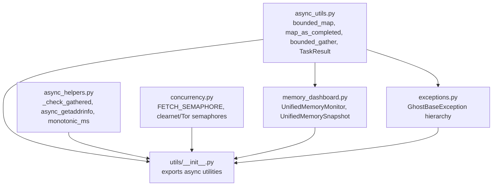
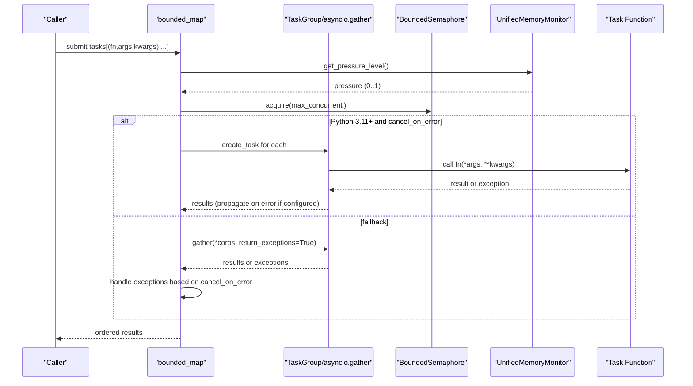
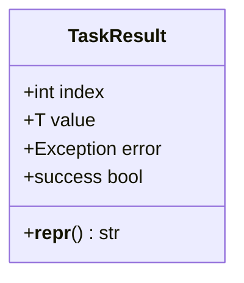
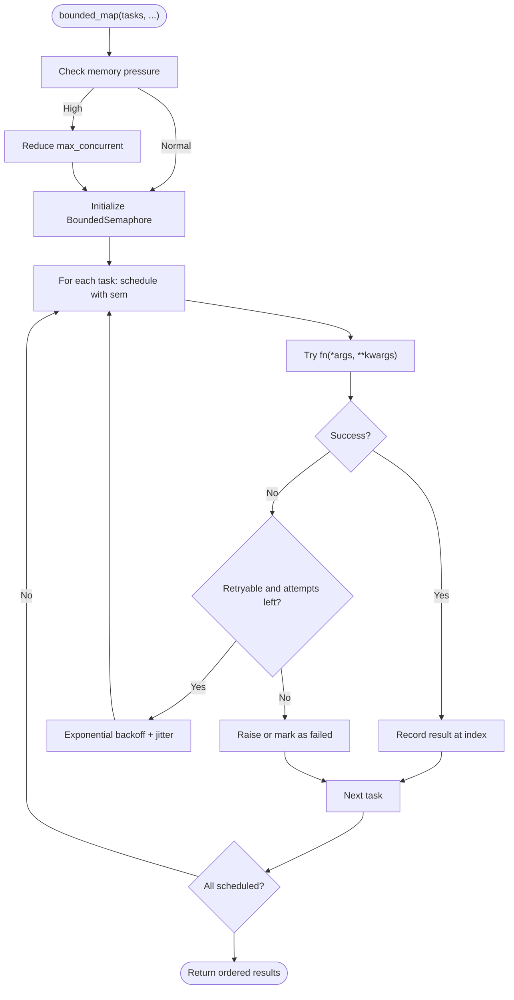
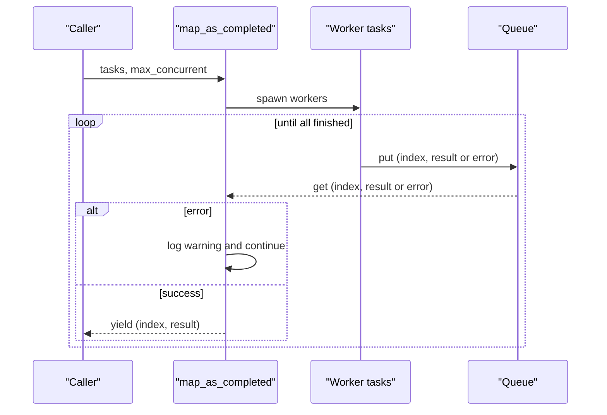
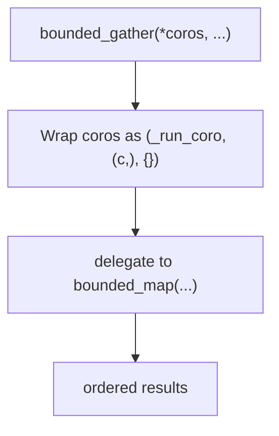
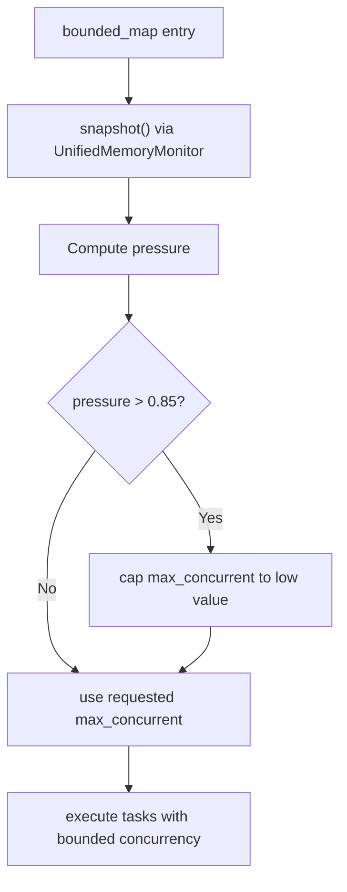
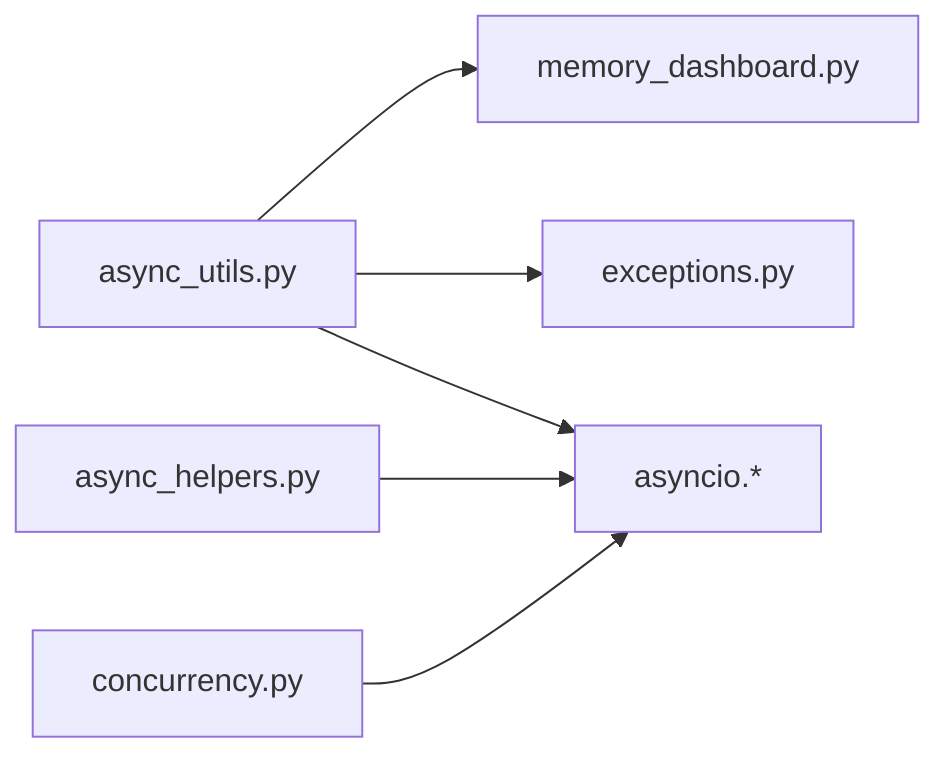

# Async Utilities

<cite>
**Referenced Files in This Document**
- [async_utils.py](file://hledac/universal/utils/async_utils.py)
- [async_helpers.py](file://hledac/universal/utils/async_helpers.py)
- [memory_dashboard.py](file://hledac/universal/utils/memory_dashboard.py)
- [concurrency.py](file://hledac/universal/utils/concurrency.py)
- [exceptions.py](file://hledac/universal/utils/exceptions.py)
- [__init__.py](file://hledac/universal/utils/__init__.py)
- [test_phase2_async.py](file://hledac/universal/tests/test_sprint81/test_phase2_async.py)
- [test_async_hygiene.py](file://hledac/universal/tests/probe_6a/test_async_hygiene.py)
</cite>

## Table of Contents
1. [Introduction](#introduction)
2. [Project Structure](#project-structure)
3. [Core Components](#core-components)
4. [Architecture Overview](#architecture-overview)
5. [Detailed Component Analysis](#detailed-component-analysis)
6. [Dependency Analysis](#dependency-analysis)
7. [Performance Considerations](#performance-considerations)
8. [Troubleshooting Guide](#troubleshooting-guide)
9. [Conclusion](#conclusion)
10. [Appendices](#appendices)

## Introduction
This document describes the async utilities subsystem focused on bounded concurrency, structured task results, memory-aware controls, and robust retry/backoff. It covers:
- Bounded concurrency helpers: bounded_map, map_as_completed, and bounded_gather
- TaskResult for index-preserving, structured outcomes
- Memory-aware concurrency control and Python version compatibility
- Retry mechanisms with exponential backoff and jitter
- Practical usage patterns for OSINT fetching, batch processing, and concurrent task orchestration
- Configuration options, error handling patterns, and performance optimization techniques

## Project Structure
The async utilities live under the utils package and integrate with other subsystems for memory monitoring, transport selection, and shared semaphores.

**Diagram sources**
- [async_utils.py:1-231](file://hledac/universal/utils/async_utils.py#L1-L231)
- [async_helpers.py:1-102](file://hledac/universal/utils/async_helpers.py#L1-L102)
- [memory_dashboard.py:1-242](file://hledac/universal/utils/memory_dashboard.py#L1-L242)
- [concurrency.py:1-142](file://hledac/universal/utils/concurrency.py#L1-L142)
- [exceptions.py:1-80](file://hledac/universal/utils/exceptions.py#L1-L80)
- [__init__.py:120-240](file://hledac/universal/utils/__init__.py#L120-L240)

**Section sources**
- [__init__.py:120-240](file://hledac/universal/utils/__init__.py#L120-L240)

## Core Components
- TaskResult: A small data structure that preserves input index and carries either a value or an error, enabling ordered result mapping even when tasks fail.
- bounded_map: Runs a list of (callable, args, kwargs) tasks with bounded concurrency, optional retries, timeouts, and memory-aware limits. Supports Python 3.11+ TaskGroup cancel_on_error semantics or falls back to gather behavior.
- map_as_completed: Streams results as they finish, preserving index mapping and yielding (index, result) pairs incrementally.
- bounded_gather: A convenience wrapper around bounded_map for coroutine lists.
- async_helpers: Provides _check_gathered for safe gather hygiene, async DNS via loop.getaddrinfo, and monotonic timing helpers.
- memory_dashboard: Unified memory monitoring with system RAM and Metal GPU metrics, exposing pressure levels and emergency checks.
- concurrency: Shared semaphores for fetch concurrency, including adaptive limits and separate pools for clearnet and Tor.

**Section sources**
- [async_utils.py:40-231](file://hledac/universal/utils/async_utils.py#L40-L231)
- [async_helpers.py:1-102](file://hledac/universal/utils/async_helpers.py#L1-L102)
- [memory_dashboard.py:37-242](file://hledac/universal/utils/memory_dashboard.py#L37-L242)
- [concurrency.py:18-142](file://hledac/universal/utils/concurrency.py#L18-L142)

## Architecture Overview
The async utilities coordinate bounded concurrency, memory pressure, and retries to deliver resilient batch processing. They interoperate with:
- Memory monitoring for adaptive concurrency
- Shared semaphores for transport-level throttling
- Exception hierarchy for typed error signaling
- Gather hygiene utilities for safe exception handling

**Diagram sources**
- [async_utils.py:78-156](file://hledac/universal/utils/async_utils.py#L78-L156)
- [memory_dashboard.py:102-158](file://hledac/universal/utils/memory_dashboard.py#L102-L158)

## Detailed Component Analysis

### TaskResult
- Purpose: Encapsulates per-task outcome with index and error for deterministic ordering and error reporting.
- Fields: index, value, error; computed property success indicates presence of error.
- Usage: Returned by bounded_map and used internally to preserve mapping.

**Diagram sources**
- [async_utils.py:40-56](file://hledac/universal/utils/async_utils.py#L40-L56)

**Section sources**
- [async_utils.py:40-56](file://hledac/universal/utils/async_utils.py#L40-L56)

### bounded_map
- Bounded concurrency via BoundedSemaphore.
- Optional memory-aware reduction: when memory pressure exceeds threshold, concurrency is capped.
- Retry with exponential backoff and jitter; configurable retryable exceptions and per-call timeout.
- Python version compatibility: uses TaskGroup (cancel_on_error) on 3.11+, otherwise gather with return_exceptions.
- Returns ordered list of results; handles exceptions based on cancel_on_error.

**Diagram sources**
- [async_utils.py:78-156](file://hledac/universal/utils/async_utils.py#L78-L156)

**Section sources**
- [async_utils.py:78-156](file://hledac/universal/utils/async_utils.py#L78-L156)

### map_as_completed
- Streams results as they complete, preserving index mapping.
- Uses a semaphore to bound concurrency and a queue to collect (index, result, error) tuples.
- On error, logs and continues to yield subsequent successes.

**Diagram sources**
- [async_utils.py:158-199](file://hledac/universal/utils/async_utils.py#L158-L199)

**Section sources**
- [async_utils.py:158-199](file://hledac/universal/utils/async_utils.py#L158-L199)

### bounded_gather
- Convenience wrapper around bounded_map for coroutine lists.
- Converts coroutines into (lambda, args, kwargs) tasks and delegates to bounded_map.

**Diagram sources**
- [async_utils.py:201-223](file://hledac/universal/utils/async_utils.py#L201-L223)

**Section sources**
- [async_utils.py:201-223](file://hledac/universal/utils/async_utils.py#L201-L223)

### Memory-aware Concurrency Control
- Memory monitoring via UnifiedMemoryMonitor snapshots system RAM and Metal GPU metrics.
- _get_memory_level returns current pressure (0..1); bounded_map reduces concurrency when pressure exceeds threshold.
- Additional system-level adaptive semaphores exist for fetch workloads (clearnet/Tor separation and RSS-based limits).

**Diagram sources**
- [async_utils.py:66-109](file://hledac/universal/utils/async_utils.py#L66-L109)
- [memory_dashboard.py:102-158](file://hledac/universal/utils/memory_dashboard.py#L102-L158)

**Section sources**
- [async_utils.py:66-109](file://hledac/universal/utils/async_utils.py#L66-L109)
- [memory_dashboard.py:37-242](file://hledac/universal/utils/memory_dashboard.py#L37-L242)

### Python Version Compatibility Features
- TaskGroup support: on Python 3.11+ with cancel_on_error=True, bounded_map uses TaskGroup to propagate first exception and cancel remaining tasks.
- Fallback behavior: on older Python or when cancel_on_error=False, bounded_map uses asyncio.gather with return_exceptions and then raises or filters results accordingly.

**Section sources**
- [async_utils.py:133-155](file://hledac/universal/utils/async_utils.py#L133-L155)

### Retry Mechanisms with Exponential Backoff and Jitter
- Retries are attempted up to max_retries for any exception type included in retryable_exceptions.
- Delay follows exponential backoff scaled by random jitter to avoid thundering herd.
- Optional per-call timeout enforced via asyncio.wait_for.

**Section sources**
- [async_utils.py:112-129](file://hledac/universal/utils/async_utils.py#L112-L129)

### Gather Hygiene and DNS Helpers
- _check_gathered separates exceptions from values and logs exceptions for downstream safety.
- async_getaddrinfo uses loop.getaddrinfo to avoid blocking the event loop.
- monotonic_ms provides millisecond-precision monotonic time.

**Section sources**
- [async_helpers.py:26-95](file://hledac/universal/utils/async_helpers.py#L26-L95)

### Shared Semaphores and Adaptive Limits
- FETCH_SEMAPHORE and dedicated clearnet/Tor semaphores provide centralized concurrency control.
- Adaptive limits reduce clearnet concurrency based on RSS thresholds to protect system stability.

**Section sources**
- [concurrency.py:18-142](file://hledac/universal/utils/concurrency.py#L18-L142)

## Dependency Analysis
The async utilities depend on:
- memory_dashboard for memory pressure signals
- exceptions for typed error signaling
- asyncio primitives (TaskGroup, Semaphore, BoundedSemaphore, gather, wait_for)
- Optional psutil and mlx for memory monitoring on supported platforms

**Diagram sources**
- [async_utils.py:27-35](file://hledac/universal/utils/async_utils.py#L27-L35)
- [memory_dashboard.py:11-35](file://hledac/universal/utils/memory_dashboard.py#L11-L35)
- [exceptions.py:9-14](file://hledac/universal/utils/exceptions.py#L9-L14)
- [async_helpers.py:16-21](file://hledac/universal/utils/async_helpers.py#L16-L21)
- [concurrency.py:10-14](file://hledac/universal/utils/concurrency.py#L10-L14)

**Section sources**
- [async_utils.py:27-35](file://hledac/universal/utils/async_utils.py#L27-L35)
- [memory_dashboard.py:11-35](file://hledac/universal/utils/memory_dashboard.py#L11-L35)
- [exceptions.py:9-14](file://hledac/universal/utils/exceptions.py#L9-L14)
- [async_helpers.py:16-21](file://hledac/universal/utils/async_helpers.py#L16-L21)
- [concurrency.py:10-14](file://hledac/universal/utils/concurrency.py#L10-L14)

## Performance Considerations
- Prefer bounded_map for ordered, bounded concurrency with retries and memory awareness.
- Use map_as_completed for streaming results as they arrive, trading ordering guarantees for throughput.
- Use bounded_gather for simple coroutine lists when you want bounded concurrency without manual task packaging.
- Tune max_concurrent based on workload characteristics; memory-aware mode automatically caps concurrency under high pressure.
- Apply retryable_exceptions carefully to avoid retry storms; combine with jitter and backoff.
- Use async_getaddrinfo and gather hygiene helpers to avoid blocking and exception leakage.
- Leverage shared semaphores for transport-level throttling and adaptive limits for system stability.

[No sources needed since this section provides general guidance]

## Troubleshooting Guide
Common issues and resolutions:
- Unexpected exceptions in gather: ensure gather uses return_exceptions and apply _check_gathered to extract valid results.
- Blocking DNS calls: replace socket.getaddrinfo with async_getaddrinfo to avoid event loop stalls.
- Excessive retries causing delays: adjust max_retries and retryable_exceptions; verify exponential backoff and jitter behavior.
- Memory pressure spikes: rely on memory-aware mode; consider lowering max_concurrent or using adaptive semaphores.
- Python version differences: confirm TaskGroup behavior on 3.11+ versus fallback gather semantics.

**Section sources**
- [async_helpers.py:26-95](file://hledac/universal/utils/async_helpers.py#L26-L95)
- [test_async_hygiene.py:20-84](file://hledac/universal/tests/probe_6a/test_async_hygiene.py#L20-L84)

## Conclusion
The async utilities subsystem provides robust, memory-aware, and version-compatible concurrency control for batch and streaming task execution. With structured results, retry/backoff, and gather hygiene, it enables reliable OSINT fetching, batch processing, and concurrent orchestration across diverse environments.

[No sources needed since this section summarizes without analyzing specific files]

## Appendices

### Practical Usage Patterns
- OSINT fetching: Use bounded_map to process URLs with bounded concurrency, retries, and timeouts; stream partial results with map_as_completed for real-time ingestion.
- Batch processing: Use bounded_map for ordered results; use bounded_gather for simple coroutine lists.
- Concurrent task management: Combine bounded_map with memory-aware mode and shared semaphores for transport-level throttling.

[No sources needed since this section provides general guidance]

### Configuration Options Summary
- bounded_map
  - max_concurrent: upper bound on parallel tasks
  - max_retries: number of retry attempts
  - cancel_on_error: enable TaskGroup cancel_on_error (Python 3.11+)
  - memory_pressure_check: reduce concurrency under high memory pressure
  - retryable_exceptions: tuple of exception types eligible for retry
  - timeout: per-call timeout enforcement
- map_as_completed
  - max_concurrent: bounded concurrency for streaming
  - forwards kwargs to bounded_map for retries/timeouts
- bounded_gather
  - max_concurrent: bounded concurrency for coroutine list
  - return_exceptions: treat exceptions as results instead of raising

**Section sources**
- [async_utils.py:78-223](file://hledac/universal/utils/async_utils.py#L78-L223)

### Error Handling Patterns
- Use TaskResult to capture per-task outcomes and preserve input ordering.
- Apply _check_gathered to safely extract valid results from gather with return_exceptions.
- Raise or propagate exceptions based on cancel_on_error semantics.

**Section sources**
- [async_utils.py:40-56](file://hledac/universal/utils/async_utils.py#L40-L56)
- [async_helpers.py:26-54](file://hledac/universal/utils/async_helpers.py#L26-L54)