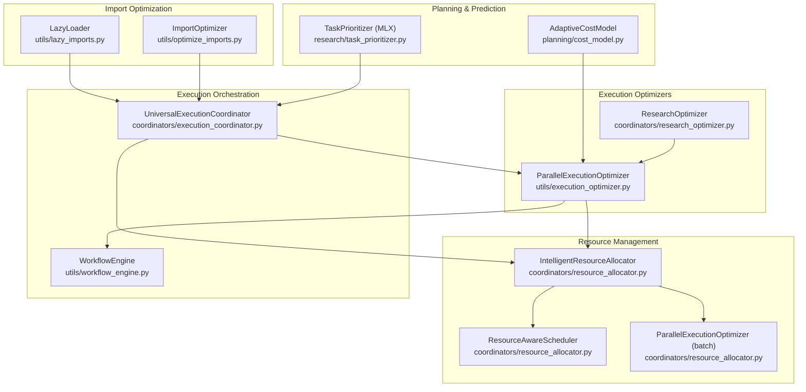
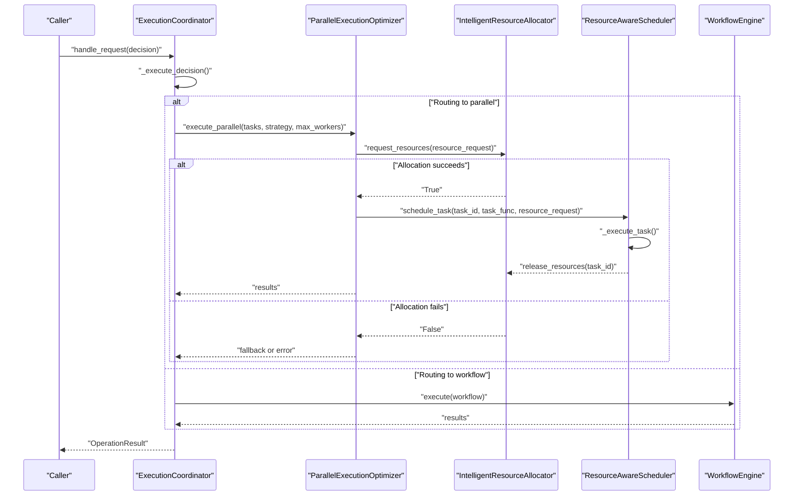
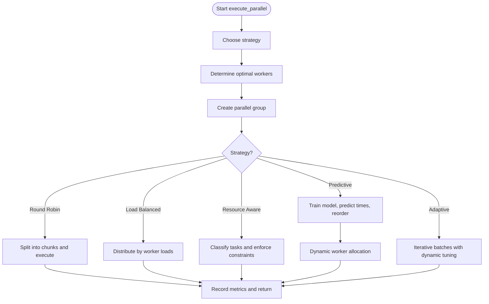
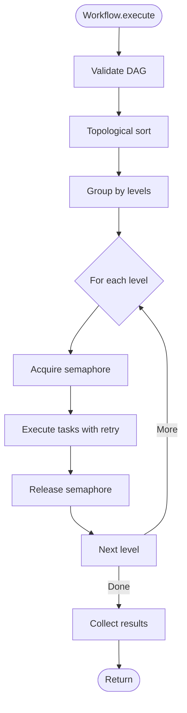
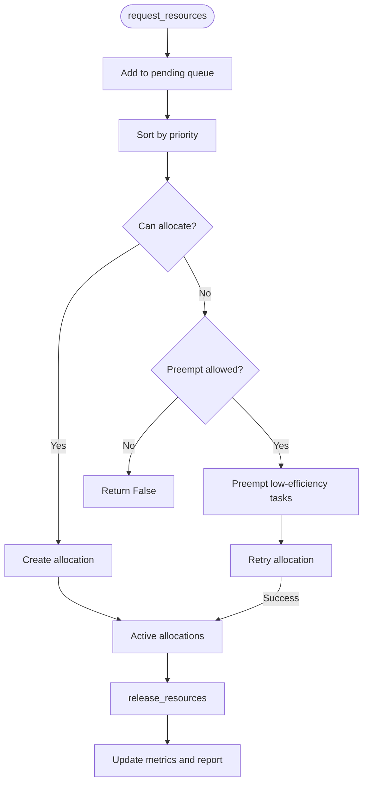
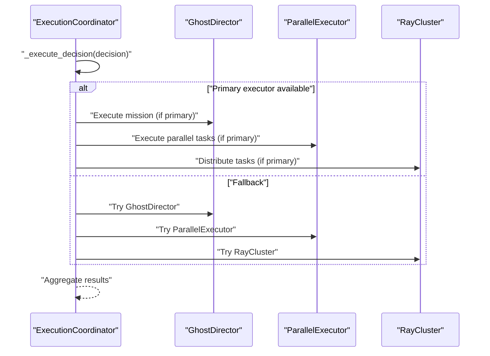
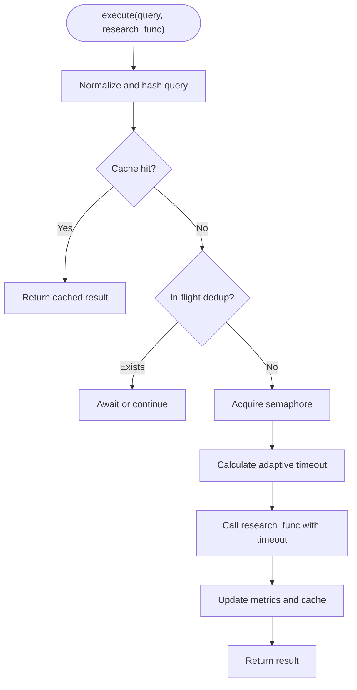
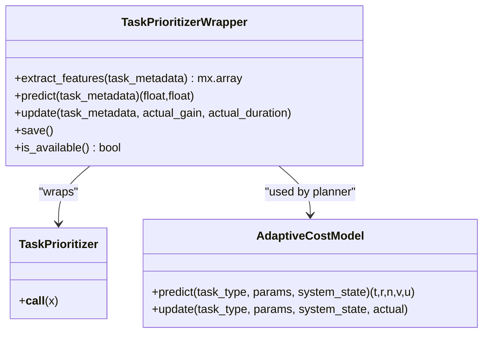
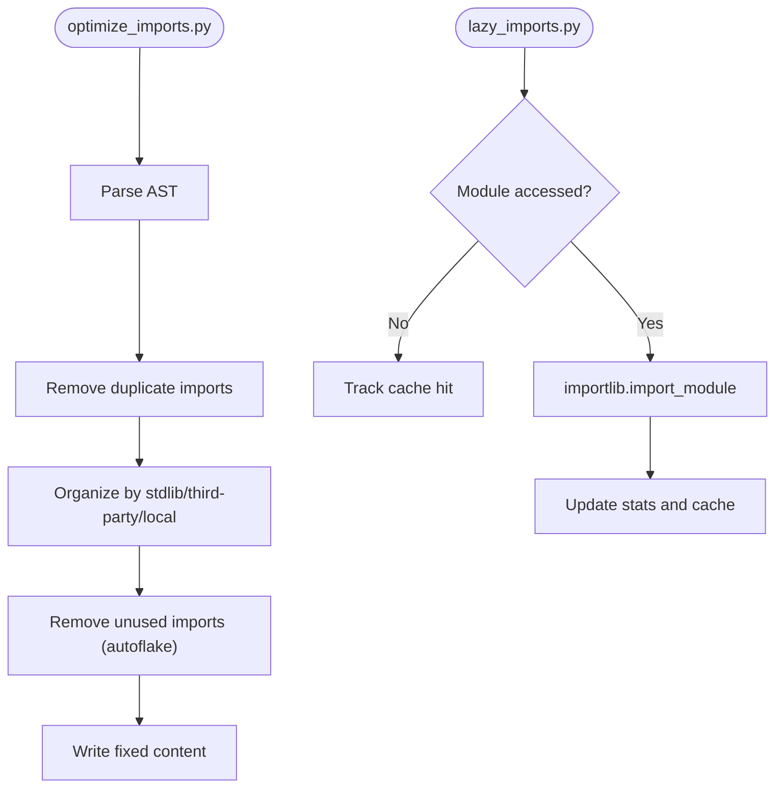
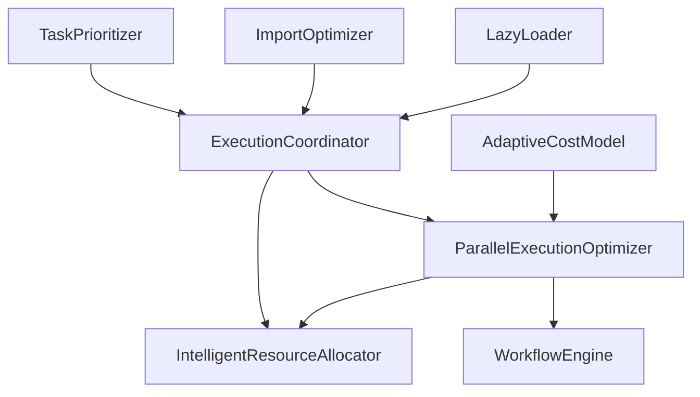

# Execution Optimization

<cite>
**Referenced Files in This Document**
- [execution_optimizer.py](file://utils/execution_optimizer.py)
- [workflow_engine.py](file://utils/workflow_engine.py)
- [resource_allocator.py](file://coordinators/resource_allocator.py)
- [execution_coordinator.py](file://coordinators/execution_coordinator.py)
- [research_optimizer.py](file://coordinators/research_optimizer.py)
- [task_prioritizer.py](file://research/task_prioritizer.py)
- [cost_model.py](file://planning/cost_model.py)
- [optimize_imports.py](file://utils/optimize_imports.py)
- [lazy_imports.py](file://utils/lazy_imports.py)
</cite>

## Table of Contents
1. [Introduction](#introduction)
2. [Project Structure](#project-structure)
3. [Core Components](#core-components)
4. [Architecture Overview](#architecture-overview)
5. [Detailed Component Analysis](#detailed-component-analysis)
6. [Dependency Analysis](#dependency-analysis)
7. [Performance Considerations](#performance-considerations)
8. [Troubleshooting Guide](#troubleshooting-guide)
9. [Conclusion](#conclusion)

## Introduction
This document explains the execution optimization utilities that improve system performance through intelligent scheduling, dynamic resource allocation, adaptive execution strategies, and workflow orchestration. It covers:
- Execution optimizer for parallel task prioritization and throughput
- Import optimization strategies to reduce startup overhead
- Workflow engine for efficient task execution with retries and parallel levels
- Dynamic resource allocation and adaptive scheduling
- Performance prediction models for optimizing execution paths

## Project Structure
The execution optimization ecosystem spans several modules:
- Parallel execution optimizer with multiple strategies (round-robin, load-balanced, resource-aware, predictive, adaptive)
- Workflow engine for DAG-based task execution with retries and conditional/loop constructs
- Intelligent resource allocator with preemption, anomaly detection, and auto-scaling
- Execution coordinator integrating multiple backends and dynamic task generation
- Research optimizer with caching, deduplication, adaptive timeouts, and batching
- Task prioritization model (MLX) and cost prediction model (online ridge + optional SSM)
- Import optimization and lazy loading utilities to reduce cold-start costs

**Diagram sources**
- [execution_optimizer.py:151-371](file://utils/execution_optimizer.py#L151-L371)
- [workflow_engine.py:132-261](file://utils/workflow_engine.py#L132-L261)
- [resource_allocator.py:81-107](file://coordinators/resource_allocator.py#L81-L107)
- [execution_coordinator.py:88-143](file://coordinators/execution_coordinator.py#L88-L143)
- [research_optimizer.py:77-113](file://coordinators/research_optimizer.py#L77-L113)
- [task_prioritizer.py:23-37](file://research/task_prioritizer.py#L23-L37)
- [cost_model.py:69-96](file://planning/cost_model.py#L69-L96)
- [optimize_imports.py:33-82](file://utils/optimize_imports.py#L33-L82)
- [lazy_imports.py:42-81](file://utils/lazy_imports.py#L42-L81)

**Section sources**
- [execution_optimizer.py:151-371](file://utils/execution_optimizer.py#L151-L371)
- [workflow_engine.py:132-261](file://utils/workflow_engine.py#L132-L261)
- [resource_allocator.py:81-107](file://coordinators/resource_allocator.py#L81-L107)
- [execution_coordinator.py:88-143](file://coordinators/execution_coordinator.py#L88-L143)
- [research_optimizer.py:77-113](file://coordinators/research_optimizer.py#L77-L113)
- [task_prioritizer.py:23-37](file://research/task_prioritizer.py#L23-L37)
- [cost_model.py:69-96](file://planning/cost_model.py#L69-L96)
- [optimize_imports.py:33-82](file://utils/optimize_imports.py#L33-L82)
- [lazy_imports.py:42-81](file://utils/lazy_imports.py#L42-L81)

## Core Components
- ParallelExecutionOptimizer: Provides multiple execution strategies, dynamic worker tuning, predictive ordering, and bounded storage for metrics and groups.
- WorkflowEngine: Executes DAG-based workflows with topological ordering, parallel levels, retries, and parameter resolution.
- IntelligentResourceAllocator: Manages resource requests, supports preemption, anomaly detection, auto-scaling, and M1-specific optimizations.
- UniversalExecutionCoordinator: Routes decisions to GhostDirector, ParallelExecutionOptimizer, or Ray cluster with fallback and dynamic task generation.
- ResearchOptimizer: Caching, in-flight deduplication, adaptive timeouts, and batching for research queries.
- TaskPrioritizer: MLX-based MLP to predict task gain and duration with persistence and online updates.
- AdaptiveCostModel: Online ridge baseline plus optional Mamba SSM to predict costs and value with uncertainty.
- ImportOptimizer and LazyLoader: Reduce startup overhead via import hygiene and lazy module loading.

**Section sources**
- [execution_optimizer.py:151-371](file://utils/execution_optimizer.py#L151-L371)
- [workflow_engine.py:132-261](file://utils/workflow_engine.py#L132-L261)
- [resource_allocator.py:81-107](file://coordinators/resource_allocator.py#L81-L107)
- [execution_coordinator.py:88-143](file://coordinators/execution_coordinator.py#L88-L143)
- [research_optimizer.py:77-113](file://coordinators/research_optimizer.py#L77-L113)
- [task_prioritizer.py:23-37](file://research/task_prioritizer.py#L23-L37)
- [cost_model.py:69-96](file://planning/cost_model.py#L69-L96)
- [optimize_imports.py:33-82](file://utils/optimize_imports.py#L33-L82)
- [lazy_imports.py:42-81](file://utils/lazy_imports.py#L42-L81)

## Architecture Overview
The system integrates execution strategies, resource management, and workflow orchestration. The UniversalExecutionCoordinator decides routing based on decision confidence and executor availability, delegating to ParallelExecutionOptimizer or Ray clusters when applicable. The ParallelExecutionOptimizer selects strategies and dynamically adapts worker counts. The IntelligentResourceAllocator ensures tasks receive adequate resources, preempting low-efficiency workloads when needed. The WorkflowEngine executes DAGs with retries and parallel levels. Planning components (TaskPrioritizer and AdaptiveCostModel) inform task selection and cost estimation.

**Diagram sources**
- [execution_coordinator.py:287-335](file://coordinators/execution_coordinator.py#L287-L335)
- [execution_optimizer.py:316-371](file://utils/execution_optimizer.py#L316-L371)
- [resource_allocator.py:291-322](file://coordinators/resource_allocator.py#L291-L322)
- [workflow_engine.py:195-261](file://utils/workflow_engine.py#L195-L261)

## Detailed Component Analysis

### Parallel Execution Optimizer
- Strategies: round-robin, load-balanced, resource-aware, predictive, adaptive.
- Dynamic worker sizing based on task type and system resources.
- Predictive ordering: trains a model on historical metrics and sorts tasks by predicted execution time.
- Bounded storage for parallel groups and worker metrics with TTL eviction.
- Thread/process pools tailored to I/O-bound and CPU-bound tasks.

**Diagram sources**
- [execution_optimizer.py:316-371](file://utils/execution_optimizer.py#L316-L371)
- [execution_optimizer.py:416-477](file://utils/execution_optimizer.py#L416-L477)
- [execution_optimizer.py:478-513](file://utils/execution_optimizer.py#L478-L513)
- [execution_optimizer.py:514-564](file://utils/execution_optimizer.py#L514-L564)
- [execution_optimizer.py:565-579](file://utils/execution_optimizer.py#L565-L579)
- [execution_optimizer.py:680-705](file://utils/execution_optimizer.py#L680-L705)
- [execution_optimizer.py:727-734](file://utils/execution_optimizer.py#L727-L734)
- [execution_optimizer.py:735-775](file://utils/execution_optimizer.py#L735-L775)

**Section sources**
- [execution_optimizer.py:151-371](file://utils/execution_optimizer.py#L151-L371)
- [execution_optimizer.py:316-371](file://utils/execution_optimizer.py#L316-L371)
- [execution_optimizer.py:416-477](file://utils/execution_optimizer.py#L416-L477)
- [execution_optimizer.py:478-513](file://utils/execution_optimizer.py#L478-L513)
- [execution_optimizer.py:514-564](file://utils/execution_optimizer.py#L514-L564)
- [execution_optimizer.py:565-579](file://utils/execution_optimizer.py#L565-L579)
- [execution_optimizer.py:680-705](file://utils/execution_optimizer.py#L680-L705)
- [execution_optimizer.py:727-734](file://utils/execution_optimizer.py#L727-L734)
- [execution_optimizer.py:735-775](file://utils/execution_optimizer.py#L735-L775)

### Workflow Engine
- DAG validation and topological sorting.
- Level-wise parallel execution with concurrency limits.
- Retry with exponential backoff and parameter resolution from context.
- Conditional and loop tasks, plus parallel task grouping.

**Diagram sources**
- [workflow_engine.py:148-179](file://utils/workflow_engine.py#L148-L179)
- [workflow_engine.py:195-261](file://utils/workflow_engine.py#L195-L261)
- [workflow_engine.py:263-294](file://utils/workflow_engine.py#L263-L294)
- [workflow_engine.py:295-330](file://utils/workflow_engine.py#L295-L330)
- [workflow_engine.py:331-365](file://utils/workflow_engine.py#L331-L365)

**Section sources**
- [workflow_engine.py:132-261](file://utils/workflow_engine.py#L132-L261)
- [workflow_engine.py:263-294](file://utils/workflow_engine.py#L263-L294)
- [workflow_engine.py:295-330](file://utils/workflow_engine.py#L295-L330)
- [workflow_engine.py:331-365](file://utils/workflow_engine.py#L331-L365)

### Intelligent Resource Allocator
- Resource request lifecycle: enqueue, sort by priority, attempt allocation, preempt if allowed.
- Capacity monitoring and M1-specific optimizations (environment toggles).
- Anomaly detection via Isolation Forest and auto-scaling thresholds.
- Efficiency scoring and reporting of allocation statistics.

**Diagram sources**
- [resource_allocator.py:291-322](file://coordinators/resource_allocator.py#L291-L322)
- [resource_allocator.py:323-364](file://coordinators/resource_allocator.py#L323-L364)
- [resource_allocator.py:378-397](file://coordinators/resource_allocator.py#L378-L397)
- [resource_allocator.py:398-413](file://coordinators/resource_allocator.py#L398-L413)
- [resource_allocator.py:414-448](file://coordinators/resource_allocator.py#L414-L448)
- [resource_allocator.py:449-491](file://coordinators/resource_allocator.py#L449-L491)
- [resource_allocator.py:491-528](file://coordinators/resource_allocator.py#L491-L528)
- [resource_allocator.py:529-546](file://coordinators/resource_allocator.py#L529-L546)

**Section sources**
- [resource_allocator.py:291-322](file://coordinators/resource_allocator.py#L291-L322)
- [resource_allocator.py:323-364](file://coordinators/resource_allocator.py#L323-L364)
- [resource_allocator.py:378-397](file://coordinators/resource_allocator.py#L378-L397)
- [resource_allocator.py:398-413](file://coordinators/resource_allocator.py#L398-L413)
- [resource_allocator.py:414-448](file://coordinators/resource_allocator.py#L414-L448)
- [resource_allocator.py:449-491](file://coordinators/resource_allocator.py#L449-L491)
- [resource_allocator.py:491-528](file://coordinators/resource_allocator.py#L491-L528)
- [resource_allocator.py:529-546](file://coordinators/resource_allocator.py#L529-L546)

### Execution Coordinator
- Multi-backend routing: GhostDirector, ParallelExecutionOptimizer, Ray cluster.
- Dynamic task generation based on decision confidence and priority assignment.
- Automatic fallback chain and batch execution with parallelism control.

**Diagram sources**
- [execution_coordinator.py:287-335](file://coordinators/execution_coordinator.py#L287-L335)
- [execution_coordinator.py:371-441](file://coordinators/execution_coordinator.py#L371-L441)
- [execution_coordinator.py:447-483](file://coordinators/execution_coordinator.py#L447-L483)
- [execution_coordinator.py:489-551](file://coordinators/execution_coordinator.py#L489-L551)
- [execution_coordinator.py:553-589](file://coordinators/execution_coordinator.py#L553-L589)

**Section sources**
- [execution_coordinator.py:88-143](file://coordinators/execution_coordinator.py#L88-L143)
- [execution_coordinator.py:287-335](file://coordinators/execution_coordinator.py#L287-L335)
- [execution_coordinator.py:371-441](file://coordinators/execution_coordinator.py#L371-L441)
- [execution_coordinator.py:447-483](file://coordinators/execution_coordinator.py#L447-L483)
- [execution_coordinator.py:489-551](file://coordinators/execution_coordinator.py#L489-L551)
- [execution_coordinator.py:553-589](file://coordinators/execution_coordinator.py#L553-L589)

### Research Optimizer
- Query normalization and hashing for deduplication.
- In-flight request deduplication with futures.
- Adaptive timeout calculation based on historical metrics.
- Configurable caching policies and batch execution.

**Diagram sources**
- [research_optimizer.py:114-225](file://coordinators/research_optimizer.py#L114-L225)
- [research_optimizer.py:226-270](file://coordinators/research_optimizer.py#L226-L270)
- [research_optimizer.py:333-353](file://coordinators/research_optimizer.py#L333-L353)
- [research_optimizer.py:302-320](file://coordinators/research_optimizer.py#L302-L320)

**Section sources**
- [research_optimizer.py:77-113](file://coordinators/research_optimizer.py#L77-L113)
- [research_optimizer.py:114-225](file://coordinators/research_optimizer.py#L114-L225)
- [research_optimizer.py:226-270](file://coordinators/research_optimizer.py#L226-L270)
- [research_optimizer.py:333-353](file://coordinators/research_optimizer.py#L333-L353)
- [research_optimizer.py:302-320](file://coordinators/research_optimizer.py#L302-L320)

### Task Prioritization and Cost Prediction
- TaskPrioritizer: MLX MLP predicting gain and duration from metadata; persistence and online updates.
- AdaptiveCostModel: Online ridge baseline plus optional Mamba SSM for cost/value prediction with uncertainty.

**Diagram sources**
- [task_prioritizer.py:23-37](file://research/task_prioritizer.py#L23-L37)
- [task_prioritizer.py:39-99](file://research/task_prioritizer.py#L39-L99)
- [task_prioritizer.py:115-156](file://research/task_prioritizer.py#L115-L156)
- [task_prioritizer.py:157-196](file://research/task_prioritizer.py#L157-L196)
- [cost_model.py:69-96](file://planning/cost_model.py#L69-L96)
- [cost_model.py:188-216](file://planning/cost_model.py#L188-L216)
- [cost_model.py:221-278](file://planning/cost_model.py#L221-L278)

**Section sources**
- [task_prioritizer.py:23-37](file://research/task_prioritizer.py#L23-L37)
- [task_prioritizer.py:39-99](file://research/task_prioritizer.py#L39-L99)
- [task_prioritizer.py:115-156](file://research/task_prioritizer.py#L115-L156)
- [task_prioritizer.py:157-196](file://research/task_prioritizer.py#L157-L196)
- [cost_model.py:69-96](file://planning/cost_model.py#L69-L96)
- [cost_model.py:188-216](file://planning/cost_model.py#L188-L216)
- [cost_model.py:221-278](file://planning/cost_model.py#L221-L278)

### Import Optimization and Lazy Loading
- ImportOptimizer: removes duplicates, organizes imports by category, and removes unused imports.
- LazyLoader: defers module loading until access, tracks load time and statistics.

**Diagram sources**
- [optimize_imports.py:41-82](file://utils/optimize_imports.py#L41-L82)
- [optimize_imports.py:104-205](file://utils/optimize_imports.py#L104-L205)
- [optimize_imports.py:206-226](file://utils/optimize_imports.py#L206-L226)
- [lazy_imports.py:42-81](file://utils/lazy_imports.py#L42-L81)

**Section sources**
- [optimize_imports.py:33-82](file://utils/optimize_imports.py#L33-L82)
- [optimize_imports.py:104-205](file://utils/optimize_imports.py#L104-L205)
- [optimize_imports.py:206-226](file://utils/optimize_imports.py#L206-L226)
- [lazy_imports.py:42-81](file://utils/lazy_imports.py#L42-L81)

## Dependency Analysis
- ExecutionCoordinator depends on ParallelExecutionOptimizer and ResourceAllocator for parallel/distributed execution.
- ParallelExecutionOptimizer depends on ResourceMonitor and LoadBalancer for resource-awareness and load balancing.
- WorkflowEngine depends on networkx (lazy) for DAG operations.
- TaskPrioritizer and AdaptiveCostModel rely on MLX/Mamba for online learning and prediction.
- ImportOptimizer and LazyLoader reduce cold-start overhead and improve startup performance.

**Diagram sources**
- [execution_coordinator.py:88-143](file://coordinators/execution_coordinator.py#L88-L143)
- [execution_optimizer.py:151-371](file://utils/execution_optimizer.py#L151-L371)
- [resource_allocator.py:81-107](file://coordinators/resource_allocator.py#L81-L107)
- [workflow_engine.py:132-261](file://utils/workflow_engine.py#L132-L261)
- [task_prioritizer.py:23-37](file://research/task_prioritizer.py#L23-L37)
- [cost_model.py:69-96](file://planning/cost_model.py#L69-L96)
- [optimize_imports.py:33-82](file://utils/optimize_imports.py#L33-L82)
- [lazy_imports.py:42-81](file://utils/lazy_imports.py#L42-L81)

**Section sources**
- [execution_coordinator.py:88-143](file://coordinators/execution_coordinator.py#L88-L143)
- [execution_optimizer.py:151-371](file://utils/execution_optimizer.py#L151-L371)
- [resource_allocator.py:81-107](file://coordinators/resource_allocator.py#L81-L107)
- [workflow_engine.py:132-261](file://utils/workflow_engine.py#L132-L261)
- [task_prioritizer.py:23-37](file://research/task_prioritizer.py#L23-L37)
- [cost_model.py:69-96](file://planning/cost_model.py#L69-L96)
- [optimize_imports.py:33-82](file://utils/optimize_imports.py#L33-L82)
- [lazy_imports.py:42-81](file://utils/lazy_imports.py#L42-L81)

## Performance Considerations
- Parallel strategies and dynamic worker allocation maximize throughput while respecting resource constraints.
- Predictive ordering reduces makespan by prioritizing shorter tasks.
- Resource-aware scheduling prevents contention and improves fairness via preemption and anomaly detection.
- WorkflowEngine’s level-wise parallelism and retries improve robustness.
- Import optimization and lazy loading reduce startup overhead and memory footprint.
- M1-specific optimizations and environment toggles tune performance for Apple Silicon.

[No sources needed since this section provides general guidance]

## Troubleshooting Guide
- Resource allocation failures: verify capacity, adjust thresholds, and enable preemption for high-priority tasks.
- Predictive model instability: ensure sufficient historical samples and consider reverting to adaptive strategy.
- Workflow deadlocks: confirm DAG acyclicity and correct dependency declarations.
- Import bottlenecks: run ImportOptimizer and adopt LazyLoader for heavy modules.
- ExecutionCoordinator fallback: confirm backend availability and adjust routing logic.

**Section sources**
- [resource_allocator.py:323-364](file://coordinators/resource_allocator.py#L323-L364)
- [resource_allocator.py:449-491](file://coordinators/resource_allocator.py#L449-L491)
- [execution_optimizer.py:494-513](file://utils/execution_optimizer.py#L494-L513)
- [workflow_engine.py:148-179](file://utils/workflow_engine.py#L148-L179)
- [optimize_imports.py:206-226](file://utils/optimize_imports.py#L206-L226)
- [execution_coordinator.py:287-335](file://coordinators/execution_coordinator.py#L287-L335)

## Conclusion
The execution optimization suite combines parallel execution strategies, intelligent resource management, workflow orchestration, and predictive modeling to achieve high throughput, low latency, and improved reliability. Import optimization and lazy loading further reduce startup overhead. Together, these components enable scalable and adaptive execution for research pipelines and distributed workloads.