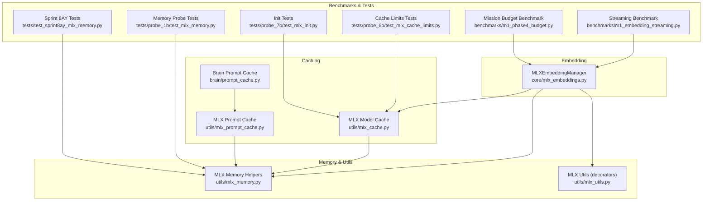
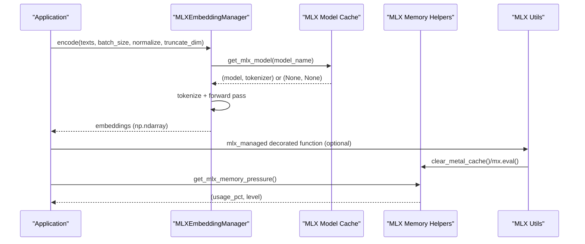
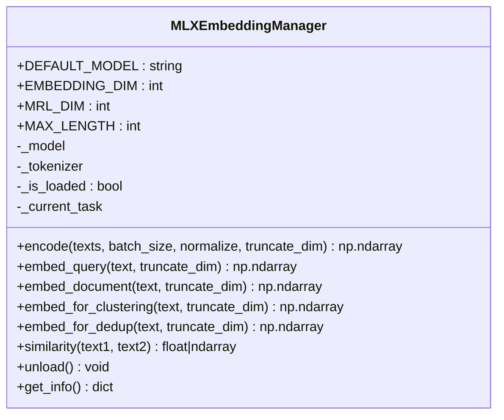
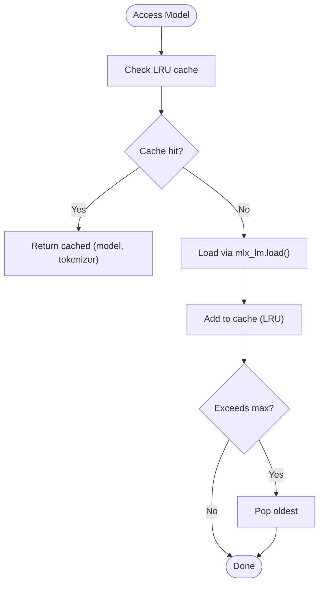
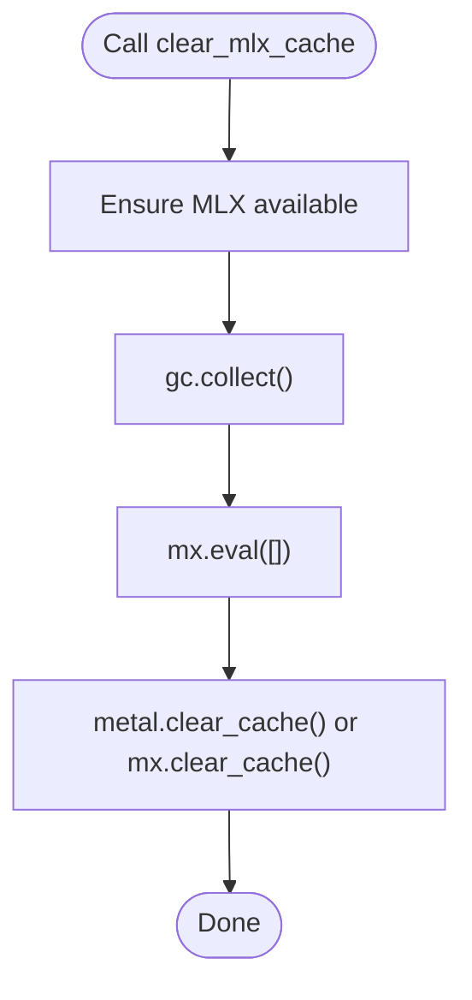
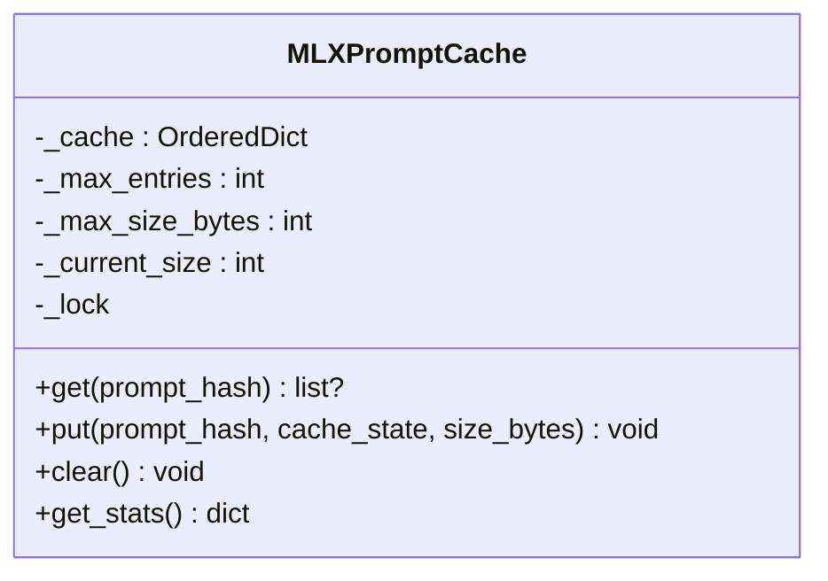
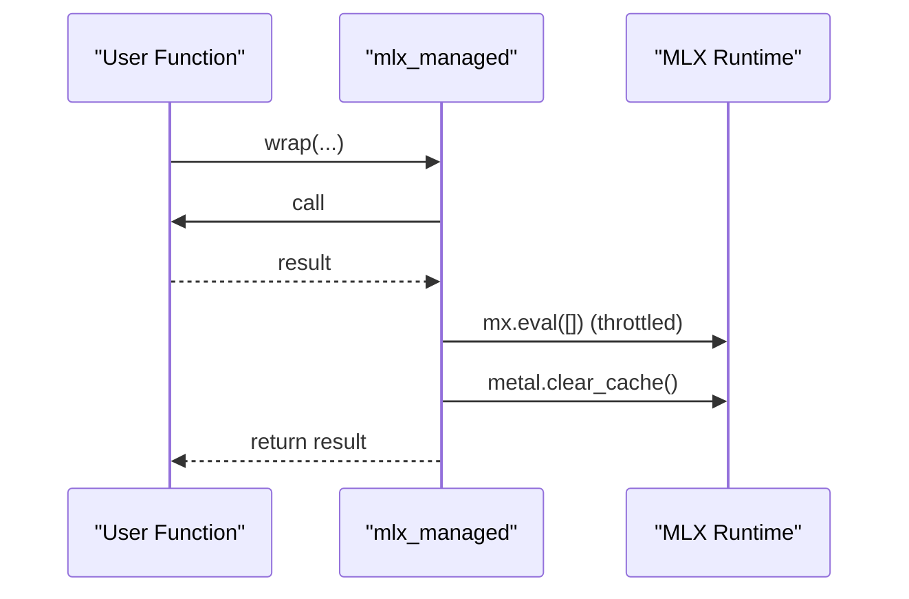
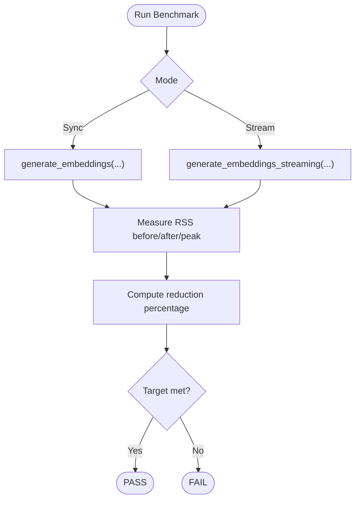
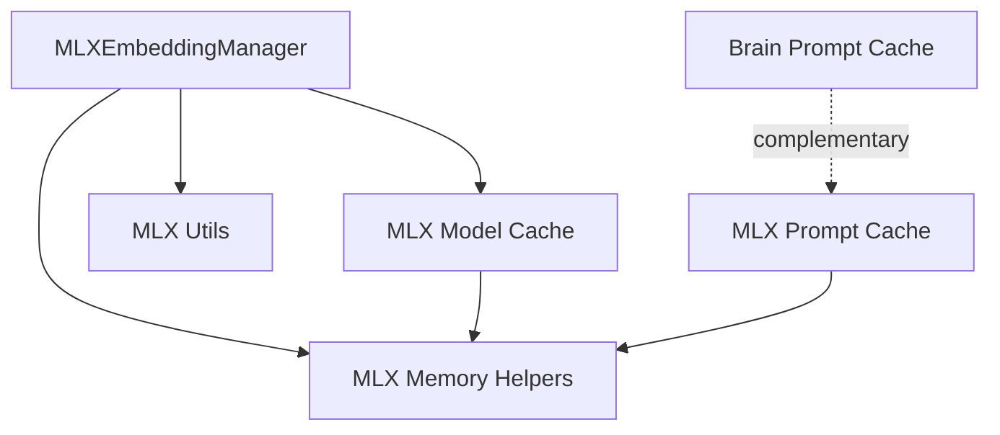

# MLX Integration

<cite>
**Referenced Files in This Document**
- [core/mlx_embeddings.py](file://core/mlx_embeddings.py)
- [utils/mlx_cache.py](file://utils/mlx_cache.py)
- [utils/mlx_memory.py](file://utils/mlx_memory.py)
- [utils/mlx_prompt_cache.py](file://utils/mlx_prompt_cache.py)
- [utils/mlx_utils.py](file://utils/mlx_utils.py)
- [brain/prompt_cache.py](file://brain/prompt_cache.py)
- [benchmarks/m1_embedding_streaming.py](file://benchmarks/m1_embedding_streaming.py)
- [benchmarks/m1_phase4_budget.py](file://benchmarks/m1_phase4_budget.py)
- [tests/probe_1b/test_mlx_memory.py](file://tests/probe_1b/test_mlx_memory.py)
- [tests/probe_6b/test_mlx_cache_limits.py](file://tests/probe_6b/test_mlx_cache_limits.py)
- [tests/probe_7b/test_mlx_init.py](file://tests/probe_7b/test_mlx_init.py)
- [tests/test_sprint8ay_mlx_memory.py](file://tests/test_sprint8ay_mlx_memory.py)
</cite>

## Table of Contents
1. [Introduction](#introduction)
2. [Project Structure](#project-structure)
3. [Core Components](#core-components)
4. [Architecture Overview](#architecture-overview)
5. [Detailed Component Analysis](#detailed-component-analysis)
6. [Dependency Analysis](#dependency-analysis)
7. [Performance Considerations](#performance-considerations)
8. [Troubleshooting Guide](#troubleshooting-guide)
9. [Conclusion](#conclusion)

## Introduction
This document explains the MLX (Metal Performance Shaders) integration utilities designed for efficient GPU utilization on Apple Silicon. It covers memory management, cache optimization strategies, and prompt caching mechanisms. The focus is on preventing thermal throttling, optimizing memory budgets, and enabling high-throughput inference for embedding and language model workloads in research pipelines.

## Project Structure
The MLX integration spans several modules:
- Embedding manager for ModernBERT-based embeddings
- Shared model cache with LRU and concurrency control
- Memory hygiene helpers for Metal memory limits and cache clearing
- Prompt cache for KV state and token prefix reuse
- Utilities for automatic cleanup and throttled evaluation
- Benchmarks and tests validating memory budgets and cache behavior

**Diagram sources**
- [core/mlx_embeddings.py:1-568](file://core/mlx_embeddings.py#L1-L568)
- [utils/mlx_cache.py:1-437](file://utils/mlx_cache.py#L1-L437)
- [utils/mlx_memory.py:1-291](file://utils/mlx_memory.py#L1-L291)
- [utils/mlx_prompt_cache.py:1-91](file://utils/mlx_prompt_cache.py#L1-L91)
- [utils/mlx_utils.py:1-246](file://utils/mlx_utils.py#L1-L246)
- [brain/prompt_cache.py:1-257](file://brain/prompt_cache.py#L1-L257)
- [benchmarks/m1_embedding_streaming.py:1-207](file://benchmarks/m1_embedding_streaming.py#L1-L207)
- [benchmarks/m1_phase4_budget.py:1-235](file://benchmarks/m1_phase4_budget.py#L1-L235)
- [tests/probe_1b/test_mlx_memory.py:1-146](file://tests/probe_1b/test_mlx_memory.py#L1-L146)
- [tests/probe_6b/test_mlx_cache_limits.py:1-66](file://tests/probe_6b/test_mlx_cache_limits.py#L1-L66)
- [tests/probe_7b/test_mlx_init.py:1-91](file://tests/probe_7b/test_mlx_init.py#L1-L91)
- [tests/test_sprint8ay_mlx_memory.py:1-261](file://tests/test_sprint8ay_mlx_memory.py#L1-L261)

**Section sources**
- [core/mlx_embeddings.py:1-568](file://core/mlx_embeddings.py#L1-L568)
- [utils/mlx_cache.py:1-437](file://utils/mlx_cache.py#L1-L437)
- [utils/mlx_memory.py:1-291](file://utils/mlx_memory.py#L1-L291)
- [utils/mlx_prompt_cache.py:1-91](file://utils/mlx_prompt_cache.py#L1-L91)
- [utils/mlx_utils.py:1-246](file://utils/mlx_utils.py#L1-L246)
- [brain/prompt_cache.py:1-257](file://brain/prompt_cache.py#L1-L257)
- [benchmarks/m1_embedding_streaming.py:1-207](file://benchmarks/m1_embedding_streaming.py#L1-L207)
- [benchmarks/m1_phase4_budget.py:1-235](file://benchmarks/m1_phase4_budget.py#L1-L235)
- [tests/probe_1b/test_mlx_memory.py:1-146](file://tests/probe_1b/test_mlx_memory.py#L1-L146)
- [tests/probe_6b/test_mlx_cache_limits.py:1-66](file://tests/probe_6b/test_mlx_cache_limits.py#L1-L66)
- [tests/probe_7b/test_mlx_init.py:1-91](file://tests/probe_7b/test_mlx_init.py#L1-L91)
- [tests/test_sprint8ay_mlx_memory.py:1-261](file://tests/test_sprint8ay_mlx_memory.py#L1-L261)

## Core Components
- MLXEmbeddingManager: ModernBERT-based embedding manager with task-aware prefixing, Matryoshka dimensionality reduction, and batched encoding.
- MLX Model Cache: Shared LRU cache for models with concurrency control and hit/miss metrics.
- MLX Memory Helpers: Lazy MLX import, memory pressure calculation, and cache clearing with debouncing.
- MLX Prompt Cache: Async-safe LRU cache for prompt KV states with explicit size tracking.
- MLX Utils: Decorators for automatic cleanup and throttled evaluation to reduce overhead.
- Benchmarks: Streaming embedding and mission budget benchmarks to validate memory and throughput targets.

**Section sources**
- [core/mlx_embeddings.py:79-420](file://core/mlx_embeddings.py#L79-L420)
- [utils/mlx_cache.py:54-136](file://utils/mlx_cache.py#L54-L136)
- [utils/mlx_memory.py:60-291](file://utils/mlx_memory.py#L60-L291)
- [utils/mlx_prompt_cache.py:19-91](file://utils/mlx_prompt_cache.py#L19-L91)
- [utils/mlx_utils.py:110-246](file://utils/mlx_utils.py#L110-L246)
- [benchmarks/m1_embedding_streaming.py:44-190](file://benchmarks/m1_embedding_streaming.py#L44-L190)
- [benchmarks/m1_phase4_budget.py:111-230](file://benchmarks/m1_phase4_budget.py#L111-L230)

## Architecture Overview
The MLX integration centers around a canonical initialization and cleanup flow, shared caches, and memory hygiene utilities. The embedding manager coordinates with the model cache and memory helpers to ensure controlled GPU memory usage and predictable performance.

**Diagram sources**
- [core/mlx_embeddings.py:236-324](file://core/mlx_embeddings.py#L236-L324)
- [utils/mlx_cache.py:54-99](file://utils/mlx_cache.py#L54-L99)
- [utils/mlx_utils.py:110-160](file://utils/mlx_utils.py#L110-L160)
- [utils/mlx_memory.py:139-170](file://utils/mlx_memory.py#L139-L170)

## Detailed Component Analysis

### MLXEmbeddingManager
- Purpose: Efficient ModernBERT-based embeddings with task-aware prefixing and Matryoshka truncation.
- Key features:
  - Task-aware encoding with prefixes for queries/documents/clustering/deduplication.
  - Batched encoding with configurable batch size and normalization.
  - Truncation to reduced dimensions for downstream efficiency.
  - Lazy model loading via mlx-embeddings.
  - Safe indexing guard ensuring only document embeddings are indexed.
- Usage patterns:
  - Use embed_query/embed_document for asymmetric retrieval.
  - Use embed_for_clustering/embed_for_dedup for symmetric tasks.
  - Truncate_dim reduces storage and improves similarity performance.

**Diagram sources**
- [core/mlx_embeddings.py:79-420](file://core/mlx_embeddings.py#L79-L420)

**Section sources**
- [core/mlx_embeddings.py:79-420](file://core/mlx_embeddings.py#L79-L420)

### MLX Model Cache (LRU + Semaphore)
- Purpose: Shared LRU cache for MLX models with concurrency control and metrics.
- Key features:
  - Max 2 models cached with LRU eviction.
  - Async-safe access with a shared semaphore limiting concurrent inference to 1.
  - Hit/miss counters and cache statistics.
  - Thread-safe eviction and lazy initialization of locks.

**Diagram sources**
- [utils/mlx_cache.py:54-99](file://utils/mlx_cache.py#L54-L99)

**Section sources**
- [utils/mlx_cache.py:18-136](file://utils/mlx_cache.py#L18-L136)

### MLX Memory Helpers
- Purpose: Lazy MLX import, memory pressure monitoring, and cache clearing with debouncing.
- Key features:
  - Lazy availability singleton to avoid importing MLX at module load time.
  - Memory pressure thresholds for M1 8GB UMA (80%/90%).
  - Debounced cache clear and cache limit setters to prevent thrashing.
  - Canonical clear sequence: gc.collect() → mx.eval([]) → metal.clear_cache().

**Diagram sources**
- [utils/mlx_memory.py:60-89](file://utils/mlx_memory.py#L60-L89)

**Section sources**
- [utils/mlx_memory.py:37-291](file://utils/mlx_memory.py#L37-L291)

### MLX Prompt Cache
- Purpose: Async-safe LRU cache for prompt KV states with explicit size tracking.
- Key features:
  - Tracks current size and evicts by size or entry count.
  - Async lock for thread-safety.
  - Stats for hits, misses, evictions, and hit rate.

**Diagram sources**
- [utils/mlx_prompt_cache.py:19-91](file://utils/mlx_prompt_cache.py#L19-L91)

**Section sources**
- [utils/mlx_prompt_cache.py:19-91](file://utils/mlx_prompt_cache.py#L19-L91)

### MLX Utils (Cleanup Decorators)
- Purpose: Automatic cleanup and throttled evaluation to reduce overhead and memory churn.
- Key features:
  - Decorators for automatic mx.eval() and metal.clear_cache() after operations.
  - Throttled mx.eval() to limit frequent GPU queue barriers.
  - Separate decorator for cache-only cleanup when eval overhead is undesired.

**Diagram sources**
- [utils/mlx_utils.py:110-160](file://utils/mlx_utils.py#L110-L160)

**Section sources**
- [utils/mlx_utils.py:110-246](file://utils/mlx_utils.py#L110-L246)

### Benchmarks and Validation
- Streaming Embedding Benchmark: Compares peak RSS deltas between synchronous batching and streaming embedding to validate memory reduction targets.
- Mission Budget Benchmark: Ensures peak RSS remains within M1 8GB mission budget without model loading.

**Diagram sources**
- [benchmarks/m1_embedding_streaming.py:44-190](file://benchmarks/m1_embedding_streaming.py#L44-L190)
- [benchmarks/m1_phase4_budget.py:111-230](file://benchmarks/m1_phase4_budget.py#L111-L230)

**Section sources**
- [benchmarks/m1_embedding_streaming.py:1-207](file://benchmarks/m1_embedding_streaming.py#L1-L207)
- [benchmarks/m1_phase4_budget.py:1-235](file://benchmarks/m1_phase4_budget.py#L1-L235)

## Dependency Analysis
- MLXEmbeddingManager depends on:
  - MLX model cache for model/tokenizer reuse.
  - MLX memory helpers for memory pressure and cache clearing.
  - MLX utils decorators for cleanup and throttling.
- MLX Model Cache depends on:
  - Async primitives and thread locks for concurrency.
  - Lazy initialization of MLX core.
- MLX Prompt Cache depends on:
  - Async lock and MLX availability for memory estimation.
- Brain Prompt Cache complements MLX Prompt Cache with CPU-side approximate similarity and token prefix caching.

**Diagram sources**
- [core/mlx_embeddings.py:79-420](file://core/mlx_embeddings.py#L79-L420)
- [utils/mlx_cache.py:18-136](file://utils/mlx_cache.py#L18-L136)
- [utils/mlx_memory.py:37-291](file://utils/mlx_memory.py#L37-L291)
- [utils/mlx_prompt_cache.py:19-91](file://utils/mlx_prompt_cache.py#L19-L91)
- [brain/prompt_cache.py:48-257](file://brain/prompt_cache.py#L48-L257)

**Section sources**
- [core/mlx_embeddings.py:79-420](file://core/mlx_embeddings.py#L79-L420)
- [utils/mlx_cache.py:18-136](file://utils/mlx_cache.py#L18-L136)
- [utils/mlx_memory.py:37-291](file://utils/mlx_memory.py#L37-L291)
- [utils/mlx_prompt_cache.py:19-91](file://utils/mlx_prompt_cache.py#L19-L91)
- [brain/prompt_cache.py:48-257](file://brain/prompt_cache.py#L48-L257)

## Performance Considerations
- Memory budgeting:
  - Canonical Metal cache and wired limits set to 2.5 GiB each to prevent unified memory saturation on M1 8GB.
  - Debounced cache clearing and throttled mx.eval() reduce overhead and fragmentation.
- Throughput and latency:
  - Shared model cache with concurrency control prevents memory overflow under sustained inference.
  - Streaming embedding benchmark validates significant peak RSS reduction compared to synchronous batching.
- Thermal throttling prevention:
  - Memory pressure monitoring and cache clearing help maintain stable GPU performance.
  - Mission budget benchmark ensures operational envelope stays within M1 8GB constraints.

[No sources needed since this section provides general guidance]

## Troubleshooting Guide
- MLX not available:
  - Lazy import behavior ensures no MLX import at module load time; APIs degrade gracefully returning safe defaults.
- Cache limits not applied:
  - Initialization occurs lazily; call the canonical initializer before inference to set Metal cache and wired limits.
- Frequent cache thrashing:
  - Use debounced cache clear and cache limit setters to avoid rapid repeated operations.
- Excessive memory usage:
  - Monitor memory pressure and trigger cache clearing; use Matryoshka truncation for embeddings to reduce storage and improve similarity performance.

**Section sources**
- [utils/mlx_memory.py:37-89](file://utils/mlx_memory.py#L37-L89)
- [utils/mlx_cache.py:189-273](file://utils/mlx_cache.py#L189-L273)
- [utils/mlx_memory.py:257-291](file://utils/mlx_memory.py#L257-L291)
- [core/mlx_embeddings.py:308-320](file://core/mlx_embeddings.py#L308-L320)

## Conclusion
The MLX integration utilities provide a robust foundation for efficient, memory-conscious inference on Apple Silicon. By combining shared model caching, memory hygiene, and prompt caching with canonical initialization and cleanup patterns, the system achieves predictable performance, reduced thermal throttling, and scalable throughput for embedding and language model workloads in research pipelines.