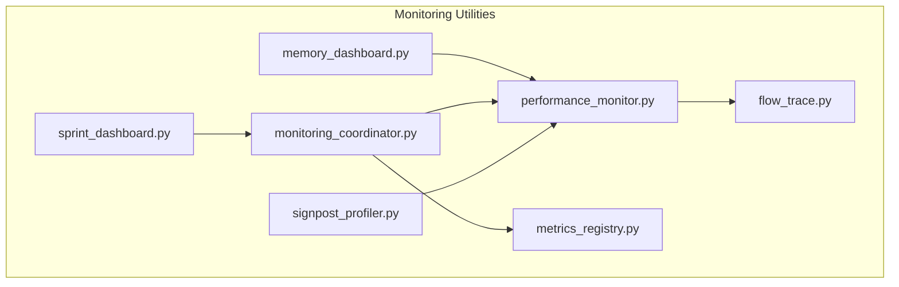
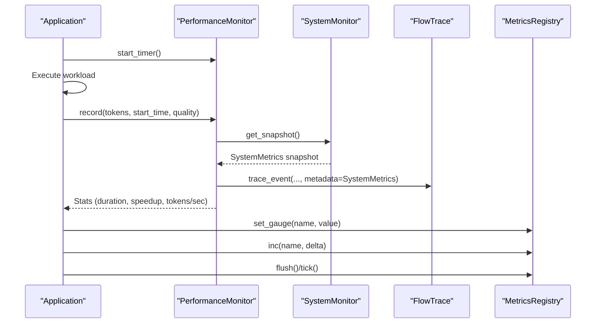
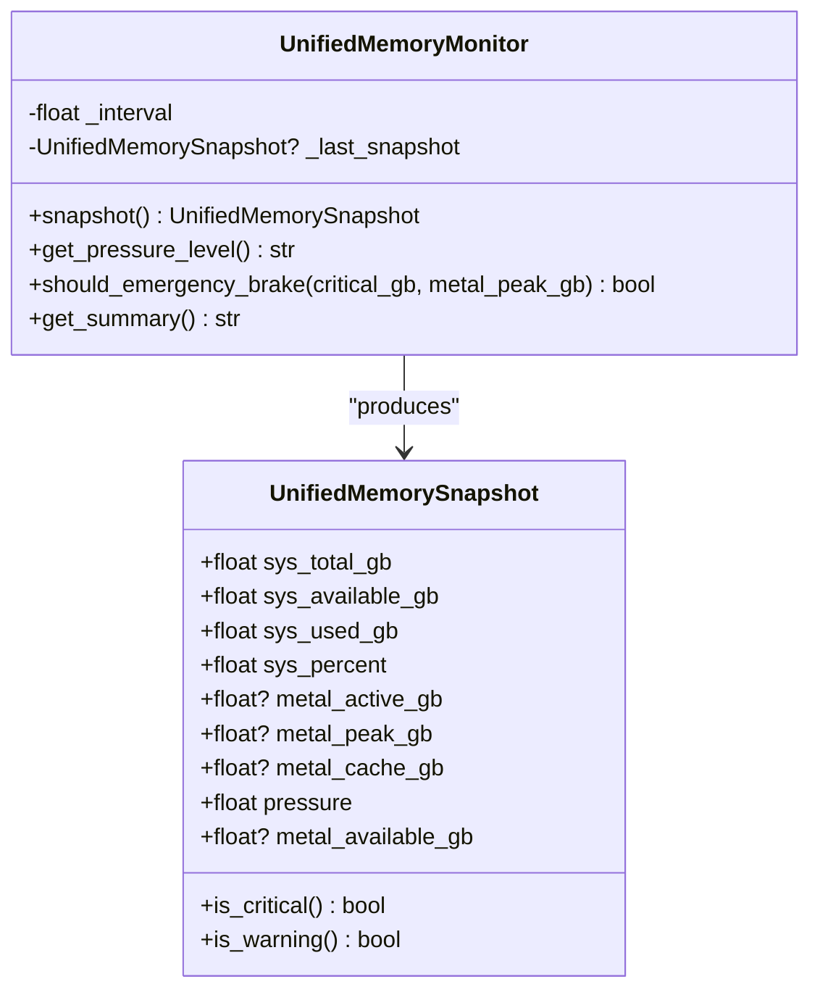
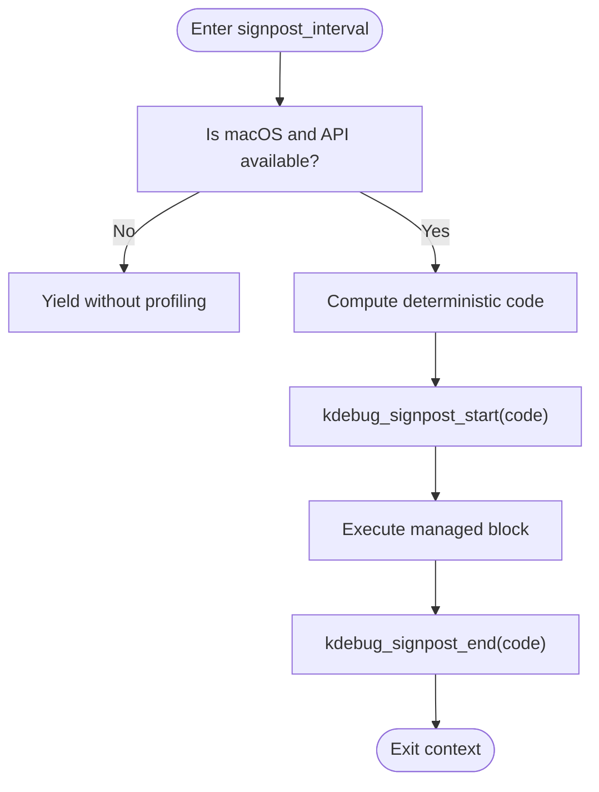
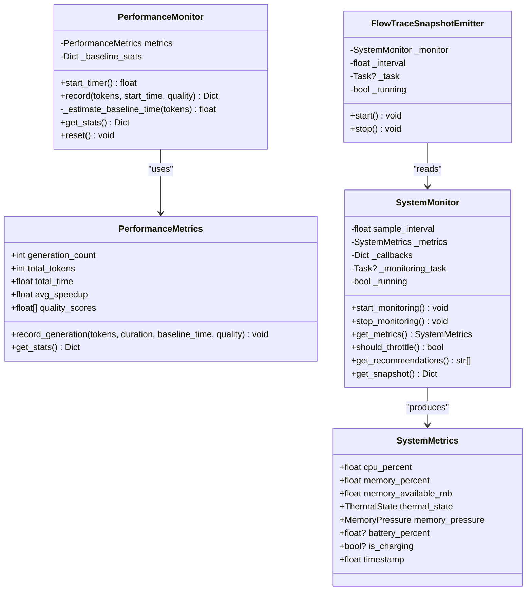
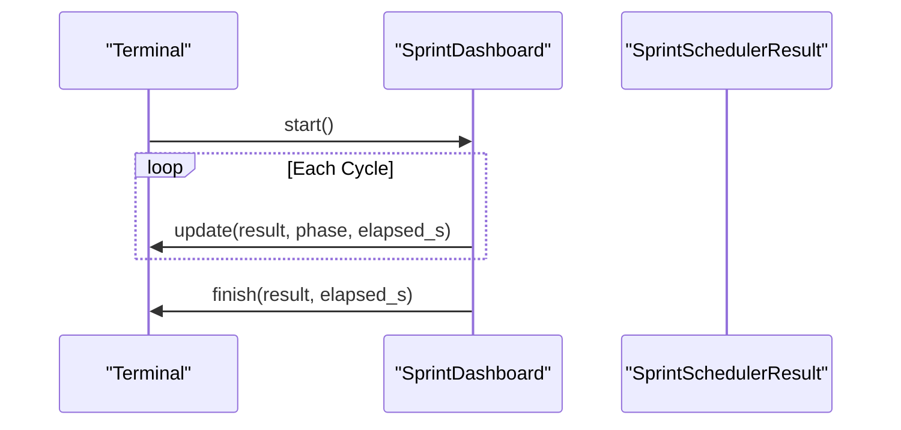
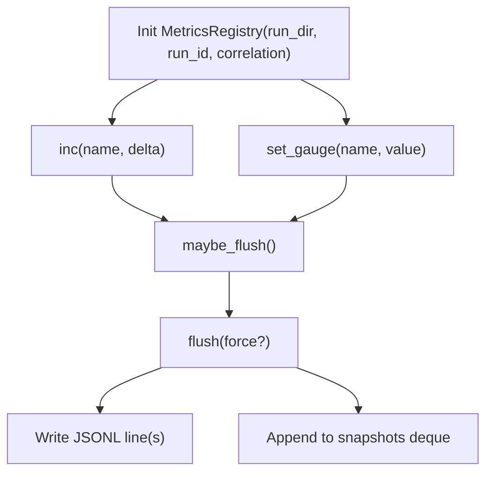
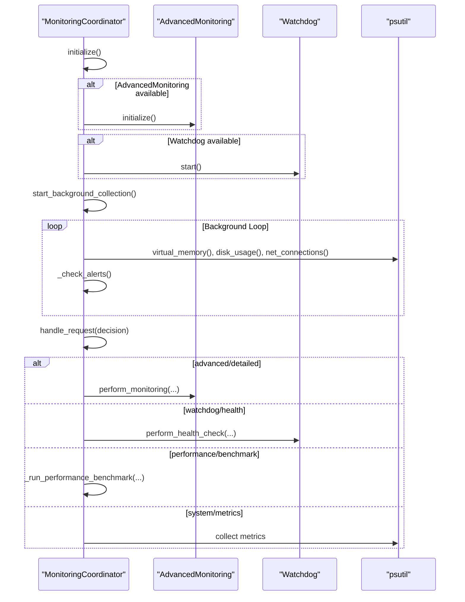
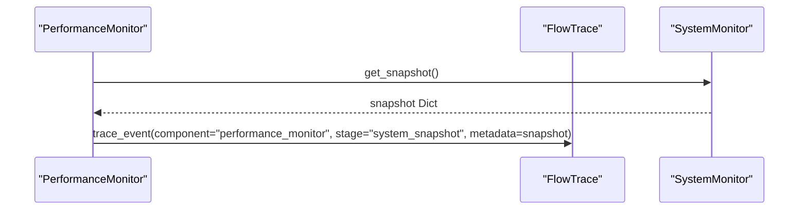
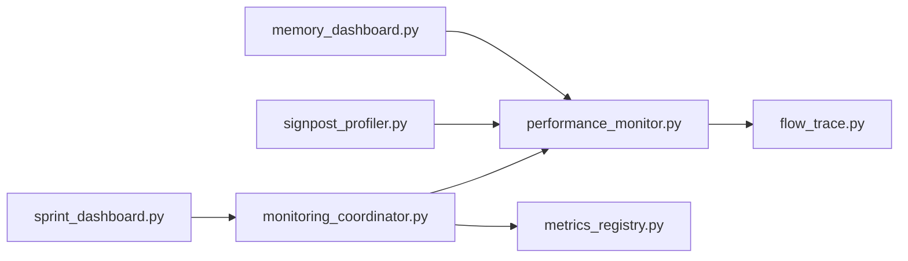

# Performance Monitoring

<cite>
**Referenced Files in This Document**
- [memory_dashboard.py](file://utils/memory_dashboard.py)
- [signpost_profiler.py](file://utils/signpost_profiler.py)
- [performance_monitor.py](file://utils/performance_monitor.py)
- [sprint_dashboard.py](file://monitoring/sprint_dashboard.py)
- [metrics_registry.py](file://metrics_registry.py)
- [monitoring_coordinator.py](file://coordinators/monitoring_coordinator.py)
- [flow_trace.py](file://utils/flow_trace.py)
</cite>

## Table of Contents
1. [Introduction](#introduction)
2. [Project Structure](#project-structure)
3. [Core Components](#core-components)
4. [Architecture Overview](#architecture-overview)
5. [Detailed Component Analysis](#detailed-component-analysis)
6. [Dependency Analysis](#dependency-analysis)
7. [Performance Considerations](#performance-considerations)
8. [Troubleshooting Guide](#troubleshooting-guide)
9. [Conclusion](#conclusion)
10. [Appendices](#appendices)

## Introduction
This document explains the performance monitoring and profiling utilities in the codebase. It covers:
- Real-time memory monitoring for unified system and GPU memory
- Signpost profiler for lightweight macOS performance tracing
- Research pipeline monitoring dashboard
- Performance metrics collection and reporting
- Instrumentation patterns for code performance analysis
- Interpretation of profiling data and bottleneck identification
- Integration with system monitoring and automated performance regression detection

## Project Structure
The performance monitoring stack spans several modules:
- Memory monitoring: unified system and GPU memory snapshots
- Profiling: signpost-based tracing for macOS
- Research pipeline dashboard: live sprint monitoring
- Metrics registry: lightweight, bounded metrics collection with periodic persistence
- System monitoring coordinator: orchestration of system metrics, benchmarks, and alerts
- Flow tracing: low-overhead data flow tracing integrated with periodic system snapshots

**Diagram sources**
- [memory_dashboard.py:1-242](file://utils/memory_dashboard.py#L1-L242)
- [signpost_profiler.py:1-79](file://utils/signpost_profiler.py#L1-L79)
- [performance_monitor.py:1-537](file://utils/performance_monitor.py#L1-L537)
- [sprint_dashboard.py:1-269](file://monitoring/sprint_dashboard.py#L1-L269)
- [metrics_registry.py:1-388](file://metrics_registry.py#L1-L388)
- [monitoring_coordinator.py:1-1210](file://coordinators/monitoring_coordinator.py#L1-L1210)
- [flow_trace.py:1-956](file://utils/flow_trace.py#L1-L956)

**Section sources**
- [memory_dashboard.py:1-242](file://utils/memory_dashboard.py#L1-L242)
- [signpost_profiler.py:1-79](file://utils/signpost_profiler.py#L1-L79)
- [performance_monitor.py:1-537](file://utils/performance_monitor.py#L1-L537)
- [sprint_dashboard.py:1-269](file://monitoring/sprint_dashboard.py#L1-L269)
- [metrics_registry.py:1-388](file://metrics_registry.py#L1-L388)
- [monitoring_coordinator.py:1-1210](file://coordinators/monitoring_coordinator.py#L1-L1210)
- [flow_trace.py:1-956](file://utils/flow_trace.py#L1-L956)

## Core Components
- Unified Memory Monitor: captures system RAM and Metal GPU memory, computes pressure and health indicators
- Signpost Profiler: lightweight macOS signpost instrumentation for deterministic, repeatable profiling
- Performance Monitor: tracks throughput, speedup vs. baseline, and quality validation; integrates system metrics and flow tracing
- Sprint Dashboard: live terminal dashboard for research pipeline phases and telemetry
- Metrics Registry: bounded, in-memory metrics with periodic JSONL persistence and ring-buffer snapshots
- Monitoring Coordinator: orchestrates system metrics, performance benchmarks, alerts, and diagnostics
- Flow Trace: low-overhead tracing of data flow events with optional periodic system snapshots

**Section sources**
- [memory_dashboard.py:37-242](file://utils/memory_dashboard.py#L37-L242)
- [signpost_profiler.py:1-79](file://utils/signpost_profiler.py#L1-L79)
- [performance_monitor.py:23-537](file://utils/performance_monitor.py#L23-L537)
- [sprint_dashboard.py:66-269](file://monitoring/sprint_dashboard.py#L66-L269)
- [metrics_registry.py:76-388](file://metrics_registry.py#L76-L388)
- [monitoring_coordinator.py:101-1210](file://coordinators/monitoring_coordinator.py#L101-L1210)
- [flow_trace.py:151-324](file://utils/flow_trace.py#L151-L324)

## Architecture Overview
The monitoring architecture combines real-time system metrics, lightweight profiling, and bounded telemetry to support research pipeline performance analysis and automated regression detection.

**Diagram sources**
- [performance_monitor.py:84-136](file://utils/performance_monitor.py#L84-L136)
- [performance_monitor.py:421-456](file://utils/performance_monitor.py#L421-L456)
- [flow_trace.py:151-213](file://utils/flow_trace.py#L151-L213)
- [metrics_registry.py:199-310](file://metrics_registry.py#L199-L310)

## Detailed Component Analysis

### Unified Memory Monitor
The unified memory monitor aggregates system RAM and Metal GPU memory on Darwin platforms, computes derived metrics (pressure, availability), and exposes health checks and summaries.

**Diagram sources**
- [memory_dashboard.py:37-158](file://utils/memory_dashboard.py#L37-L158)

Key behaviors:
- Uses psutil for system memory and optional mlx.metal APIs for GPU memory on Darwin
- Computes memory pressure and health indicators
- Provides emergency brake thresholds and human-readable summaries

**Section sources**
- [memory_dashboard.py:37-242](file://utils/memory_dashboard.py#L37-L242)

### Signpost Profiler
The signpost profiler provides deterministic, repeatable profiling markers for macOS using kdebug_signpost. It generates stable codes per category.name and yields safely on non-Darwin platforms.

**Diagram sources**
- [signpost_profiler.py:42-66](file://utils/signpost_profiler.py#L42-L66)

Usage pattern:
- Wrap hotspots with a category and operation name
- Use consistent names to ensure deterministic codes across runs

**Section sources**
- [signpost_profiler.py:1-79](file://utils/signpost_profiler.py#L1-L79)

### Performance Monitor and System Monitor
The performance monitor tracks throughput, speedup vs. baseline, and quality scores. The system monitor collects CPU, memory, thermal state, and memory pressure, and optionally emits periodic snapshots into the flow trace.

**Diagram sources**
- [performance_monitor.py:23-136](file://utils/performance_monitor.py#L23-L136)
- [performance_monitor.py:227-456](file://utils/performance_monitor.py#L227-L456)
- [performance_monitor.py:459-522](file://utils/performance_monitor.py#L459-L522)

Operational highlights:
- PerformanceMonitor records generations, computes speedup, and logs throughput
- SystemMonitor runs an async loop sampling system metrics and triggers callbacks on state changes
- FlowTraceSnapshotEmitter periodically emits system snapshots when tracing is enabled

**Section sources**
- [performance_monitor.py:69-136](file://utils/performance_monitor.py#L69-L136)
- [performance_monitor.py:240-456](file://utils/performance_monitor.py#L240-L456)
- [performance_monitor.py:459-522](file://utils/performance_monitor.py#L459-L522)

### Sprint Dashboard
The sprint dashboard provides a live terminal view of research pipeline phases, findings, cycle progress, and branch/blocker status.

**Diagram sources**
- [sprint_dashboard.py:96-137](file://monitoring/sprint_dashboard.py#L96-L137)

**Section sources**
- [sprint_dashboard.py:66-269](file://monitoring/sprint_dashboard.py#L66-L269)

### Metrics Registry
The metrics registry maintains bounded counters and gauges, periodically flushes to JSONL, and supports correlation metadata for run-scoped telemetry.

**Diagram sources**
- [metrics_registry.py:181-310](file://metrics_registry.py#L181-L310)

Design notes:
- Bounded metric names to avoid uncontrolled cardinality
- Ring buffer for recent snapshots
- Optional psutil-based tick() to capture process memory and FDs
- Graceful degradation when persistence fails

**Section sources**
- [metrics_registry.py:86-388](file://metrics_registry.py#L86-L388)

### Monitoring Coordinator
The monitoring coordinator orchestrates system metrics collection, performance benchmarks, alert thresholds, and diagnostics. It also integrates Hermes3 operation tracking and health status computation.

**Diagram sources**
- [monitoring_coordinator.py:174-241](file://coordinators/monitoring_coordinator.py#L174-L241)
- [monitoring_coordinator.py:320-443](file://coordinators/monitoring_coordinator.py#L320-L443)
- [monitoring_coordinator.py:445-508](file://coordinators/monitoring_coordinator.py#L445-L508)

**Section sources**
- [monitoring_coordinator.py:101-1210](file://coordinators/monitoring_coordinator.py#L101-L1210)

### Flow Trace Integration
Flow trace provides low-overhead, bounded tracing of data flow events and integrates periodic system snapshots from the system monitor.

**Diagram sources**
- [performance_monitor.py:507-516](file://utils/performance_monitor.py#L507-L516)
- [flow_trace.py:151-213](file://utils/flow_trace.py#L151-L213)

**Section sources**
- [flow_trace.py:151-324](file://utils/flow_trace.py#L151-L324)
- [performance_monitor.py:459-522](file://utils/performance_monitor.py#L459-L522)

## Dependency Analysis
- UnifiedMemoryMonitor depends on psutil and optional mlx.metal APIs
- PerformanceMonitor depends on SystemMonitor for system snapshots and FlowTrace for emitting telemetry
- MetricsRegistry depends on psutil for tick() and writes JSONL files
- MonitoringCoordinator composes AdvancedMonitoring, Watchdog, and psutil-based metrics
- FlowTrace is a standalone tracer used by multiple components

**Diagram sources**
- [memory_dashboard.py:1-242](file://utils/memory_dashboard.py#L1-L242)
- [signpost_profiler.py:1-79](file://utils/signpost_profiler.py#L1-L79)
- [performance_monitor.py:1-537](file://utils/performance_monitor.py#L1-L537)
- [sprint_dashboard.py:1-269](file://monitoring/sprint_dashboard.py#L1-L269)
- [metrics_registry.py:1-388](file://metrics_registry.py#L1-L388)
- [monitoring_coordinator.py:1-1210](file://coordinators/monitoring_coordinator.py#L1-L1210)
- [flow_trace.py:1-956](file://utils/flow_trace.py#L1-L956)

**Section sources**
- [memory_dashboard.py:1-242](file://utils/memory_dashboard.py#L1-L242)
- [performance_monitor.py:1-537](file://utils/performance_monitor.py#L1-L537)
- [metrics_registry.py:1-388](file://metrics_registry.py#L1-L388)
- [monitoring_coordinator.py:1-1210](file://coordinators/monitoring_coordinator.py#L1-L1210)
- [flow_trace.py:1-956](file://utils/flow_trace.py#L1-L956)

## Performance Considerations
- Prefer deterministic signpost categories/names for consistent profiling across runs
- Use bounded metrics names to avoid cardinality explosion; rely on correlation metadata for contextual grouping
- Keep flow trace sampling rates tuned to reduce overhead; leverage bounded metadata sanitization
- Use SystemMonitor’s throttling and recommendations to adapt workloads under thermal or memory pressure
- Integrate periodic system snapshots into flow traces to correlate bottlenecks with system conditions

## Troubleshooting Guide
Common issues and remedies:
- Missing psutil or mlx.metal: fallbacks ensure functionality; monitor logs for missing dependencies
- Non-Darwin platforms: signpost profiler is disabled; use alternative timing or sampling approaches
- Tracing disabled: verify environment flags; ensure sampling rate and max events are configured appropriately
- Metrics persistence failures: MetricsRegistry reports degraded mode; check filesystem permissions and disk space
- High memory pressure or thermal throttling: SystemMonitor recommends reducing load; consider lowering concurrency or offloading tasks

**Section sources**
- [memory_dashboard.py:22-34](file://utils/memory_dashboard.py#L22-L34)
- [signpost_profiler.py:15-28](file://utils/signpost_profiler.py#L15-L28)
- [flow_trace.py:73-76](file://utils/flow_trace.py#L73-L76)
- [metrics_registry.py:162-176](file://metrics_registry.py#L162-L176)
- [performance_monitor.py:398-419](file://utils/performance_monitor.py#L398-L419)

## Conclusion
The monitoring stack provides a cohesive set of tools for real-time memory monitoring, lightweight profiling, research pipeline dashboards, bounded metrics collection, and orchestration of system health and performance. By instrumenting code with signposts, integrating system snapshots into flow traces, and leveraging the metrics registry, teams can identify bottlenecks, track regressions, and maintain stability under varying system conditions.

## Appendices

### Instrumentation Examples
- Wrap hotspots with signpost intervals using deterministic category and operation names
- Record performance metrics around generation steps and log throughput and speedup
- Emit flow trace events for major pipeline stages and augment with system snapshots
- Use MetricsRegistry to track counters and gauges for resource utilization and operational signals

**Section sources**
- [signpost_profiler.py:42-66](file://utils/signpost_profiler.py#L42-L66)
- [performance_monitor.py:88-118](file://utils/performance_monitor.py#L88-L118)
- [flow_trace.py:151-213](file://utils/flow_trace.py#L151-L213)
- [metrics_registry.py:181-215](file://metrics_registry.py#L181-L215)

### Monitoring Research Pipeline Performance
- Use Sprint Dashboard to observe phases, cycle progress, and branch/blocker status during sprints
- Combine SystemMonitor recommendations with flow trace snapshots to diagnose stalls or spikes
- Track performance regressions via MetricsRegistry and compare averages/peaks over time windows

**Section sources**
- [sprint_dashboard.py:66-269](file://monitoring/sprint_dashboard.py#L66-L269)
- [performance_monitor.py:459-522](file://utils/performance_monitor.py#L459-L522)
- [monitoring_coordinator.py:618-668](file://coordinators/monitoring_coordinator.py#L618-L668)