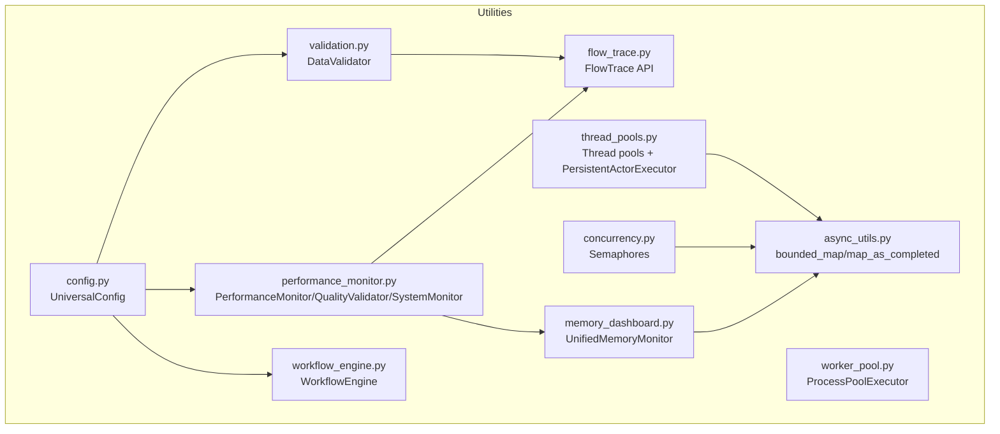
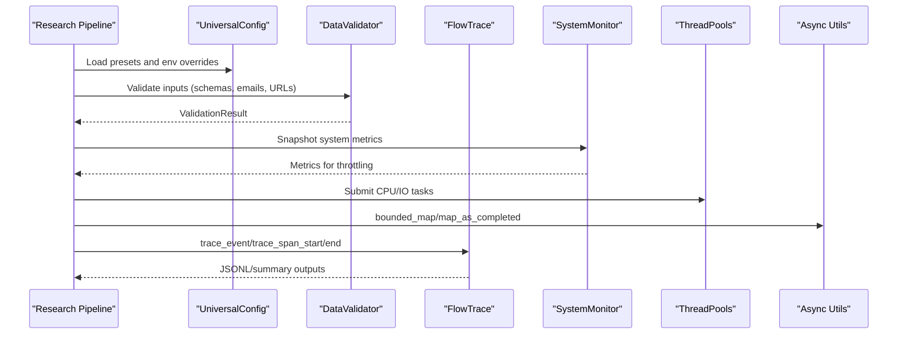
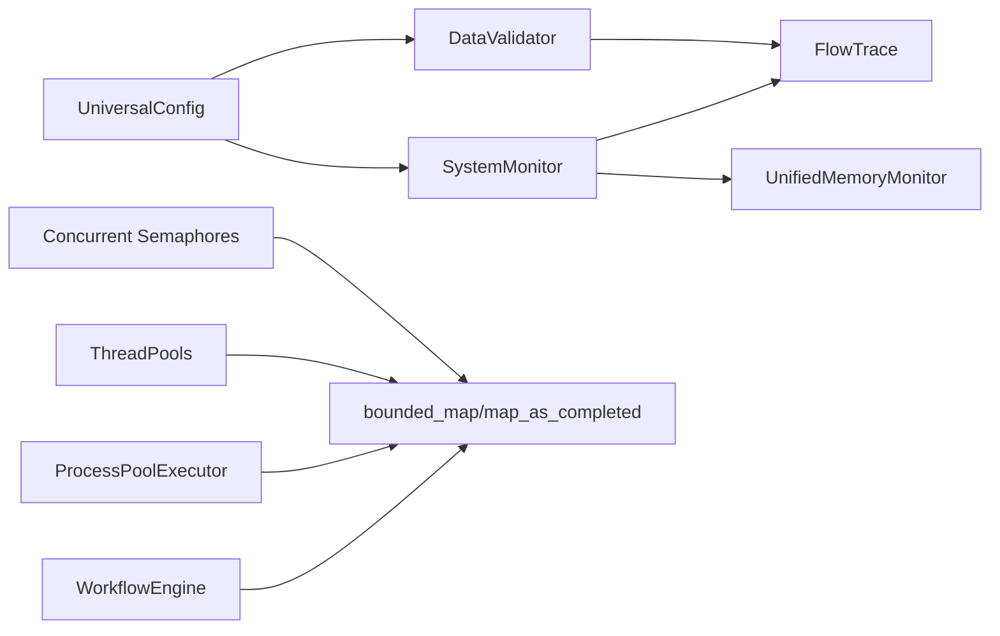

# System Helpers

<cite>
**Referenced Files in This Document**
- [utils/__init__.py](file://utils/__init__.py)
- [utils/config.py](file://utils/config.py)
- [utils/validation.py](file://utils/validation.py)
- [utils/flow_trace.py](file://utils/flow_trace.py)
- [utils/thread_pools.py](file://utils/thread_pools.py)
- [utils/worker_pool.py](file://utils/worker_pool.py)
- [utils/concurrency.py](file://utils/concurrency.py)
- [utils/async_utils.py](file://utils/async_utils.py)
- [utils/performance_monitor.py](file://utils/performance_monitor.py)
- [utils/workflow_engine.py](file://utils/workflow_engine.py)
- [utils/memory_dashboard.py](file://utils/memory_dashboard.py)
- [config.py](file://config.py)
</cite>

## Table of Contents
1. [Introduction](#introduction)
2. [Project Structure](#project-structure)
3. [Core Components](#core-components)
4. [Architecture Overview](#architecture-overview)
5. [Detailed Component Analysis](#detailed-component-analysis)
6. [Dependency Analysis](#dependency-analysis)
7. [Performance Considerations](#performance-considerations)
8. [Troubleshooting Guide](#troubleshooting-guide)
9. [Conclusion](#conclusion)

## Introduction
This document describes the system-level helper utilities that underpin the Hledac AI Research Platform. It focuses on configuration management, input validation, flow tracing for debugging, and thread/worker pool management. These utilities ensure reliable operation, predictable performance, and strong debugging capabilities across diverse research pipelines and environments, especially optimized for Apple Silicon M1 systems.

## Project Structure
The system helpers are primarily located under the utils package and integrate with broader orchestration and research modules. They expose a unified interface for:
- Centralized configuration presets and environment-driven tuning
- Robust input validation with caching and extensibility
- Lightweight, always-on flow tracing with bounded memory and sampling
- Asynchronous and synchronous concurrency primitives and worker pools
- Performance monitoring, quality validation, and system-aware throttling
- DAG-based workflow execution with retries and parallelism

**Diagram sources**
- [utils/config.py:228-498](file://utils/config.py#L228-L498)
- [utils/validation.py:51-432](file://utils/validation.py#L51-L432)
- [utils/flow_trace.py:151-323](file://utils/flow_trace.py#L151-L323)
- [utils/thread_pools.py:141-327](file://utils/thread_pools.py#L141-L327)
- [utils/worker_pool.py:1-4](file://utils/worker_pool.py#L1-L4)
- [utils/concurrency.py:22-142](file://utils/concurrency.py#L22-L142)
- [utils/async_utils.py:78-230](file://utils/async_utils.py#L78-L230)
- [utils/performance_monitor.py:69-536](file://utils/performance_monitor.py#L69-L536)
- [utils/workflow_engine.py:132-368](file://utils/workflow_engine.py#L132-L368)
- [utils/memory_dashboard.py:82-241](file://utils/memory_dashboard.py#L82-L241)

**Section sources**
- [utils/__init__.py:1-240](file://utils/__init__.py#L1-L240)

## Core Components
- Configuration Management
  - Centralized configuration with environment-driven overrides, M1 8GB presets, and validation.
  - Provides research-mode presets and layered sub-configurations for security, stealth, privacy, and deep research.
- Input Validation
  - High-performance validator with caching, strictness controls, and extensible custom validators.
  - Supports JSON schema validation, email and URL checks, and structured error reporting.
- Flow Tracing
  - Lightweight, always-on tracing with sampling, bounded buffers, and JSONL output.
  - Rich event types for fetch, dedup, evidence append/flush, and anti-bot challenges.
- Concurrency and Worker Pools
  - Asynchronous concurrency controls (semaphores) with adaptive limits and memory-aware adjustments.
  - Thread pools with Apple Silicon QoS and named executors for ANE and DB workloads.
  - Process pool for CPU-intensive tasks and bounded async helpers for controlled parallelism.
- Performance Monitoring and Quality
  - Performance metrics tracking, speedup computation, and quality scoring.
  - System monitor with thermal and memory pressure states, plus periodic flow trace snapshots.
- Workflow Engine
  - DAG-based execution with parallel levels, retries, and parameter substitution.

**Section sources**
- [utils/config.py:228-498](file://utils/config.py#L228-L498)
- [utils/validation.py:51-432](file://utils/validation.py#L51-L432)
- [utils/flow_trace.py:151-323](file://utils/flow_trace.py#L151-L323)
- [utils/concurrency.py:22-142](file://utils/concurrency.py#L22-L142)
- [utils/thread_pools.py:141-327](file://utils/thread_pools.py#L141-L327)
- [utils/worker_pool.py:1-4](file://utils/worker_pool.py#L1-L4)
- [utils/async_utils.py:78-230](file://utils/async_utils.py#L78-L230)
- [utils/performance_monitor.py:69-536](file://utils/performance_monitor.py#L69-L536)
- [utils/workflow_engine.py:132-368](file://utils/workflow_engine.py#L132-L368)
- [utils/memory_dashboard.py:82-241](file://utils/memory_dashboard.py#L82-L241)

## Architecture Overview
The system helpers form a cohesive layer that:
- Normalizes configuration across modules
- Validates inputs early to fail fast
- Surfaces runtime behavior via flow traces
- Controls concurrency and resource usage to maintain stability
- Monitors performance and system health for adaptive behavior

**Diagram sources**
- [utils/config.py:466-498](file://utils/config.py#L466-L498)
- [utils/validation.py:215-312](file://utils/validation.py#L215-L312)
- [utils/performance_monitor.py:421-456](file://utils/performance_monitor.py#L421-L456)
- [utils/thread_pools.py:81-106](file://utils/thread_pools.py#L81-L106)
- [utils/async_utils.py:78-155](file://utils/async_utils.py#L78-L155)
- [utils/flow_trace.py:151-276](file://utils/flow_trace.py#L151-L276)

## Detailed Component Analysis

### Configuration Management
- Purpose: Provide a single source of truth for research orchestration with environment-driven tuning and M1-specific optimizations.
- Key features:
  - Presets for QUICK/STANDARD/DEEP/EXTREME/AUTONOMOUS modes
  - M1 8GB RAM and thermal thresholds
  - Layered sub-configs for security, stealth, privacy, and deep research
  - Environment variable overrides and runtime updates
  - Validation of configuration boundaries and warnings for RAM-heavy combinations
- Integration patterns:
  - Used by orchestrators to select research modes and adjust agent concurrency and timeouts
  - Applied to disable heavy features when memory is constrained

Best practices:
- Prefer mode-based presets for consistent behavior
- Use environment variables for deployment-time overrides
- Validate configuration before starting long-running research sessions

**Section sources**
- [utils/config.py:228-498](file://utils/config.py#L228-L498)
- [config.py:1-666](file://config.py#L1-L666)

### Input Validation
- Purpose: Enforce data correctness early with caching, strictness, and structured error reporting.
- Key features:
  - Email and URL validation with configurable strictness and allowed schemes
  - JSON schema validation with required fields, type checks, and format enforcement
  - Custom validator registration and composition
  - LRU-style cache for validation results and performance stats
- Integration patterns:
  - Used by ingestion and research components to validate inputs before processing
  - Integrates with flow tracing to capture validation failures and previews

Examples:
- Validate a user profile against a schema with required fields and formats
- Register a custom phone-number validator and apply it to incoming data
- Use cache statistics to tune validation performance

**Section sources**
- [utils/validation.py:51-432](file://utils/validation.py#L51-L432)

### Flow Tracing for Debugging
- Purpose: Provide low-overhead, always-on data flow tracing with sampling and bounded memory.
- Key features:
  - Environment flags for enabling tracing, sampling rate, and max events
  - Event types for fetch, dedup, evidence append/flush, and anti-bot challenges
  - Span tracking for nested timing and counters
  - JSONL output with periodic summaries
- Integration patterns:
  - Used by fetch and evidence components to trace bottlenecks
  - Periodic snapshots emitted by SystemMonitor when tracing is enabled

Examples:
- Trace a fetch start/end with transport and status
- Trace a dedup decision with reason metadata
- Emit periodic system snapshots during research runs

**Section sources**
- [utils/flow_trace.py:1-323](file://utils/flow_trace.py#L1-L323)
- [utils/performance_monitor.py:459-522](file://utils/performance_monitor.py#L459-L522)

### Concurrency and Worker Pool Management
- Purpose: Control parallelism and resource usage to maintain stability and responsiveness.
- Key features:
  - Adaptive fetch semaphores for clearnet vs Tor to avoid head-of-line blocking
  - Memory-aware concurrency reduction using UnifiedMemoryMonitor
  - Thread pools with Apple Silicon QoS (P/E cores) and named executors for ANE and DB
  - Process pool for CPU-intensive tasks
  - Bounded async helpers for controlled parallelism with retries and jitter
- Integration patterns:
  - Async tasks use bounded_map/map_as_completed to limit concurrency and handle failures
  - Thread pools are used for I/O-bound and specialized workloads
  - Memory dashboard informs dynamic worker adjustments

Examples:
- Use bounded_map to run a batch of I/O tasks with retry and memory-pressure awareness
- Submit CPU-intensive work to the process pool via the global executor
- Use PersistentActorExecutor to bridge worker threads to an event loop

**Section sources**
- [utils/concurrency.py:22-142](file://utils/concurrency.py#L22-L142)
- [utils/thread_pools.py:141-327](file://utils/thread_pools.py#L141-L327)
- [utils/worker_pool.py:1-4](file://utils/worker_pool.py#L1-L4)
- [utils/async_utils.py:78-230](file://utils/async_utils.py#L78-L230)
- [utils/memory_dashboard.py:82-241](file://utils/memory_dashboard.py#L82-L241)

### Performance Monitoring and Quality
- Purpose: Track performance, compute speedup relative to baseline, and validate output quality.
- Key features:
  - PerformanceMonitor for generations, tokens, and speedup
  - QualityValidator for textual similarity and heuristics
  - SystemMonitor with thermal and memory pressure states
  - FlowTraceSnapshotEmitter to periodically emit system snapshots when tracing is enabled
- Integration patterns:
  - Used by research stages to record timing and quality metrics
  - SystemMonitor drives throttling and recommendations based on current state

**Section sources**
- [utils/performance_monitor.py:69-536](file://utils/performance_monitor.py#L69-L536)

### Workflow Engine
- Purpose: Execute DAG-based workflows with parallel levels, retries, and parameter substitution.
- Key features:
  - Task types: normal, conditional, loop, parallel
  - Topological execution with parallel levels
  - Retry with exponential backoff and context parameter resolution
- Integration patterns:
  - Used by orchestrators to define and execute research phases

**Section sources**
- [utils/workflow_engine.py:132-368](file://utils/workflow_engine.py#L132-L368)

## Dependency Analysis
The utilities are loosely coupled and designed for composability. Configuration is consumed by validation, tracing, and monitoring. Concurrency and pools are used by async utilities and workflow engine. Performance monitoring integrates with tracing and memory dashboards.

**Diagram sources**
- [utils/config.py:228-498](file://utils/config.py#L228-L498)
- [utils/validation.py:51-432](file://utils/validation.py#L51-L432)
- [utils/flow_trace.py:151-323](file://utils/flow_trace.py#L151-L323)
- [utils/performance_monitor.py:240-522](file://utils/performance_monitor.py#L240-L522)
- [utils/memory_dashboard.py:82-241](file://utils/memory_dashboard.py#L82-L241)
- [utils/concurrency.py:22-142](file://utils/concurrency.py#L22-L142)
- [utils/async_utils.py:78-230](file://utils/async_utils.py#L78-L230)
- [utils/thread_pools.py:141-327](file://utils/thread_pools.py#L141-L327)
- [utils/worker_pool.py:1-4](file://utils/worker_pool.py#L1-L4)
- [utils/workflow_engine.py:132-368](file://utils/workflow_engine.py#L132-L368)

**Section sources**
- [utils/__init__.py:126-239](file://utils/__init__.py#L126-L239)

## Performance Considerations
- Always-on tracing is fail-open and bounded; tune sampling and max events to balance fidelity and overhead.
- Use memory-aware concurrency helpers to reduce contention under memory pressure.
- Prefer adaptive worker strategies and bounded pools to avoid resource exhaustion.
- Validate configuration early to prevent expensive misconfiguration-induced failures.
- Use flow tracing to identify hotspots and adjust worker pools or concurrency limits accordingly.

[No sources needed since this section provides general guidance]

## Troubleshooting Guide
Common scenarios and remedies:
- High memory pressure causing throttling
  - Use UnifiedMemoryMonitor to detect pressure and reduce concurrency
  - Review M1 presets and disable heavy features if needed
- Frequent validation failures
  - Inspect ValidationResult errors and adjust custom validators
  - Verify allowed schemes and strictness settings
- Bottlenecks in fetch/evidence
  - Enable flow tracing and review JSONL/summary outputs
  - Use span tracking to measure stage durations
- Unstable async execution
  - Use bounded_map with retry and jitter to handle transient failures
  - Adjust semaphore limits for clearnet vs Tor separation

**Section sources**
- [utils/performance_monitor.py:385-419](file://utils/performance_monitor.py#L385-L419)
- [utils/validation.py:314-380](file://utils/validation.py#L314-L380)
- [utils/flow_trace.py:293-323](file://utils/flow_trace.py#L293-L323)
- [utils/async_utils.py:78-155](file://utils/async_utils.py#L78-L155)

## Conclusion
The system-level helpers provide a robust foundation for configuration, validation, tracing, and concurrency control. Together with performance monitoring and workflow execution, they enable reliable, debuggable, and adaptive research pipelines—especially optimized for M1 environments. Adopt the integration patterns and best practices outlined here to ensure consistent behavior and strong operational insights across diverse research tasks.