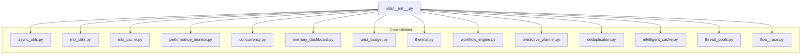
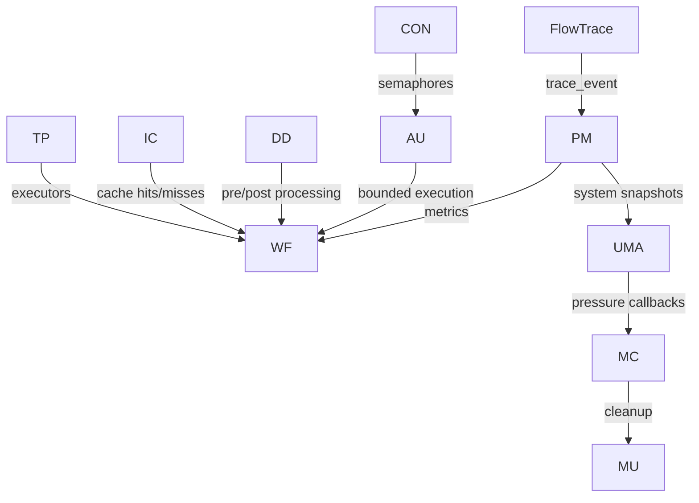
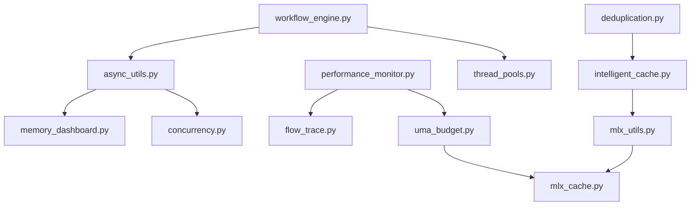

# Utilities and Helpers

<cite>
**Referenced Files in This Document**
- [utils/__init__.py](file://utils/__init__.py)
- [utils/async_utils.py](file://utils/async_utils.py)
- [utils/mlx_utils.py](file://utils/mlx_utils.py)
- [utils/mlx_cache.py](file://utils/mlx_cache.py)
- [utils/performance_monitor.py](file://utils/performance_monitor.py)
- [utils/concurrency.py](file://utils/concurrency.py)
- [utils/memory_dashboard.py](file://utils/memory_dashboard.py)
- [utils/uma_budget.py](file://utils/uma_budget.py)
- [utils/thermal.py](file://utils/thermal.py)
- [utils/workflow_engine.py](file://utils/workflow_engine.py)
- [utils/predictive_planner.py](file://utils/predictive_planner.py)
- [utils/deduplication.py](file://utils/deduplication.py)
- [utils/intelligent_cache.py](file://utils/intelligent_cache.py)
- [utils/thread_pools.py](file://utils/thread_pools.py)
- [utils/flow_trace.py](file://utils/flow_trace.py)
</cite>

## Table of Contents
1. [Introduction](#introduction)
2. [Project Structure](#project-structure)
3. [Core Components](#core-components)
4. [Architecture Overview](#architecture-overview)
5. [Detailed Component Analysis](#detailed-component-analysis)
6. [Dependency Analysis](#dependency-analysis)
7. [Performance Considerations](#performance-considerations)
8. [Troubleshooting Guide](#troubleshooting-guide)
9. [Conclusion](#conclusion)

## Introduction
This document describes the utilities and helper subsystem that powers performance monitoring, concurrency control, MLX integration, memory management, workflow orchestration, deduplication, and observability across the system. It explains implementation details, invocation relationships, interfaces, domain models, and usage patterns, with concrete references to the codebase. It also covers configuration options, parameters, return values, and relationships with other components, addressing both beginners and experienced developers.

## Project Structure
The utilities are organized under the utils package and exported via a central module for easy consumption across the system. Key areas include:
- Async concurrency and bounded execution helpers
- MLX memory management and model caching
- Performance monitoring and system metrics
- Concurrency primitives and adaptive worker pools
- Memory and thermal monitoring
- Workflow execution and predictive planning
- Deduplication strategies and intelligent caching
- Flow tracing for runtime observability

**Diagram sources**
- [utils/__init__.py:1-240](file://utils/__init__.py#L1-L240)

**Section sources**
- [utils/__init__.py:1-240](file://utils/__init__.py#L1-L240)

## Core Components
This section highlights the primary utility modules and their roles.

- Async concurrency helpers: bounded_map, map_as_completed, bounded_gather, TaskResult
- MLX utilities: memory management, cache, and cleanup decorators
- Performance monitoring: metrics, quality validation, system monitoring, and flow tracing integration
- Concurrency controls: shared semaphores, adaptive limits, and transport separation
- Memory and thermal monitoring: unified memory snapshots, UMA watchdog, and thermal state
- Workflow engine: DAG-based execution, retries, and parameter substitution
- Predictive planner: speculative execution, rollback, and accuracy tracking
- Deduplication: semantic, content, and metadata strategies with hybrid approaches
- Intelligent cache: ARC eviction, adaptive strategies, persistence, and memory-optimized URL set
- Thread pools: Apple Silicon core-aware executors and persistent actor bridge
- Flow trace: low-overhead runtime tracing with enums and convenience wrappers

**Section sources**
- [utils/async_utils.py:1-231](file://utils/async_utils.py#L1-L231)
- [utils/mlx_utils.py:1-246](file://utils/mlx_utils.py#L1-L246)
- [utils/mlx_cache.py:1-437](file://utils/mlx_cache.py#L1-L437)
- [utils/performance_monitor.py:1-537](file://utils/performance_monitor.py#L1-L537)
- [utils/concurrency.py:1-142](file://utils/concurrency.py#L1-L142)
- [utils/memory_dashboard.py:1-242](file://utils/memory_dashboard.py#L1-L242)
- [utils/uma_budget.py:1-489](file://utils/uma_budget.py#L1-L489)
- [utils/thermal.py:1-203](file://utils/thermal.py#L1-L203)
- [utils/workflow_engine.py:1-369](file://utils/workflow_engine.py#L1-L369)
- [utils/predictive_planner.py:1-358](file://utils/predictive_planner.py#L1-L358)
- [utils/deduplication.py:1-800](file://utils/deduplication.py#L1-L800)
- [utils/intelligent_cache.py:1-782](file://utils/intelligent_cache.py#L1-L782)
- [utils/thread_pools.py:1-327](file://utils/thread_pools.py#L1-L327)
- [utils/flow_trace.py:1-956](file://utils/flow_trace.py#L1-L956)

## Architecture Overview
The utilities subsystem integrates tightly with the broader system through shared primitives and cross-cutting concerns:
- Concurrency and flow tracing provide the foundation for safe, observable execution
- MLX utilities and caches enable efficient model inference on Apple Silicon
- Performance monitoring and system metrics inform adaptive controls
- Deduplication and intelligent caching optimize throughput and memory usage
- Predictive planning and workflow engines coordinate complex pipelines

**Diagram sources**
- [utils/flow_trace.py:150-277](file://utils/flow_trace.py#L150-L277)
- [utils/performance_monitor.py:298-456](file://utils/performance_monitor.py#L298-L456)
- [utils/uma_budget.py:362-489](file://utils/uma_budget.py#L362-L489)
- [utils/mlx_cache.py:331-436](file://utils/mlx_cache.py#L331-L436)
- [utils/mlx_utils.py:110-246](file://utils/mlx_utils.py#L110-L246)
- [utils/concurrency.py:18-78](file://utils/concurrency.py#L18-L78)
- [utils/async_utils.py:78-156](file://utils/async_utils.py#L78-L156)
- [utils/workflow_engine.py:195-262](file://utils/workflow_engine.py#L195-L262)
- [utils/deduplication.py:180-265](file://utils/deduplication.py#L180-L265)
- [utils/intelligent_cache.py:188-310](file://utils/intelligent_cache.py#L188-L310)
- [utils/thread_pools.py:141-327](file://utils/thread_pools.py#L141-L327)

## Detailed Component Analysis

### Async Concurrency Helpers
Implements bounded concurrency, retries, memory-aware throttling, and streaming completion.

Key elements:
- TaskResult: structured result with index for ordered mapping
- bounded_map: executes tasks with bounded concurrency, retry with exponential backoff and jitter, memory-aware throttling
- map_as_completed: streams results as they complete
- bounded_gather: simplified wrapper around bounded_map

Usage patterns:
- Use bounded_map for batch operations with controlled parallelism and retries
- Use map_as_completed for streaming results (e.g., OSINT fetching)
- Use bounded_gather for simpler coroutine gathering with bounded concurrency

Parameters and return values:
- bounded_map: tasks list of (callable, args, kwargs), max_concurrent, max_retries, cancel_on_error, memory_pressure_check, retryable_exceptions, timeout; returns list of results aligned by input index
- map_as_completed: yields (index, result) tuples as tasks complete
- bounded_gather: returns list of results

Integration:
- Uses UnifiedMemoryMonitor for memory pressure checks
- Supports Python 3.11+ TaskGroup for cancel_on_error behavior

**Section sources**
- [utils/async_utils.py:40-231](file://utils/async_utils.py#L40-L231)

### MLX Utilities and Cache
Provides memory management, model caching, and cleanup routines for MLX on Apple Silicon.

Key elements:
- mlx_utils: mlx_managed decorator, mlx_cleanup_after, get_mlx_memory_stats, reset_metal_peak
- mlx_cache: LRU cache for models, shared semaphore, memory limit configuration, cleanup functions, and watchdog integration

Usage patterns:
- Wrap MLX operations with mlx_managed to automatically evaluate and clear Metal cache
- Use get_mlx_model to retrieve cached models with LRU eviction
- Configure Metal memory limits once via init_mlx_buffers
- Trigger cleanup with mlx_cleanup_sync or mlx_cleanup_aggressive

Parameters and return values:
- get_mlx_memory_stats: returns dict with active_mb, peak_mb, cache_mb
- get_mlx_model: returns (model, tokenizer) or (None, None)
- get_metal_limits_status: returns dict with configured, cache_limit_bytes, wired_limit_bytes, last_error

Integration:
- Integrates with performance_monitor and flow_trace for diagnostics
- Used by brain modules for model lifecycle and inference

**Section sources**
- [utils/mlx_utils.py:110-246](file://utils/mlx_utils.py#L110-L246)
- [utils/mlx_cache.py:54-136](file://utils/mlx_cache.py#L54-L136)
- [utils/mlx_cache.py:294-321](file://utils/mlx_cache.py#L294-L321)
- [utils/mlx_cache.py:331-436](file://utils/mlx_cache.py#L331-L436)

### Performance Monitoring and System Metrics
Monitors performance, validates quality, and tracks system metrics for M1 devices.

Key elements:
- PerformanceMonitor: records generations, computes speedup, and aggregates metrics
- QualityValidator: compares outputs against references and applies heuristics
- SystemMonitor: tracks CPU, memory, thermal state, and memory pressure; supports callbacks and throttling
- FlowTraceSnapshotEmitter: periodically emits system snapshots when tracing is enabled

Usage patterns:
- Use PerformanceMonitor.record to measure generation performance
- Use SystemMonitor.get_recommendations for operational guidance
- Register callbacks for thermal/memory state changes

Parameters and return values:
- record: tokens, start_time, quality_score; returns dict with duration, speedup, tokens_per_sec
- get_recommendations: returns list of advice strings
- get_snapshot: returns dict with rss_mb, cpu_percent, memory_percent, thermal_state, memory_pressure

Integration:
- Integrated with flow_trace for runtime observability
- Provides baselines for speedup calculations

**Section sources**
- [utils/performance_monitor.py:88-136](file://utils/performance_monitor.py#L88-L136)
- [utils/performance_monitor.py:152-198](file://utils/performance_monitor.py#L152-L198)
- [utils/performance_monitor.py:288-456](file://utils/performance_monitor.py#L288-L456)
- [utils/performance_monitor.py:499-522](file://utils/performance_monitor.py#L499-L522)

### Concurrency Controls and Adaptive Limits
Centralizes shared semaphores and adaptive concurrency for fetch operations.

Key elements:
- FETCH_SEMAPHORE: shared semaphore for fetch concurrency control
- get_clearnet_semaphore and get_tor_semaphore: separate pools to avoid head-of-line blocking
- get_adaptive_limit: reduces concurrency when memory exceeds thresholds
- adjust_fetch_workers and adjust_clearnet_workers: dynamic limit adjustment

Usage patterns:
- Import and use FETCH_SEMAPHORE from utils.concurrency to gate fetch operations
- Use separate semaphores for clearnet vs Tor traffic
- Adjust limits after heavy operations (e.g., after loading MLX models)

Parameters and return values:
- get_adaptive_limit: returns int concurrency based on RSS
- adjust_fetch_workers/new_limit: updates semaphore limit

Integration:
- Used by fetch_coordinator and other transport layers
- Coordinates with thermal and memory monitors for throttling

**Section sources**
- [utils/concurrency.py:22-78](file://utils/concurrency.py#L22-L78)
- [utils/concurrency.py:97-142](file://utils/concurrency.py#L97-L142)

### Memory and Thermal Monitoring
Provides unified memory monitoring and thermal state detection.

Key elements:
- UnifiedMemoryMonitor: combines system RAM and Metal memory metrics
- get_unified_snapshot: returns snapshot with pressure calculation
- UmaWatchdog: async watchdog that triggers callbacks on pressure changes
- thermal monitor: reads macOS thermal state via IOKit/sysctl

Usage patterns:
- Use UnifiedMemoryMonitor.snapshot for memory pressure insights
- Start UmaWatchdog to receive callbacks on warn/critical/emergency
- Use thermal APIs to decide throttling actions

Parameters and return values:
- get_uma_pressure_level: returns (usage_pct, level)
- is_thermal_critical: returns bool
- format_thermal_snapshot: returns dict with platform, level, and flags

Integration:
- Used by MLX cache cleanup and adaptive controls
- Supplies data to performance_monitor and flow_trace

**Section sources**
- [utils/memory_dashboard.py:102-159](file://utils/memory_dashboard.py#L102-L159)
- [utils/uma_budget.py:183-233](file://utils/uma_budget.py#L183-L233)
- [utils/uma_budget.py:362-489](file://utils/uma_budget.py#L362-L489)
- [utils/thermal.py:118-188](file://utils/thermal.py#L118-L188)

### Workflow Engine
DAG-based workflow execution with retries, conditional tasks, and parallelism.

Key elements:
- TaskType: NORMAL, CONDITIONAL, LOOP, PARALLEL
- TaskStatus: PENDING, RUNNING, COMPLETED, FAILED, SKIPPED
- WorkflowEngine: validates DAG, groups by levels, executes with concurrency, and retries with exponential backoff
- Parameter substitution: resolves ${task_id_result.field} references

Usage patterns:
- Define tasks with dependencies and conditions
- Use WorkflowEngine.execute to run the DAG with parallel levels
- Configure max_concurrency for balancing throughput and resource usage

Parameters and return values:
- validate: returns bool
- execute: returns dict of task results
- _resolve_params: resolves context references

Integration:
- Used by orchestrators and research flows
- Works with async_utils for bounded execution

**Section sources**
- [utils/workflow_engine.py:36-112](file://utils/workflow_engine.py#L36-L112)
- [utils/workflow_engine.py:148-194](file://utils/workflow_engine.py#L148-L194)
- [utils/workflow_engine.py:195-262](file://utils/workflow_engine.py#L195-L262)
- [utils/workflow_engine.py:295-365](file://utils/workflow_engine.py#L295-L365)

### Predictive Planner
Speculative execution with rollback and accuracy tracking.

Key elements:
- Prediction: action, params, confidence, timestamps
- PredictionMetrics: tracks total, correct, incorrect, not_executed
- RollbackManager: checkpoints and rollbacks state
- PredictivePlanner.plan_with_prediction: runs planner in background, predicts steps, speculatively executes, validates, and either continues or rolls back

Usage patterns:
- Use plan_with_prediction to accelerate planning by speculating early steps
- Tune min_confidence and max_speculative_steps for desired trade-offs

Parameters and return values:
- plan_with_prediction: returns dict with results, predictions, accuracy, duration

Integration:
- Works with workflow engine and execution contexts
- Uses rollback manager to maintain consistency

**Section sources**
- [utils/predictive_planner.py:21-57](file://utils/predictive_planner.py#L21-L57)
- [utils/predictive_planner.py:114-203](file://utils/predictive_planner.py#L114-L203)
- [utils/predictive_planner.py:204-306](file://utils/predictive_planner.py#L204-L306)

### Deduplication System
Multi-strategy deduplication combining semantic, content, and metadata approaches.

Key elements:
- DeduplicationStrategy: SEMANTIC, CONTENT, METADATA, HYBRID
- Configurable thresholds and strategies
- SemanticDeduplicator: vector embeddings with LSH clustering and cache
- ContentDeduplicator: MinHash and hashing signatures
- MetadataDeduplicator: weighted field comparisons
- DeduplicationEngine: orchestrates strategies and produces matches

Usage patterns:
- Configure thresholds and strategies in DeduplicationConfig
- Use find_duplicates to compare candidates against a target item
- Integrate results into processing pipelines

Parameters and return values:
- find_duplicates: returns list of DeduplicationMatch
- get_deduplication_rate: returns float ratio

Integration:
- Used in data ingestion and research flows
- Integrates with intelligent cache for embeddings

**Section sources**
- [utils/deduplication.py:42-88](file://utils/deduplication.py#L42-L88)
- [utils/deduplication.py:196-265](file://utils/deduplication.py#L196-L265)
- [utils/deduplication.py:462-551](file://utils/deduplication.py#L462-L551)
- [utils/deduplication.py:694-755](file://utils/deduplication.py#L694-L755)

### Intelligent Cache
Adaptive caching with ARC eviction, persistence, and memory-conscious design.

Key elements:
- EvictionStrategy: LRU, LFU, ADAPTIVE
- IntelligentCache: ARC-based eviction, TTL, persistence, background cleanup
- MemoryOptimizedURLSet: memory-limited URL tracking
- get_global_cache: singleton access to global cache

Usage patterns:
- Initialize with CacheConfig and call initialize
- Use set/get/delete for async operations
- Enable persistence for durability across sessions

Parameters and return values:
- set: key, value, ttl, size_bytes; returns bool
- get: returns cached value or None
- get_stats: returns CacheStats

Integration:
- Used across components for memoization and resource caching
- MLX availability is checked lazily for ML-powered scoring

**Section sources**
- [utils/intelligent_cache.py:47-65](file://utils/intelligent_cache.py#L47-L65)
- [utils/intelligent_cache.py:188-310](file://utils/intelligent_cache.py#L188-L310)
- [utils/intelligent_cache.py:649-659](file://utils/intelligent_cache.py#L649-L659)
- [utils/intelligent_cache.py:666-764](file://utils/intelligent_cache.py#L666-L764)

### Thread Pools and Actor Executors
Apple Silicon–aware thread pools and persistent actor bridge.

Key elements:
- get_io_pool and get_cpu_pool: QoS-aware pools sized by P/E cores
- PersistentActorExecutor: worker-thread-to-event-loop bridge with health metadata
- Named executors: ANE and DB executors

Usage patterns:
- Use get_io_pool for I/O-bound tasks and get_cpu_pool for CPU-bound tasks
- Use PersistentActorExecutor for long-running workers that bridge to the event loop
- Use named executors for specialized subsystems

Parameters and return values:
- submit: returns asyncio.Future
- health: returns dict with submitted/completed/orphaned counts

Integration:
- Used by workflow engine and research components
- Bridges to event loop via call_soon_threadsafe

**Section sources**
- [utils/thread_pools.py:81-107](file://utils/thread_pools.py#L81-L107)
- [utils/thread_pools.py:141-288](file://utils/thread_pools.py#L141-L288)
- [utils/thread_pools.py:294-327](file://utils/thread_pools.py#L294-L327)

### Flow Trace
Low-overhead runtime tracing for data flow and bottlenecks.

Key elements:
- Canonical enums for source families, acquisition modes, challenge outcomes
- trace_event, trace_span_start/end, trace_counter
- Convenience wrappers for fetch, dedup, evidence, and challenge flows
- Sampling and bounded buffer flushing

Usage patterns:
- Enable tracing via environment flags and emit trace_event from components
- Use convenience wrappers for common flows (e.g., trace_fetch_start/end)
- Periodically emit snapshots for system monitoring

Parameters and return values:
- trace_event: component, stage, event_type, item_id, url, target, status, duration_ms, metadata
- trace_span_start/trace_span_end: returns start/end timestamps or duration_ms
- get_summary: returns dict with counts and counters

Integration:
- Integrated with performance_monitor for periodic snapshots
- Used across fetch, evidence, and research flows

**Section sources**
- [utils/flow_trace.py:151-214](file://utils/flow_trace.py#L151-L214)
- [utils/flow_trace.py:214-277](file://utils/flow_trace.py#L214-L277)
- [utils/flow_trace.py:363-425](file://utils/flow_trace.py#L363-L425)
- [utils/flow_trace.py:442-532](file://utils/flow_trace.py#L442-L532)
- [utils/flow_trace.py:643-798](file://utils/flow_trace.py#L643-L798)

## Dependency Analysis
The utilities subsystem exhibits tight coupling around shared primitives and cross-cutting concerns.

**Diagram sources**
- [utils/async_utils.py:66-76](file://utils/async_utils.py#L66-L76)
- [utils/concurrency.py:18-78](file://utils/concurrency.py#L18-L78)
- [utils/mlx_utils.py:34-41](file://utils/mlx_utils.py#L34-L41)
- [utils/mlx_cache.py:77-85](file://utils/mlx_cache.py#L77-L85)
- [utils/performance_monitor.py:499-522](file://utils/performance_monitor.py#L499-L522)
- [utils/uma_budget.py:342-360](file://utils/uma_budget.py#L342-L360)
- [utils/workflow_engine.py:229-241](file://utils/workflow_engine.py#L229-L241)
- [utils/thread_pools.py:141-195](file://utils/thread_pools.py#L141-L195)
- [utils/deduplication.py:371-376](file://utils/deduplication.py#L371-L376)
- [utils/intelligent_cache.py:31-43](file://utils/intelligent_cache.py#L31-L43)

**Section sources**
- [utils/__init__.py:23-239](file://utils/__init__.py#L23-L239)

## Performance Considerations
- Use bounded_map with memory_pressure_check to adapt concurrency under memory pressure
- Leverage MLX utilities to minimize overhead via throttled eval and cache clearing
- Employ adaptive limits in concurrency controls to avoid contention on M1 8GB systems
- Use IntelligentCache with ARC eviction and persistence to balance hit rates and memory footprint
- Enable flow tracing selectively via environment flags to avoid overhead in production
- Use PredictivePlanner to accelerate planning while maintaining correctness via rollback

[No sources needed since this section provides general guidance]

## Troubleshooting Guide
Common issues and resolutions:
- MLX memory pressure: Use get_mlx_memory_stats to diagnose and trigger mlx_cleanup_sync/aggressive
- High memory usage: Use UnifiedMemoryMonitor and UmaWatchdog to detect pressure and reduce concurrency
- Thermal throttling: Use thermal APIs to detect critical states and reduce workload
- Concurrency bottlenecks: Switch to separate clearnet/Tor semaphores and adjust limits dynamically
- Flow tracing failures: FlowTrace is fail-open; check environment flags and buffer sizes
- Deduplication performance: Tune thresholds and enable MinHash for content strategy
- Cache misses: Increase cache size or enable ML-powered scoring in IntelligentCache

**Section sources**
- [utils/mlx_utils.py:197-234](file://utils/mlx_utils.py#L197-L234)
- [utils/mlx_cache.py:331-404](file://utils/mlx_cache.py#L331-L404)
- [utils/memory_dashboard.py:160-200](file://utils/memory_dashboard.py#L160-L200)
- [utils/uma_budget.py:362-489](file://utils/uma_budget.py#L362-L489)
- [utils/thermal.py:172-188](file://utils/thermal.py#L172-L188)
- [utils/concurrency.py:116-142](file://utils/concurrency.py#L116-L142)
- [utils/flow_trace.py:210-213](file://utils/flow_trace.py#L210-L213)
- [utils/deduplication.py:59-88](file://utils/deduplication.py#L59-L88)
- [utils/intelligent_cache.py:459-516](file://utils/intelligent_cache.py#L459-L516)

## Conclusion
The utilities and helpers subsystem provides robust, cross-cutting capabilities for performance, concurrency, memory management, MLX integration, workflow orchestration, deduplication, and observability. By leveraging bounded concurrency, adaptive controls, intelligent caching, and comprehensive tracing, the system achieves stability and scalability on M1 hardware while remaining extensible and maintainable.

[No sources needed since this section summarizes without analyzing specific files]